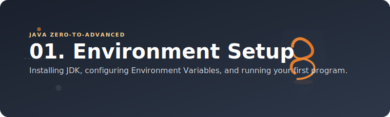
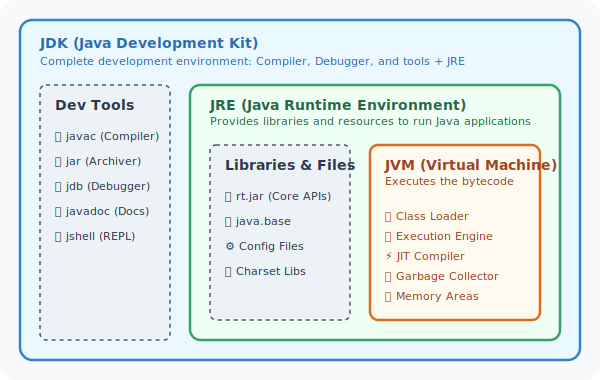
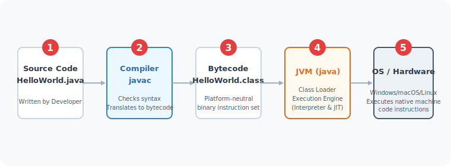

# ⚙️ Java Development Environment Setup



---

## 🎯 Learning Objectives

By the end of this module, you will be able to:
* **Understand** the core components of the Java platform: **JDK, JRE, and JVM**.
* **Install and Configure** the correct Java Development Kit (JDK) for your Operating System.
* **Set up environment variables** (`JAVA_HOME` and `PATH`) to access Java globally.
* **Compile and run** a Java application from the command line interface (CLI).
* **Install and configure** an IDE (IntelliJ IDEA or VS Code) and Version Control (Git).
* **Troubleshoot** common environment configuration issues.

---

## 🚦 Learning Progress
- [x] Theoretical understanding of JDK vs JRE vs JVM
- [ ] JDK Download and installation
- [ ] Environment variable configuration (`JAVA_HOME` & `PATH`)
- [ ] Installation of IDE & Git
- [ ] Compiling & running the first "Hello World" program

---

## 💻 Prerequisites & System Requirements

Here is a quick look at the minimal system requirements and platform specifications:

| Component | Windows (10/11) | macOS (Intel / Apple Silicon) | Linux (Ubuntu/Debian/RedHat) |
| :--- | :--- | :--- | :--- |
| **Minimum RAM** | 4 GB (8 GB Recommended) | 4 GB (8 GB Recommended) | 4 GB (8 GB Recommended) |
| **Disk Space** | ~1 GB for JDK + IDE | ~1 GB for JDK + IDE | ~1 GB for JDK + IDE |
| **Package Manager** | `winget` (Optional) | `Homebrew` (Highly Recommended) | `apt` / `yum` (Recommended) |
| **Preferred JDK** | Oracle JDK / Eclipse Temurin | Eclipse Temurin / Azul Zulu (ARM) | OpenJDK |

---

## 📁 Folder Structure

This setup module is organized into the following guides:

```text
01_SETUP/
├── README.md                    # Main entry point and platform overview (This file)
├── Tools.md                     # Breakdown of standard software tools per OS
├── windows-java-setup.md        # Step-by-step setup guide for Microsoft Windows
├── mac-java-setup.md            # Step-by-step setup guide for Intel-based macOS
└── apple-silicon-java-setup.md  # Optimized setup guide for Apple Silicon M1/M2/M3 Macs
```

---

## 📘 Theory: JDK vs. JRE vs. JVM

To understand what you are installing, you must understand the relationship between the three main building blocks of Java execution:

1. **JVM (Java Virtual Machine)**: 
   * The runtime engine that actually executes Java bytecode. 
   * It is highly platform-dependent (there are different JVMs for Windows, Mac, and Linux) but allows the bytecode it runs to be completely platform-independent (Write Once, Run Anywhere - *WORA*).
2. **JRE (Java Runtime Environment)**: 
   * A package that contains the JVM + Core Library Classes + supporting files needed to **run** compiled Java programs.
   * *Note: JRE does not contain development tools like a compiler.*
3. **JDK (Java Development Kit)**: 
   * The complete software development package. 
   * It contains the JRE + Development Tools (such as the compiler `javac`, the archiver `jar`, the debugger `jdb`, etc.).

### Relationship Diagram

Here is how these components nest within each other:



---

## 🔄 Compilation & Execution Workflow

Java is a hybrid language—it is **both compiled and interpreted**. The execution flow goes through these steps:

1. **Developer writes** source code in a `.java` file (e.g., `HelloWorld.java`).
2. **Compiler (`javac`)** compiles the source code into platform-independent intermediate code called **Bytecode** stored in a `.class` file.
3. **JVM (`java`)** loads the bytecode, verifies it, and translates it into native machine code (using an Interpreter + **JIT Compiler** for performance) for the host operating system to execute.



---

## 🛠️ Step-by-Step Installation Guides

Select the guide below that matches your operating system:

| Platform | Setup Guide Link | Primary Method |
| :--- | :--- | :--- |
| 🪟 **Windows** | [Windows Java Setup Guide](file:///d:/New%20folder/PROJECTS/JAVA_Zero-to-Advanced/01_SETUP/windows-java-setup.md) | Executable installer (`.exe`) + Manual Path Configuration |
| 🍎 **macOS (Intel)** | [macOS Intel Java Setup Guide](file:///d:/New%20folder/PROJECTS/JAVA_Zero-to-Advanced/01_SETUP/mac-java-setup.md) | Homebrew Package Manager / Manual DMG Installer |
| 🚀 **Apple Silicon** | [Apple Silicon M1/M2/M3 Java Setup Guide](file:///d:/New%20folder/PROJECTS/JAVA_Zero-to-Advanced/01_SETUP/apple-silicon-java-setup.md) | Native ARM64 builds via Homebrew / Zulu JDK |
| 🛠️ **Tools Breakdown** | [Recommended Software Tools Catalog](file:///d:/New%20folder/PROJECTS/JAVA_Zero-to-Advanced/01_SETUP/Tools.md) | Detailed look at IDEs, Terminals, and Command Utilities |

---

## ⚡ First Program: Compiling & Running via CLI

Once your environment is set up, let's write and run a simple program to verify everything works.

### 1. The Code (`HelloWorld.java`)
Create a file named `HelloWorld.java` in a clean directory and write:

```java
public class HelloWorld {
    public static void main(String[] args) {
        System.out.println("Hello, Java World!");
    }
}
```

### 🔍 Code Explanation
* **`public class HelloWorld`**: Declares a public class named `HelloWorld`. In Java, the file name **must** exactly match the public class name (case-sensitive).
* **`public static void main(String[] args)`**: The entry point of any Java application. The JVM looks for this exact signature to start executing code.
  * `public`: Accessible from anywhere.
  * `static`: Can be called without creating an instance of the class.
  * `void`: Does not return any value.
  * `main`: Name of the method.
  * `String[] args`: Array of command-line arguments passed to the program.
* **`System.out.println(...)`**: Prints the text to the standard output console.

---

### 2. Compilation and Execution Commands

Run these commands inside the folder where you saved the file:

#### Step A: Compile the Java Source Code
```bash
javac HelloWorld.java
```
> **What happens?** The `javac` compiler checks for syntax errors. If clean, it generates a binary bytecode file named `HelloWorld.class` in the same directory.

#### Step B: Execute the Bytecode via JVM
```bash
java HelloWorld
```
> **What happens?** The `java` command launches the JVM and runs the bytecode. Note that we do **not** add `.class` extension to the class name here.

#### Output:
```text
Hello, Java World!
```

---

## 💡 Best Practices

* **Use LTS Versions**: For learning and production, stick to Long-Term Support (LTS) releases of Java (e.g., Java 17, Java 21) rather than experimental intermediate versions.
* **Path Variables**: Avoid putting spaces in directory paths where JDK is installed. (e.g., `C:\Java\jdk-21` is safer than `C:\Program Files\Java\jdk-21` on some older command-line tools, though modern versions handle spaces better).
* **Isolate Configurations**: If you work on multiple projects that require different Java versions, use a manager like **SDKMAN!** (on Unix/macOS) to switch JDK versions dynamically without messing up environment variables.
* **Capitalization Rules**: Remember that Java is highly case-sensitive. `HelloWorld` is different from `helloworld`.

---

## ⚠️ Common Mistakes & Troubleshooting

> [!WARNING]
> ### 1. Error: `javac: command not found` or `'javac' is not recognized...`
> * **Cause**: The system does not know where `javac` is located.
> * **Fix**: Double-check your `PATH` environment variable. Ensure it points to the `%JAVA_HOME%\bin` (or `$JAVA_HOME/bin` on Unix) folder and that the change has been saved. Remember to **restart your terminal** window for changes to take effect.

> [!IMPORTANT]
> ### 2. Error: `Could not find or load main class HelloWorld`
> * **Cause**: Trying to run `java HelloWorld.class` instead of `java HelloWorld`, or you are running the command from a directory other than where the `.class` file is stored.
> * **Fix**: Change directory (`cd`) to the folder containing the `.class` file and run `java HelloWorld` without any file extension.

> [!NOTE]
> ### 3. Error: `Class names are case-sensitive`
> * **Cause**: File name is `helloworld.java` but the public class name inside is `HelloWorld`.
> * **Fix**: Rename the file to match the public class exactly.

---

## 🤝 Interview Questions (FAQ)

<details>
<summary><b>1. What is the difference between JDK, JRE, and JVM?</b></summary>
<br>
The difference lies in their scopes:
* **JVM** is the abstract machine that executes bytecode. It is the core execution environment.
* **JRE** consists of JVM + standard library class files. It runs Java applications.
* **JDK** consists of JRE + development tools like the compiler (`javac`). It is used to write and compile Java applications.
</details>

<details>
<summary><b>2. Why is Java platform-independent, but JVM is platform-dependent?</b></summary>
<br>
Java compiler translates Java source code into **bytecode** (which is platform-independent). However, different operating systems (Windows, macOS, Linux) have different underlying instruction sets. 
Therefore, you need a different, platform-specific **JVM** for each OS to translate that same independent bytecode into the corresponding host operating system's native machine instructions.
</details>

<details>
<summary><b>3. What is the role of the JIT Compiler?</b></summary>
<br>
The **Just-In-Time (JIT) Compiler** is part of the JVM's execution engine. While the JVM interpreter translates bytecode line-by-line (which can be slow), the JIT compiler analyzes running code to find "hot spots" (frequently executed code blocks) and compiles them directly into native machine code. Subsequent calls to these hot spots execute instantly, greatly improving Java application performance.
</details>

<details>
<summary><b>4. What is the difference between path and classpath?</b></summary>
<br>
* **PATH** is an operating system variable used by the shell to find executable files (like `java`, `javac`, `git`).
* **CLASSPATH** is a Java environment variable or command parameter used by the JVM to find compiled user-defined classes and packages (`.class` or `.jar` files) during compilation or execution.
</details>

---

## 🔗 Related Topics & Next Steps

* [Tools Setup Catalog](file:///d:/New%20folder/PROJECTS/JAVA_Zero-to-Advanced/01_SETUP/Tools.md)
* [Windows Setup Guide](file:///d:/New%20folder/PROJECTS/JAVA_Zero-to-Advanced/01_SETUP/windows-java-setup.md)
* [macOS Setup Guide](file:///d:/New%20folder/PROJECTS/JAVA_Zero-to-Advanced/01_SETUP/mac-java-setup.md)

➡️ **Next Module:** Let's learn about Java syntax, primitives, variables, and type casting in [02_Introduction](file:///d:/New%20folder/PROJECTS/JAVA_Zero-to-Advanced/02_Introduction)
