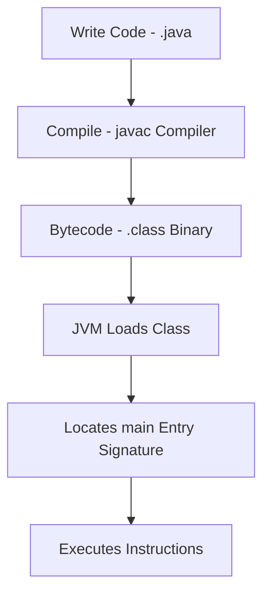

# Hello World and the Main Method in Java

This guide details the structure of a standard Java application entry point, exploring the syntactic significance of each keyword in the main method signature.

---

## Introduction

Every executable Java program begins its execution lifecycle from a specific method called the **main method**. It acts as the primary entry point that the Java Virtual Machine (JVM) looks for when launching the application.

---

## Basic Program

Below is the standard "Hello World" template in Java:

```java
public class Main {
    public static void main(String[] args) {
        System.out.println("Hello World");
    }
}
```

---

## Understanding the Keyword Signature

Java has a strict syntax system. Every keyword in the main method signature serves a specific operational purpose:

### class
* **Definition**: A keyword used to declare a class. In Java, all code must reside within a class.
* **Rule**: The name of the public class must match the name of the file exactly (e.g., `public class Main` must be stored in `Main.java`).

### public
* **Access Modifier**: Dictates the visibility scope of the method.
* **Why it is required**: The JVM executes your program from outside the class's package. To do so, the main method must be declared `public` so it is accessible globally.

### static
* **Behavior**: Allows a method to be invoked without creating an instance of the declaring class.
* **Why it is required**: When the program starts, no objects exist in memory. Declaring the main method as `static` allows the JVM to execute it directly without allocating class instances first.

### void
* **Return Type**: Indicates that the method does not return any data back to the caller.
* **Why it is required**: The main method is called directly by the JVM. Since the execution engine does not require an exit code return value, the method is declared `void`.

### main
* **Identifier**: The exact name of the starting method.
* **Rule**: The JVM searches for the method identifier named exactly `main`. Any variation (like `Main` or `mian`) will result in a runtime lookup error.

### String[] args
* **Parameters**: A command-line arguments array.
* **Purpose**: Allows passing external parameters into the program at launch time. For example, running `java Main arg1 arg2` maps `args[0]` to `"arg1"` and `args[1]` to `"arg2"`.

---

## Execution Flow



---

## Technical Details: Exit Status in Java

Unlike C or C++ where `main()` returns an integer value representing the execution exit status (like `return 0` for success), Java does not return exit codes from `main()`. Instead, Java runs encapsulated inside the JVM. 

If you need to manually communicate an execution exit status back to the host operating system, you must call the system exit API:

```java
System.exit(0); // Successful termination (standard code 0)
System.exit(1); // Unsuccessful termination (standard code 1)
```

---

## Common Mistakes

* **Missing static keyword**: Will compile successfully, but JVM will throw a runtime error saying `Main method is not static`.
* **Wrong parameter type**: Writing `String args` instead of `String[] args` or `String args[]` changes the signature. The JVM will fail to locate the entry method.
* **File name mismatch**: Naming the file `test.java` while declaring `public class Main` causes a compilation error.
* **Incorrect casing**: Writing `void Main` or `system.out.println`. Java is strictly case-sensitive.

---

## Key Takeaways

* The `main` method is the runtime bootstrap for Java execution.
* Declaring it `static` is necessary because the environment must run it before object instantiations occur.
* Command-line parameters are captured as an array of `String` objects in the `args` array parameter.

---

**Back to Module Home:** [Introduction to Java Programming](file:///d:/New%20folder/PROJECTS/JAVA_Zero-to-Advanced/02_Introduction/README.md)
