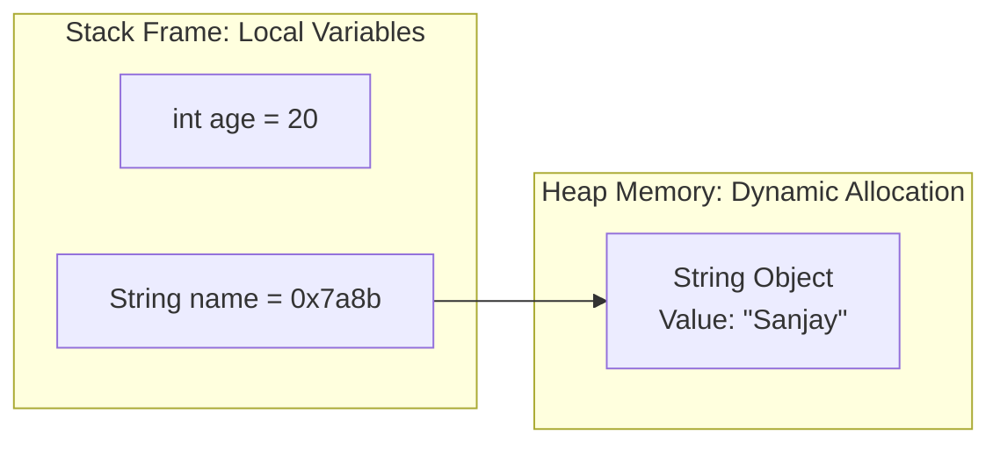

# Variables in Java

This guide introduces variables in Java, explaining declaration, initialization, naming rules, memory allocation, and scope behaviors.

---

## What is a Variable?

A variable is a named memory address location reserved for storing data values. In Java, instead of directly manipulating hex memory addresses, variables provide human-readable identifiers to store and retrieve data values from RAM during runtime.

---

## Basic Syntax

Java is a strongly-typed language, meaning every variable must be declared with a specific data type before it can store a value:

```java
dataType variableName = value;
```

For example:
```java
int age = 20;
```
* `int`: The **Data Type** (specifies that the memory location stores 4-byte integers).
* `age`: The **Variable Name** (the identifier used to access this memory space).
* `20`: The **Value** (the actual data written to the reserved memory).

---

## Variable Scopes and Classifications

Java variables are classified into three types based on where they are declared and their lifecycle scope:

### 1. Local Variables
* **Declaration**: Declared inside a method, constructor, or code block.
* **Scope**: Accessible only within the method or block where they are declared.
* **Lifecycle**: Created when the method is entered and destroyed immediately when the method returns or exits.
* **Note**: Local variables do not get default values. They must be initialized before first access, or the code will fail compile-time checks.

```java
public class Demo {
    public static void main(String[] args) {
        int localVal = 10; // Local variable inside main method
        System.out.println(localVal);
    }
}
```

### 2. Instance Variables (Fields)
* **Declaration**: Declared inside a class but outside any methods.
* **Scope**: Accessible by any non-static method in the class.
* **Lifecycle**: Created when an object of the class is instantiated using the `new` keyword, and destroyed when that object is garbage-collected.
* **Note**: They automatically receive default values (e.g., `0` for numbers, `false` for booleans, `null` for object references) if not initialized manually.

```java
class Student {
    String name; // Instance variable, unique to each Student instance
    int age;    // Instance variable
}
```

### 3. Static Variables (Class Variables)
* **Declaration**: Declared inside a class but with the `static` keyword.
* **Scope**: Accessible globally across the application. Can be referenced using the class name directly (e.g., `Student.college`).
* **Lifecycle**: Created when the program starts (class loading phase) and destroyed when the program terminates.
* **Note**: Only one copy of a static variable is shared across all instances of the class.

```java
class Student {
    static String collegeName = "Global University"; // Shared static variable
}
```

---

## Variable Declaration vs. Initialization

* **Declaration**: Declaring the name and data type, telling the compiler how much memory to reserve.
  ```java
  int score;
  ```
* **Initialization**: The first time a value is written to the variable.
  ```java
  score = 95;
  ```
* **Combined**: Declaring and initializing in a single statement.
  ```java
  int score = 95;
  ```

---

## Rules for Naming Variables (Identifiers)

In Java, naming identifiers must adhere to strict rules:

* **Starting Character**: Must begin with a letter (A-Z or a-z), a currency character (`$`), or an underscore (`_`).
* **Leading Digits**: Cannot start with a number (e.g., `int 1value;` is invalid).
* **Whitespace**: No spaces are permitted inside a variable name (use camelCase instead).
* **Keywords**: Cannot use reserved keywords (such as `int`, `class`, `public`, `void`).

### Examples:
* **Valid**: `int totalScore;`, `double _exchangeRate;`, `String $userToken;`
* **Invalid**: `int total score;` (contains space), `double 2x;` (starts with a digit), `char class;` (reserved word)

---

## Memory Representation: Primitives vs. References

* **Primitive Variables**: Store the actual raw data values directly on the stack memory frame.
* **Reference Variables**: Store the memory address location (pointer) of the object allocated on the heap.



---

## Code Example: Scope and Usage

This program demonstrates all three variable types in action:

```java
public class VariableDemo {
    // Static class variable
    static String department = "Computer Science";

    // Instance variable
    int studentId = 101;

    public void displayInfo() {
        // Local variable
        double gpa = 3.8;

        System.out.println("ID: " + studentId);
        System.out.println("Department: " + department);
        System.out.println("GPA: " + gpa);
    }

    public static void main(String[] args) {
        VariableDemo demo = new VariableDemo();
        demo.displayInfo();
    }
}
```

---

## Practice Challenges

### Challenge 1: Data Swapping
Write a program that swaps the values of two integer variables using a third temporary variable.
* **Input**: `a = 5`, `b = 10`
* **Output**: `a = 10`, `b = 5`

```java
public class SwapNumbers {
    public static void main(String[] args) {
        int a = 5;
        int b = 10;
        int temp = a;
        a = b;
        b = temp;
        System.out.println("a: " + a + ", b: " + b);
    }
}
```

### Challenge 2: Arithmetic Calculator
Declare two decimal numbers, calculate their sum, difference, product, and quotient, and print the results to the console.

---

**Back to Module Home:** [Introduction to Java Programming](file:///d:/New%20folder/PROJECTS/JAVA_Zero-to-Advanced/02_Introduction/README.md)
