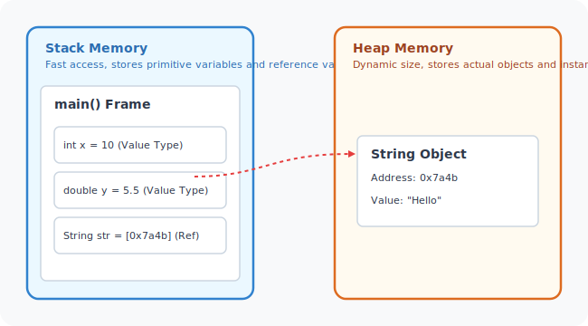
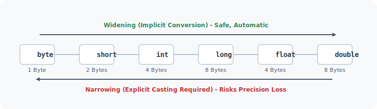

# Introduction to Java Programming

This module covers the core building blocks of Java programming. You will learn about Java's execution environment, basic syntax, variables, primitive data types, memory model, and operators.

---

## Learning Objectives

By the end of this module, you will be able to:
* Explain the structure of a standard Java class and the signature of the main method.
* Declare, initialize, and manage variables using appropriate naming rules.
* Differentiate between value types (primitives) and reference types (objects) and describe how they are allocated in memory.
* Perform safe type conversions (widening) and explicit type casting (narrowing).
* Handle console input and output using standard Java streams.
* Understand float/double precision limits and handle unicode character representations.
* Work with single and multi-dimensional arrays.
* Apply Java operators to manipulate operands efficiently.

---

## Topics Index

Below is the list of topics covered in this module. Select a topic to read its dedicated guide:

| Topic | Description | Link |
| :--- | :--- | :--- |
| **01. Hello World &amp; Main Method** | Structure of main(), public static void main, class syntax. | [Open Guide](file:///d:/New%20folder/PROJECTS/JAVA_Zero-to-Advanced/02_Introduction/01_hello-world-and-main-method.md) |
| **02. Java Overview** | Compiler, Bytecode, Class Loader, JVM memory areas, execution. | [Open Guide](file:///d:/New%20folder/PROJECTS/JAVA_Zero-to-Advanced/02_Introduction/02_java-overview.md) |
| **03. Variables** | Declarations, dynamic allocations, local vs instance scopes. | [Open Guide](file:///d:/New%20folder/PROJECTS/JAVA_Zero-to-Advanced/02_Introduction/03_Variables.md) |
| **04. Primitive Basics** | Core primitive definitions, integer types, characteristics. | [Open Guide](file:///d:/New%20folder/PROJECTS/JAVA_Zero-to-Advanced/02_Introduction/04_Primitive-DataType-Basics.md) |
| **05. Primitives Code** | Compilation examples, range limits, minimum/maximum values. | [Open Guide](file:///d:/New%20folder/PROJECTS/JAVA_Zero-to-Advanced/02_Introduction/05_Program-Primitive-DataTypes.md) |
| **06. Type Casting** | Widening and narrowing conversions, data truncation hazards. | [Open Guide](file:///d:/New%20folder/PROJECTS/JAVA_Zero-to-Advanced/02_Introduction/06_Type-Casting.md) |
| **07. Input &amp; Output** | Standard I/O with Scanner, print, println, and formatted printf. | [Open Guide](file:///d:/New%20folder/PROJECTS/JAVA_Zero-to-Advanced/02_Introduction/07_Input-Output.md) |
| **08. Float &amp; Double** | IEEE 754 floating-point standards, round-off errors, precision. | [Open Guide](file:///d:/New%20folder/PROJECTS/JAVA_Zero-to-Advanced/02_Introduction/08_Float-and-Double.md) |
| **09. Char &amp; Unicode** | UTF-16 character encoding, escape sequences, ASCII values. | [Open Guide](file:///d:/New%20folder/PROJECTS/JAVA_Zero-to-Advanced/02_Introduction/09_Char-and-Unicode.md) |
| **10. Boolean** | Logical flags, conditional triggers, truth evaluations. | [Open Guide](file:///d:/New%20folder/PROJECTS/JAVA_Zero-to-Advanced/02_Introduction/10_Boolean.md) |
| **11. Strings** | String immutability, String Pool, common API methods. | [Open Guide](file:///d:/New%20folder/PROJECTS/JAVA_Zero-to-Advanced/02_Introduction/11_Strings.md) |
| **12. Arrays** | One-dimensional and multi-dimensional arrays, memory indexing. | [Open Guide](file:///d:/New%20folder/PROJECTS/JAVA_Zero-to-Advanced/02_Introduction/12_Array.md) |
| **13. Reference vs Value Types** | Stack vs Heap allocation, pointer mechanics, copy behaviors. | [Open Guide](file:///d:/New%20folder/PROJECTS/JAVA_Zero-to-Advanced/02_Introduction/13_Reference-Types-and-Value-Types.md) |
| **14. Operators** | Arithmetic, relational, logical, assignment, bitwise operations. | [Open Guide](file:///d:/New%20folder/PROJECTS/JAVA_Zero-to-Advanced/02_Introduction/14_Operators-and-Operands.md) |

---

## Core Theory Summary

### 1. The Java Memory Model: Stack vs. Heap

In Java, memory allocation is divided into two primary zones: the Stack and the Heap.

* **Stack Memory**:
  * Stores temporary local variables declared inside methods.
  * Stores value types (primitives like `int`, `double`, `boolean`) directly as raw values.
  * Stores references (memory addresses) that point to objects residing in the heap.
  * Operates on a LIFO (Last-In-First-Out) stack frame basis; memory is automatically cleaned up when the method finishes execution.
* **Heap Memory**:
  * Stores all objects (such as `String` instances, arrays, custom class instances).
  * Objects inside the heap are accessed via references stored on the Stack.
  * Memory is managed by the Garbage Collector (GC), which periodically deallocates objects that no longer have active references.



---

### 2. Primitive Data Types Reference Table

Java defines 8 built-in primitive data types. They have fixed sizes across all platforms:

| Type | Size (Bytes) | Category | Default Value | Value Range |
| :--- | :--- | :--- | :--- | :--- |
| **byte** | 1 | Integer | `0` | -128 to 127 |
| **short** | 2 | Integer | `0` | -32,768 to 32,767 |
| **int** | 4 | Integer | `0` | -2,147,483,648 to 2,147,483,647 |
| **long** | 8 | Integer | `0L` | -9,223,372,036,854,775,808 to 9,223,372,036,854,775,807 |
| **float** | 4 | Floating-point | `0.0f` | ~1.4e-45 to 3.4e+38 (7 decimal digits precision) |
| **double** | 8 | Floating-point | `0.0d` | ~4.9e-324 to 1.7e+308 (15 decimal digits precision) |
| **char** | 2 | Character | `\u0000` | Single 16-bit Unicode character (0 to 65,535) |
| **boolean**| 1 (JVM dependent) | Logical | `false` | `true` or `false` |

---

### 3. Type Casting Rules

Type casting is the process of converting a value from one data type to another.

* **Widening (Implicit)**: 
  * Occurs when converting a smaller data type to a larger data type.
  * Safe and automatic; no syntax is needed.
  * Example: `int` (4 bytes) is automatically converted to `double` (8 bytes).
* **Narrowing (Explicit)**: 
  * Occurs when converting a larger data type to a smaller data type.
  * Requires explicit syntax mapping (e.g., `(int) myDouble`).
  * Potential for data loss or precision truncation if the value exceeds the target type's range.



---

## Best Practices

* **Always initialize local variables**: Unlike class-level fields, local variables inside methods do not receive default values and must be initialized before use, or the code will fail to compile.
* **Be careful with double comparisons**: Due to floating-point precision limits, do not use `==` to compare double or float values. Use a small tolerance value (epsilon) instead:
  ```java
  double epsilon = 0.00001;
  if (Math.abs(d1 - d2) < epsilon) { ... }
  ```
* **Minimize narrowing operations**: Only narrow types when strictly necessary, and ensure target boundaries are checked to prevent integer overflow errors.
* **Prefer String immutability advantages**: Strings in Java are immutable. When building strings in loops, use `StringBuilder` to avoid cluttering the heap String Pool.

---

**Next Module:** Let's learn about modular code structure and designing methods in [03_function_design](file:///d:/New%20folder/PROJECTS/JAVA_Zero-to-Advanced/03_function_design)
