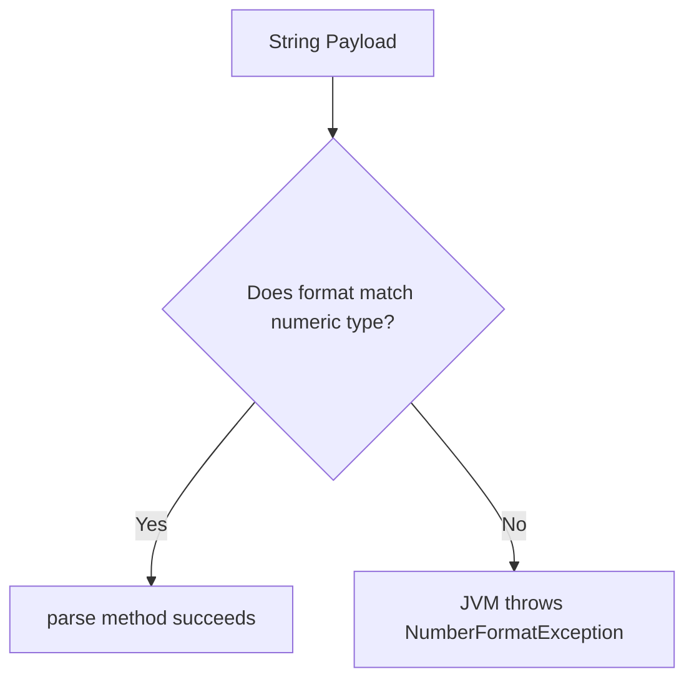

# String to Primitive Conversion in Java

This guide details the parsing mechanisms used to convert textual `String` data into numeric primitives, wrapper class utilities, and standard exception handling patterns.

---

## Introduction

In Java, data fetched from external sources (such as console inputs, text files, API payloads, or database records) is typically received as a sequence of characters (`String`).

Since mathematical or comparative operators cannot be applied directly to String objects, you must convert these text sequences into their appropriate primitive values.

This conversion process is referred to as **Parsing**.

---

## Why String Conversion is Important

When variables are declared as strings, the addition operator `+` performs string concatenation rather than numeric addition:

```java
String val1 = "10";
String val2 = "20";
System.out.println(val1 + val2); // Outputs "1020" due to concatenation
```

By parsing these values first, we can execute mathematical arithmetic operations:

```java
int num1 = Integer.parseInt("10");
int num2 = Integer.parseInt("20");
System.out.println(num1 + num2); // Outputs 30 (addition)
```

---

## Technical Concept: Parsing vs. Casting

It is important to differentiate between parsing and type casting:
* **Type Casting**: Relies on compiler-level byte truncation to convert one compatible primitive data type to another (e.g., `(int) myDouble`).
* **Parsing**: Relies on JVM library classes to analyze a character string, verify it contains numeric symbols, and compile it into a binary value.

---

## Common Parsing Methods

Java provides helper static methods inside the standard primitive **Wrapper Classes** to execute conversions:

| Target Primitive | Wrapper Class | Static Parsing Method | Exception Thrown on Failure |
| :--- | :--- | :--- | :--- |
| **byte** | `Byte` | `Byte.parseByte(String)` | `NumberFormatException` |
| **short** | `Short` | `Short.parseShort(String)` | `NumberFormatException` |
| **int** | `Integer` | `Integer.parseInt(String)` | `NumberFormatException` |
| **long** | `Long` | `Long.parseLong(String)` | `NumberFormatException` |
| **float** | `Float` | `Float.parseFloat(String)` | `NumberFormatException` |
| **double** | `Double` | `Double.parseDouble(String)` | `NumberFormatException` |
| **boolean** | `Boolean` | `Boolean.parseBoolean(String)` | Does not fail (returns `false` if invalid) |

---

## Basic Parsing Code Examples

### 1. Parsing to int
```java
public class StringToInt {
    public static void main(String[] args) {
        String numStr = "150";
        int parsedInt = Integer.parseInt(numStr);
        System.out.println("Parsed integer: " + parsedInt);
    }
}
```

### 2. Parsing to double
```java
public class StringToDouble {
    public static void main(String[] args) {
        String doubleStr = "99.99";
        double parsedDouble = Double.parseDouble(doubleStr);
        System.out.println("Parsed double: " + parsedDouble);
    }
}
```

### 3. Parsing to boolean
* **Unique Behavior**: `Boolean.parseBoolean()` does not throw an exception on invalid input. It returns `true` only if the String content matches `"true"` (case-insensitive); otherwise, it defaults to `false`.
```java
public class StringToBoolean {
    public static void main(String[] args) {
        System.out.println(Boolean.parseBoolean("true"));  // Prints true
        System.out.println(Boolean.parseBoolean("TRUE"));  // Prints true
        System.out.println(Boolean.parseBoolean("hello")); // Prints false
    }
}
```

---

## Handling Parsing Exceptions: NumberFormatException

If a String contains non-numeric characters (e.g., `"12a"`, `"abc"`, `" 45"`) or formatting mismatches (e.g., passing `"9.99"` to `Integer.parseInt()`), the conversion fails. The JVM throws a **`NumberFormatException`**.



### Defensive Code Pattern: Try-Catch Handling
To prevent application crashes when parsing user-submitted strings, wrap the conversion code in a `try-catch` block:

```java
public class SafeParsing {
    public static void main(String[] args) {
        String userInput = "45a";

        try {
            int age = Integer.parseInt(userInput);
            System.out.println("Valid Age: " + age);
        } catch (NumberFormatException e) {
            System.out.println("Error: The input '" + userInput + "' is not a valid integer.");
        }
    }
}
```

### Output
```text
Error: The input '45a' is not a valid integer.
```

---

## Practice Challenges

### Challenge 1: String Multiplier
Write a program that takes two numeric strings as input, parses them safely, multiplies them, and outputs the result. If parsing fails, output a clear error message.

### Challenge 2: Calculator parsing
Write a program that parses `"12.5"` and `"3"` into appropriate decimal types, calculates the sum, and displays it formatted to 2 decimal places using `System.out.printf()`.

### Challenge 3: Parsing Boolean Configuration
Create a program that parses configuration flags from string variables: `isEnabled = "true"`, `debugMode = "false"`, `logLevel = "verbose"`. Print out the boolean values and state whether `logLevel` is parsed as a valid boolean.

---

**Back to Module Home:** [Function Design &amp; Modular Programming](README.md)
