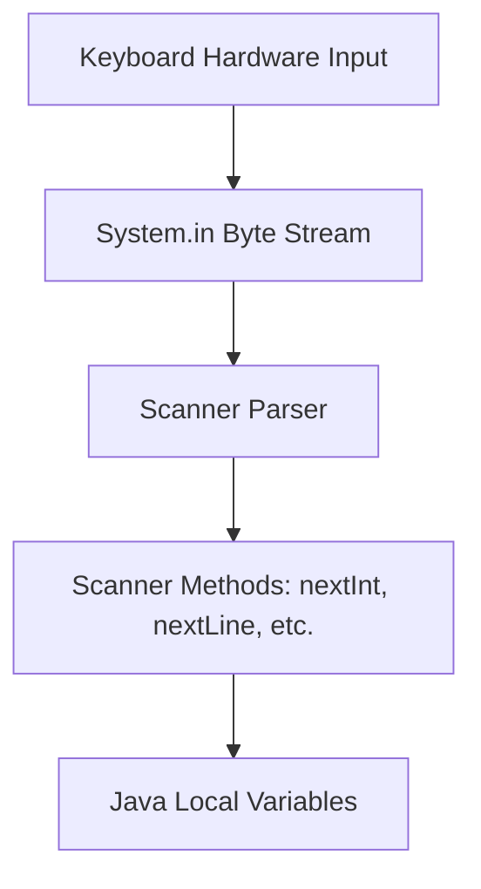

# User Input and Console Interaction in Java

This guide details the mechanisms of capturing console inputs in Java using the `Scanner` class, handling stream tokens, and resolving common buffer processing issues.

---

## Introduction

To create interactive, dynamic applications, programs must be able to read data entered by users. Java provides several ways to read input from the keyboard, files, or network sockets. The primary utility for reading command-line console inputs is the `java.util.Scanner` class.

---

## The Scanner Class

The `Scanner` class parses standard input streams into variables of various primitive data types or strings:

```java
import java.util.Scanner;

public class BasicInput {
    public static void main(String[] args) {
        // Instantiate the Scanner object wrapping the system input stream
        Scanner scanner = new Scanner(System.in);

        System.out.print("Enter your name: ");
        String name = scanner.nextLine(); // Reads the entire line of text

        System.out.println("Welcome, " + name + "!");

        // Release resources
        scanner.close();
    }
}
```

---

## Technical Mechanism: System Input Streaming

When a key is pressed, data is transmitted to the application via `System.in`:



---

## Scanner API: Input Reading Methods

| Target Data Type | Scanner Method | Description |
| :--- | :--- | :--- |
| **String (Line)** | `nextLine()` | Reads the entire line of text until the next newline (`\n`). |
| **String (Word)** | `next()` | Reads a single space-separated token (word). |
| **int** | `nextInt()` | Reads the next token as an integer. |
| **double** | `nextDouble()` | Reads the next token as a double-precision decimal. |
| **float** | `nextFloat()` | Reads the next token as a single-precision decimal. |
| **long** | `nextLong()` | Reads the next token as a long integer. |
| **boolean** | `nextBoolean()` | Reads the next token as a boolean (`true`/`false`). |

---

## Handling the Scanner Buffer Defect

Mixing numeric scanners (e.g., `nextInt()`, `nextDouble()`) with line scanners (`nextLine()`) can cause the program to skip inputs.

### The Problem
* Numeric scanners parse only the numeric characters and stop at whitespace or newlines.
* When the user presses Enter, a newline character (`\n`) is generated and remains in the `System.in` buffer.
* Calling `nextLine()` immediately after consumes this leftover `\n` character as an empty string, skipping the prompt.

### The Solution
Always consume the leftover newline character by executing a dummy `nextLine()` call after any numeric read operations:

```java
import java.util.Scanner;

public class BufferSolution {
    public static void main(String[] args) {
        Scanner input = new Scanner(System.in);

        System.out.print("Enter your age: ");
        int age = input.nextInt(); // Leaves '\n' in the input stream buffer

        input.nextLine(); // Consumes the '\n' character to clear the buffer

        System.out.print("Enter your address: ");
        String address = input.nextLine(); // Correctly prompts for input

        System.out.println("Age: " + age + ", Address: " + address);
        input.close();
    }
}
```

---

## Practice Challenges

### Challenge 1: Average Calculator
Write a program that prompts the user to enter three decimal numbers, reads them using `nextDouble()`, calculates their average, and prints the result.

### Challenge 2: Console Profile Creator
Write a program that prompts the user for:
1. Full name (using `nextLine()`)
2. Age (using `nextInt()`)
3. Favorite programming language (using `next()`)

Print the collected details back using formatted output (`printf()`). Ensure all buffer issues are handled.

---

**Back to Module Home:** [Function Design &amp; Modular Programming](README.md)
