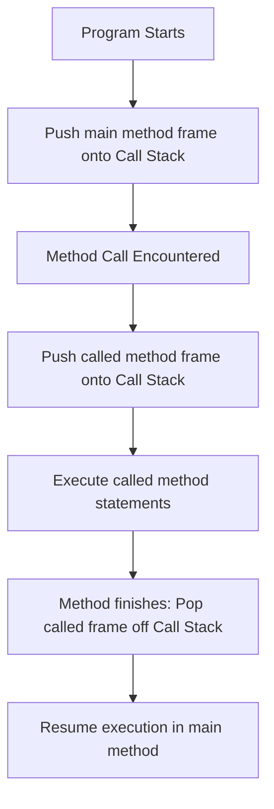

# Methods in Java

This guide details the specifications of methods in Java, explaining declaration syntax, parameter mapping, stack frame lifecycles, and execution returns.

---

## Introduction

A method is a self-contained block of code designed to perform a specific, modular task. Instead of writing the same instructions multiple times, you can wrap them inside a method and call it from different parts of your application.

Methods promote:
* **Code Reusability**: Write once, reuse multiple times.
* **Maintainability**: Changing code inside a method updates it globally.
* **Separation of Concerns**: Dividing large algorithms into logical sub-tasks.

---

## General Syntax

In Java, a static method is declared using this syntax:

```java
accessModifier static returnType methodName(parameterList) {
    // Method body containing logic
    return value; // (Required if returnType is not void)
}
```

For example:
```java
public static void greet() {
    System.out.println("Hello, Java!");
}
```
* **`public`**: Access modifier. Indicates the method is accessible from any package.
* **`static`**: Indicates the method belongs to the class itself, rather than an instance of the class. It can be invoked without allocating class objects.
* **`void`**: Return type. Indicates the method does not return any data value when finished.
* **`greet`**: Method name (uses camelCase).
* **`()`**: Empty parameter list, indicating the method takes no input arguments.

---

## Method Execution and the Stack Frame

The Java Virtual Machine manages method execution using **Stack Memory**:

1. When a program starts, the JVM pushes the `main()` method frame onto the thread's call stack.
2. When the compiler encounters a method call (e.g., `greet()`), execution pauses in the current method.
3. The JVM pushes a new stack frame representing the called method (`greet()`) onto the call stack.
4. The variables and parameters defined in the called method are allocated inside this new stack frame.
5. Once the called method finishes execution (reaches a `return` statement or the closing brace), its stack frame is popped off the stack, and control returns to the caller.



---

## Parameter Passing vs. Arguments

* **Parameter**: The variable declared in the method signature (e.g., `String name` in `public static void greet(String name)`).
* **Argument**: The actual value passed to the method during invocation (e.g., `"Sanjay"` in `greet("Sanjay")`).

```java
public class ParameterDemo {
    public static void main(String[] args) {
        greet("Sanjay"); // "Sanjay" is the argument
    }

    public static void greet(String name) { // 'name' is the parameter
        System.out.println("Welcome, " + name);
    }
}
```

---

## Methods returning values: The return statement

If a method is designed to perform a calculation and send the result back to the caller, you must declare a return type other than `void`, and use the `return` keyword:

```java
public class Calculator {
    public static void main(String[] args) {
        double result = calculateSpeed(100.0, 20.0);
        System.out.println("Speed: " + result + " m/s");
    }

    public static double calculateSpeed(double distance, double time) {
        if (time == 0) {
            return Double.NaN; // Returns "Not a Number" if division by zero is attempted
        }
        return distance / time; // Returns the calculated quotient
    }
}
```

### Output
```text
Speed: 5.0 m/s
```

---

## Categories of Methods

Methods are classified into four main structures based on parameters and return signatures:

1. **No Parameters, No Return**:
   ```java
   public static void displayHeader() {
       System.out.println("--- Welcome ---");
   }
   ```
2. **Parameters, No Return**:
   ```java
   public static void printSum(int a, int b) {
       System.out.println("Sum: " + (a + b));
   }
   ```
3. **No Parameters, Return Value**:
   ```java
   public static double getPiValue() {
       return 3.14159;
   }
   ```
4. **Parameters and Return Value**:
   ```java
   public static int calculateSquare(int number) {
       return number * number;
   }
   ```

---

## Common Beginner Errors

> [!WARNING]
> ### 1. Missing Return Statement
> If a method declares a return type (e.g., `public static int getSum()`), it **must** return an integer value along all execution paths. Forgetting to write `return` will cause a compilation error.

> [!IMPORTANT]
> ### 2. Return Type Mismatch
> Trying to return a value of a type incompatible with the declared return type (e.g., returning a `String` from a method declared to return an `int`) causes a compile-time check error.

---

## Practice Challenges

### Challenge 1: Rectangle Area
Write a method `calculateArea(double length, double width)` that calculates and returns the area of a rectangle. Call it from `main()` and print the output.

### Challenge 2: Number Even Check
Write a method `isEven(int number)` that returns `true` if the number is even and `false` otherwise.

### Challenge 3: Temperature Converter
Write a method `celsiusToFahrenheit(double celsius)` that takes a temperature value in Celsius and returns its Fahrenheit equivalent ($F = C \times \frac{9}{5} + 32$).

---

**Back to Module Home:** [Introduction to Java Programming](README.md)
