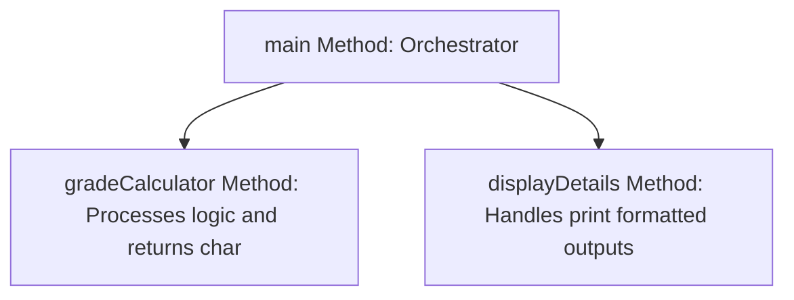
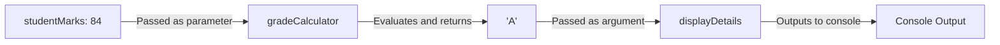

# Method-Based Problem Solving in Java

This guide details code decomposition techniques, separating computing logic from display logic, and tracing JVM stack lifecycles using a practical student grading system.

---

## Introduction

Learning syntax is the baseline; applying it to break down complex problems is where method design becomes powerful. Real-world programming relies on **Decomposition**—breaking down large, complex problems into small, modular, single-purpose methods.

Benefits of Method-Based Decomposition:
* **Separation of Concerns**: Separate business logic calculations from console presentation details.
* **Traceability**: Isolate bugs quickly within specific functions.
* **Testability**: Test individual units of logic independently.

---

## Problem Statement

Design a program that accepts a student's name and score, and then:
1. Calculates the appropriate letter grade based on the score.
2. Returns the grade character.
3. Formats and prints a detailed summary to the console.

---

## Architecture: Separating Concerns

Instead of putting all statements into `main()`, we divide the requirements into separate roles:



---

## Complete Implementation

```java
public class StudentGradeSystem {
    public static void main(String[] args) {
        String studentName = "Manish Agarwal";
        int studentMarks = 84;

        // 1. Calculate grade based on marks
        char studentGrade = gradeCalculator(studentMarks);

        // 2. Display student details
        displayDetails(studentName, studentMarks, studentGrade);
    }

    public static char gradeCalculator(int marks) {
        if (marks < 0 || marks > 100) {
            return 'F'; // Default/invalid fallback
        }
        if (marks > 90) {
            return 'S'; // Super Class
        }
        if (marks > 80) {
            return 'A'; // Distinction
        }
        if (marks > 70) {
            return 'B'; // First Class
        }
        return 'F'; // Fail
    }

    public static void displayDetails(String name, int score, char grade) {
        System.out.println("--- Student Report ---");
        System.out.printf("Name:  %s%n", name);
        System.out.printf("Score: %d%n", score);
        System.out.printf("Grade: %c%n", grade);
    }
}
```

### Output
```text
--- Student Report ---
Name:  Manish Agarwal
Score: 84
Grade: A
```

---

## Data Flow Pipeline

The parameters pass values through methods sequentially:



---

## JVM Stack Frame Lifecycle Trace

When executing this application, the JVM call stack changes dynamically:

1. **Step 1: Application starts**
   * The JVM pushes the `main()` frame onto the thread stack.
2. **Step 2: Invoking `gradeCalculator(84)`**
   * A new frame for `gradeCalculator()` is pushed onto the stack. Local parameter variable `marks` is allocated with value `84` inside this frame.
3. **Step 3: `gradeCalculator()` finishes**
   * The expression checks conditions, evaluates to `'A'`, returns `'A'`, and its stack frame is immediately popped off. Control returns to `main()`.
4. **Step 4: Invoking `displayDetails("Manish Agarwal", 84, 'A')`**
   * A new frame for `displayDetails()` is pushed onto the stack. Its parameters are populated and run.
5. **Step 5: Execution complete**
   * The frame is popped off. The `main()` method completes, its frame is popped, and the call stack becomes empty.

---

## Why Return Values Instead of Printing Directly?

A common mistake is writing methods that print outputs directly inside business calculations:

```java
// Anti-Pattern: Mixed Responsibilities
public static void printGrade(int marks) {
    if (marks > 90) {
        System.out.println("S"); // Hard-wired to console print!
    }
}
```

### The Problem
If the application needs to write the grade to a database, email it to a student, or display it in a GUI window, this method is useless because its output is hard-wired to `System.out.println`.

### The Solution
Return the parsed value (`char`) to keep the method reusable for all interface types:
```java
public static char gradeCalculator(int marks) {
    if (marks > 90) return 'S';
    return 'F';
}
```

---

## Practice Challenges

### Challenge 1: Pass/Fail Evaluator
Write a method `evaluatePassFail(int score)` that returns a boolean `true` if the score is 50 or above, and `false` otherwise. Call this from `main()` and print a personalized message.

### Challenge 2: GPA converter
Write a method `getGPA(char grade)` that converts letter grades to GPA values:
* `'S'` maps to `4.0`
* `'A'` maps to `3.5`
* `'B'` maps to `3.0`
* `'F'` maps to `0.0`
Return the result as a `double`.

### Challenge 3: Performance Evaluator
Write a method `assessPerformance(int marks)` that returns a String descriptive evaluation: `"Topper"` if marks are above 90, `"Average"` if between 60 and 90, and `"Needs Improvement"` if below 60.

---

**Back to Module Home:** [Introduction to Java Programming](file:///d:/New%20folder/PROJECTS/JAVA_Zero-to-Advanced/03_function_design/README.md)
