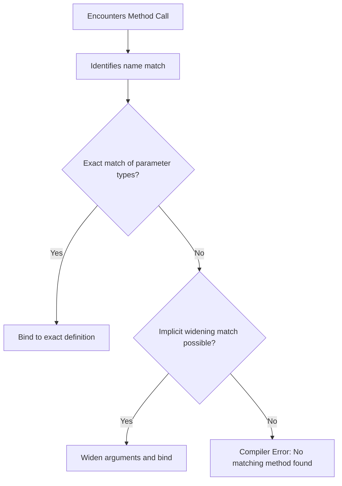

# Method Overloading in Java

This guide details compile-time polymorphism (static binding) in Java, exploring the parameters matching rules, compiler resolution workflows, and comparisons between overloading and overriding.

---

## Introduction

In real-world applications, a single logical action (such as calculations, logging, or authentication) might accept different parameters depending on the context.

For example, a printing method might accept:
* Just a String message.
* A String message and a count of copies.
* A numeric value.

Without overloading, you would have to invent separate names for every variation (e.g., `printString()`, `printStringWithCopies()`, `printInt()`). Java solves this by permitting **Method Overloading**, which allows multiple methods to share the same name within the same class, differentiated only by their input signatures.

---

## Defining Method Overloading

Method Overloading is the process of creating multiple methods within the same class that share the **same name** but declare **different parameter lists**.

It is a form of **Compile-Time Polymorphism** (or *Static Binding*) because the compiler maps the method call to the correct definition during compilation.

---

## Rules of Method Overloading

For the compiler to differentiate between overloaded methods, their signatures must vary in one or more of the following ways:

### 1. The Number of Parameters
```java
public static void calculate(int a) { }
public static void calculate(int a, int b) { } // Overloaded by parameter count
```

### 2. The Data Types of Parameters
```java
public static void display(int value) { }
public static void display(String value) { } // Overloaded by parameter type
```

### 3. The Sequence Order of Parameter Types
```java
public static void register(String name, int age) { }
public static void register(int age, String name) { } // Overloaded by type sequence
```

---

## Invalid Overloading Scenarios

> [!WARNING]
> Modifying **only** the return type of a method is not sufficient to overload it. The compiler ignores return types when checking for duplicate declarations because it must determine which method to call based on the arguments supplied.

```java
// Compilation Error: Duplicate method declaration
public static int getSum(int a, int b) { return a + b; }
public static double getSum(int a, int b) { return (double) (a + b); }
```

---

## Dynamic Resolution Workflow

When a program invokes a method, the Java compiler matches the call against overloaded definitions using a specific hierarchy:



---

## Implementation Example: Detailed Profile Display

This program demonstrates five distinct methods named `displayDetails` overloading each other within the same class:

```java
public class ProfileService {
    public static void main(String[] args) {
        String name = "Manish";
        int age = 27;
        char grade = 'A';
        double height = 179.5;

        // Evaluates arguments and binds to the appropriate overloaded definition:
        displayDetails(name, age, grade, height);
        displayDetails(name, age, grade);
        displayDetails(name, age);
        displayDetails(name);
        displayDetails();
    }

    public static void displayDetails() {
        System.out.println("Displaying: No information provided.");
    }

    public static void displayDetails(String name) {
        System.out.println("Displaying Name: " + name);
    }

    public static void displayDetails(String name, int age) {
        System.out.println("Displaying Name: " + name + ", Age: " + age);
    }

    public static void displayDetails(String name, int age, char grade) {
        System.out.println("Displaying Name: " + name + ", Age: " + age + ", Grade: " + grade);
    }

    public static void displayDetails(String name, int age, char grade, double height) {
        System.out.println("Displaying Complete Profile: " + name + " | " + age + " | " + grade + " | " + height + "cm");
    }
}
```

### Output
```text
Displaying Complete Profile: Manish | 27 | A | 179.5cm
Displaying Name: Manish, Age: 27, Grade: A
Displaying Name: Manish, Age: 27
Displaying Name: Manish
Displaying: No information provided.
```

---

## Comparison: Overloading vs. Overriding

It is easy to confuse Method Overloading with Method Overriding. The table below lists their core distinctions:

| Parameter | Method Overloading (Static) | Method Overriding (Dynamic) |
| :--- | :--- | :--- |
| **Class Scope** | Occurs within the same class. | Occurs across superclass and subclass hierarchies. |
| **Method Signatures** | Signatures **must** differ. | Signatures **must** be identical. |
| **Binding Time** | Resolved at **Compile-Time** (Static binding). | Resolved at **Runtime** (Dynamic binding). |
| **Inheritance Requirement** | Not required. | Requires inheritance structure. |

---

## Practice Challenges

### Challenge 1: Calculator Overloading
Create a class containing three overloaded static `add` methods:
1. `add(int a, int b)`
2. `add(double a, double b)`
3. `add(int a, int b, int c)`
Call all three from `main()` and verify compile-time binding.

### Challenge 2: Area Calculator
Write two overloaded methods to calculate geometric areas:
1. `calculateArea(double radius)`: Calculates and returns the area of a circle ($\pi r^2$).
2. `calculateArea(double length, double width)`: Calculates and returns the area of a rectangle.

---

**Back to Module Home:** [Introduction to Java Programming](file:///d:/New%20folder/PROJECTS/JAVA_Zero-to-Advanced/03_function_design/README.md)
