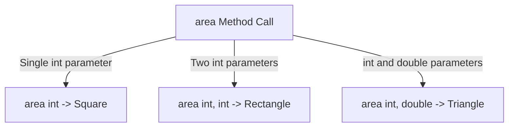

# Method Overloading Challenge

This document outlines a coding challenge designed to practice method overloading rules by implementing geometric area calculation methods sharing a single identifier name.

---

## Challenge Overview

Create a program that calculates the area of:
1. A Square ($side \times side$)
2. A Rectangle ($length \times breadth$)
3. A Triangle ($\frac{1}{2} \times base \times height$)

Rather than declaring separate method names (such as `calculateSquareArea()`, `calculateRectangleArea()`, `calculateTriangleArea()`), implement all calculations using a single method name: **`area`**.

---

## Requirements

### 1. Variables Declarations
* Input parameters: `int length`, `int breadth`, `double height`.
* Result storage variables: `double sqArea`, `double rectArea`, `double triArea`.

### 2. Overloaded Method Definitions
* **Square Area**:
  * Signature: `area(int length)`
  * Formula: $Area = length \times length$
* **Rectangle Area**:
  * Signature: `area(int length, int breadth)`
  * Formula: $Area = length \times breadth$
* **Triangle Area**:
  * Signature: `area(int breadth, double height)`
  * Formula: $Area = 0.5 \times breadth \times height$

---

## Method Binding Mapping

During compilation, the compiler matches the invocation signature against the definitions:



---

## Reference Implementation

```java
public class AreaCalculator {
    public static void main(String[] args) {
        int length = 10;
        int breadth = 5;
        double height = 8.0;

        double sqArea = area(length);
        double rectArea = area(length, breadth);
        double triArea = area(breadth, height);

        System.out.println("Square Area:    " + sqArea);
        System.out.println("Rectangle Area: " + rectArea);
        System.out.println("Triangle Area:  " + triArea);
    }

    // Square
    public static double area(int length) {
        if (length < 0) return 0.0;
        return (double) (length * length);
    }

    // Rectangle
    public static double area(int length, int breadth) {
        if (length < 0 || breadth < 0) return 0.0;
        return (double) (length * breadth);
    }

    // Triangle
    public static double area(int breadth, double height) {
        if (breadth < 0 || height < 0.0) return 0.0;
        return 0.5 * breadth * height;
    }
}
```

### Output
```text
Square Area:    100.0
Rectangle Area: 50.0
Triangle Area:  20.0
```

---

## Code Execution Tracing

When executing `double triArea = area(breadth, height);`:
1. The arguments pass integer value `5` and double-precision value `8.0`.
2. The compiler maps this call to the signature matching `area(int, double)`.
3. The method evaluates `0.5 * 5 * 8.0` and returns `20.0`.
4. The result value is written to the variable `triArea`.

---

## Common Compilation Errors to Avoid

> [!WARNING]
> ### 1. Identical Parameter Lists with Mismatched Names
> ```java
> public static double area(int side) { ... }
> public static double area(int length) { ... } // Duplicate method error!
> ```
> Changing only the parameter names does not overload a method because parameter names are ignored during compile-time binding checks.

> [!IMPORTANT]
> ### 2. Same Signature with Mismatched Return Types
> ```java
> public static int area(int length) { ... }
> public static double area(int length) { ... } // Duplicate method error!
> ```
> Return types are not considered by the compiler during signature binding resolution.

---

## Challenge Extensions

### Extension 1: Circle Area
Add a fourth overloaded method named `area(double radius)` that calculates and returns the area of a circle ($\pi r^2$). Use the value `Math.PI` for accuracy.

### Extension 2: Shape Perimeters
Implement a separate set of overloaded methods named `perimeter` to calculate:
* Square perimeter: `perimeter(int side)`
* Rectangle perimeter: `perimeter(int length, int breadth)`
* Circle circumference: `perimeter(double radius)`

---

**Back to Module Home:** [Introduction to Java Programming](README.md)
