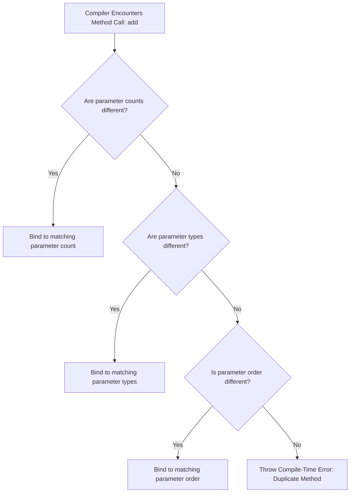
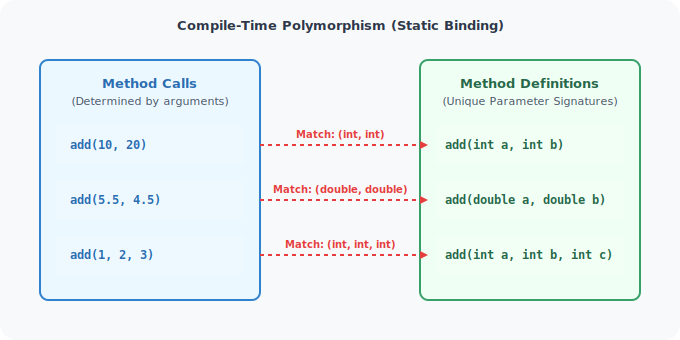

# Function Design and Modular Programming in Java

This module covers Java keywords, parsing utilities, console reading abstractions, method design, modular problem-solving, and method overloading (compile-time polymorphism).

---

## Learning Objectives

By the end of this module, you will be able to:
* Differentiate between reserved Java keywords and expressions.
* Parse strings into numeric primitives using wrapper classes (`Integer.parseInt`, `Double.parseDouble`, etc.).
* Handle user inputs using console stream abstractions.
* Design and define modular methods with parameters and return types.
* Structure software solutions using method-based abstraction principles.
* Apply method overloading rules to implement compile-time polymorphism.
* Trace and explain JVM stack frame execution during method invocations.

---

## Topics Index

Below is the directory map of the lessons contained in this module:

| Lesson File | Core Concepts Covered | Link |
| :--- | :--- | :--- |
| **01. Keywords &amp; Expressions** | Predefined Java syntax, statement structures, expression evaluations. | [Open Guide](file:///d:/New%20folder/PROJECTS/JAVA_Zero-to-Advanced/03_function_design/01_Keywords-and-Expressions.md) |
| **02. String to Primitive Conversion** | Wrapper parsing utilities, handling NumberFormatException exceptions. | [Open Guide](file:///d:/New%20folder/PROJECTS/JAVA_Zero-to-Advanced/03_function_design/02_String-to-Primitive-Conversion.md) |
| **03. User Input** | Capturing command-line and interactive console stream arguments. | [Open Guide](file:///d:/New%20folder/PROJECTS/JAVA_Zero-to-Advanced/03_function_design/03_User-Input.md) |
| **04. Methods in Java** | Defining methods, calling syntax, stack allocation lifecycles. | [Open Guide](file:///d:/New%20folder/PROJECTS/JAVA_Zero-to-Advanced/03_function_design/04_Methods-in-Java.md) |
| **05. Method-Based Problem Solving** | Code decomposition, separation of concerns, writing clean methods. | [Open Guide](file:///d:/New%20folder/PROJECTS/JAVA_Zero-to-Advanced/03_function_design/05_Method-Based-Problem-Solving.md) |
| **06. Method Challenges** | Logic building exercises using modular class methods. | [Open Guide](file:///d:/New%20folder/PROJECTS/JAVA_Zero-to-Advanced/03_function_design/06_Method-Practice-Challenges.md) |
| **07. Challenge Solutions** | Complete solution references for the method exercises. | [Open Guide](file:///d:/New%20folder/PROJECTS/JAVA_Zero-to-Advanced/03_function_design/07_Method-Challenge-Solutions.md) |
| **08. Method Overloading** | Implementing compile-time polymorphism, signature rules. | [Open Guide](file:///d:/New%20folder/PROJECTS/JAVA_Zero-to-Advanced/03_function_design/08_Method-Overloading.md) |
| **09. Overloading Challenges** | Advanced validation exercises utilizing overloaded signatures. | [Open Guide](file:///d:/New%20folder/PROJECTS/JAVA_Zero-to-Advanced/03_function_design/09_Method-Overloading-Challenge.md) |

---

## Core Theory Summary

### 1. Structure of a Java Method

A method is a block of code containing statements that executes only when called. It promotes code reusability and encapsulation.

```java
accessModifier returnType methodName(parameterList) {
    // Method body containing logic
    return value; // (Required if returnType is not void)
}
```

* **Access Modifier**: Dictates if other classes can call the method (e.g., `public`, `private`).
* **Return Type**: The data type of the value returned by the method. If no value is returned, use `void`.
* **Method Name**: The identifier used to call the method (uses camelCase).
* **Parameter List**: Input variables passed to the method, defined by their type and name.
* **Method Signature**: The combination of the method name and the parameter list. The return type is **not** part of the signature.

---

### 2. Method Overloading (Compile-Time Polymorphism)

Method overloading allows a class to have multiple methods with the same name, provided their parameter lists are unique.



#### Overloading Rules
To successfully overload a method, definitions must vary by at least one of the following criteria:
* The **number** of parameters.
* The **data types** of parameters.
* The **sequence/order** of parameter types.

> [!WARNING]
> Changing only the return type or access modifier of a method does **not** overload the method. The compiler will flag this as a duplicate method declaration error.



---

## Best Practices for Method Design

* **Keep Methods Small**: A method should perform one specific task (Single Responsibility Principle). If a method does multiple things, break it down.
* **Use Verb-based Names**: Method names should represent actions (e.g., `calculateInterest`, `saveRecord` rather than `interest` or `record`).
* **Validate Parameters**: Check inputs at the beginning of a method (e.g., check for null values or out-of-bound ranges) before running business logic.
* **Limit Parameter Count**: Try to limit the number of parameters to three or four. If a method requires more, consider grouping them into a helper class or object.

---

**Next Module:** Let's learn about conditional routing, switch cases, and loops in [04_control-flow-statements](file:///d:/New%20folder/PROJECTS/JAVA_Zero-to-Advanced/04_control-flow-statements)
