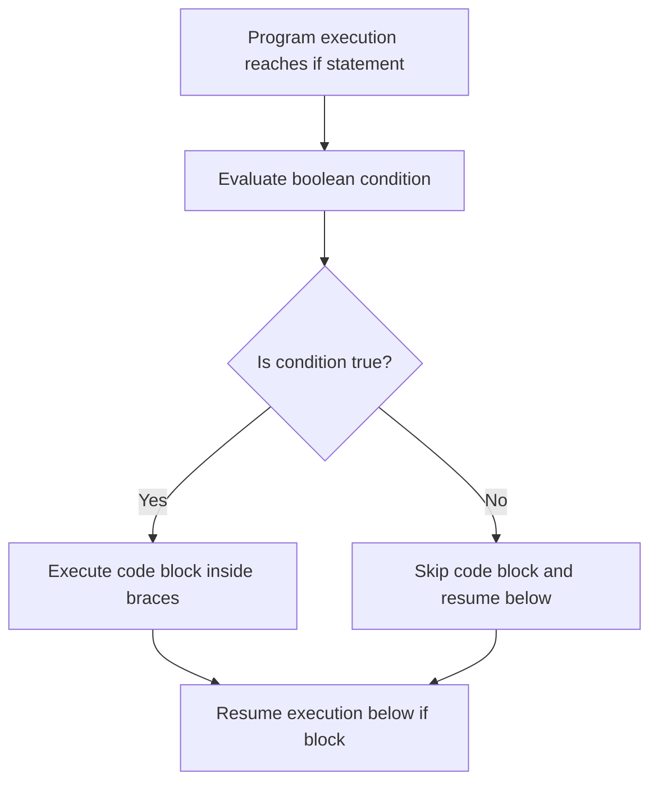

# The If Statement in Java

This guide details the specifications of the `if` decision-making statement, boolean validations, nested conditional checks, and common compilation traps.

---

## Introduction

Real-world software must make dynamic decisions based on data inputs—such as verifying a user's age before processing a vote, checking account balances at an ATM, or validating authentication tokens.

In Java, conditional routing begins with the **`if`** statement. It redirects the thread's execution pathway to run a block of statements only if a condition evaluates to `true`.

---

## Syntax and Structure

```java
if (condition) {
    // Statement block executed only if condition evaluates to true
}
```

* **`condition`**: Must be an expression that resolves directly to a **`boolean`** value (`true` or `false`).
* **`{ }` (Brace Blocks)**: Define the scope of statements grouped under the condition.

---

## Workflow Mechanics

When a thread encounters an `if` statement, it routes control based on the condition's boolean output:



---

## Code Examples

### 1. Basic Condition Check
```java
public class VotingSystem {
    public static void main(String[] args) {
        int age = 20;

        if (age >= 18) {
            System.out.println("User is eligible to register to vote.");
        }
    }
}
```

### 2. Using Boolean Variables Directly
Since the expression inside an `if` statement must resolve to a boolean, you do not need to use comparisons when evaluating a boolean variable:

```java
public class SecurityConsole {
    public static void main(String[] args) {
        boolean accessGranted = true;

        // Correct and clean:
        if (accessGranted) {
            System.out.println("Access approved. Welcome!");
        }

        // Avoid writing: if (accessGranted == true) - this is redundant
    }
}
```

---

## Nested If Statements

You can place an `if` statement inside the execution block of another `if` statement to evaluate multiple criteria sequentially:

```java
public class AirportSecurity {
    public static void main(String[] args) {
        int age = 22;
        boolean hasValidID = true;

        if (age >= 18) {
            if (hasValidID) {
                System.out.println("Entry permitted to boarding lounge.");
            }
        }
    }
}
```

---

## Common Compiler and Logical Mistakes

> [!WARNING]
> ### 1. Using Assignment (`=`) instead of Comparison (`==`)
> ```java
> int count = 5;
> if (count = 10) { ... } // Compilation Error: Type mismatch (cannot convert int to boolean)
> ```
> An assignment statement returns the value being assigned. In this case, `count = 10` returns `10`, which is an integer. Java requires a boolean expression.

> [!CAUTION]
> ### 2. The Rogue Semicolon Defect
> ```java
> int age = 15;
> if (age >= 18); { // Notice the semicolon ending the condition scope!
>     System.out.println("You can vote!"); // Prints anyway!
> }
> ```
> Placing a semicolon directly after the condition completes the `if` statement as a single empty instruction, making the following brace block independent code that runs unconditionally.

---

## Practice Challenges

### Challenge 1: Sign Evaluator
Write a program that declares an integer variable, checks if it is a positive number (greater than `0`), and prints `"Positive"` if true.

### Challenge 2: Divisibility Check
Write a program that takes an integer variable and prints `"Divisible by 5"` only if the number can be divided by 5 without a remainder.

### Challenge 3: Member Validation
Create a profile check where a boolean variable `isSubscribed = true` and integer `credits = 5` are evaluated. Print `"Premium Access Granted"` if both criteria are satisfied.

---

**Back to Module Home:** [Control Flow Statements](README.md)
