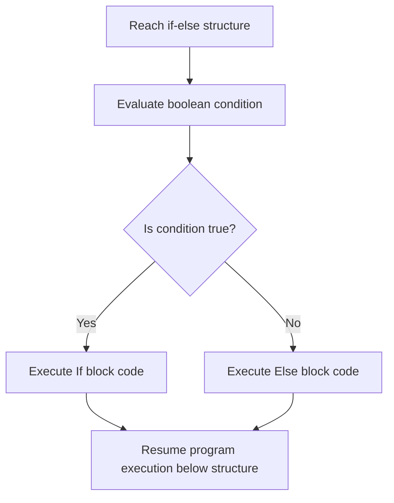

# The If-Else Statement in Java

This guide details the specifications of the `if-else` statement, two-way execution pathways, nested conditions, and comparison differences with single branching.

---

## Introduction

While a single `if` statement executes a block only when a condition is met, real-world logic often requires a secondary fallback pathway when the condition is not met—such as showing an "Insufficient Balance" warning when a bank withdrawal check fails.

In Java, binary routing is implemented using the **`if-else`** statement.

---

## Syntax and Structure

```java
if (condition) {
    // Block executed when the condition evaluates to true
} else {
    // Block executed when the condition evaluates to false
}
```

* **`else`**: A reserved keyword that cannot exist independently. It must follow an `if` block.
* **Mutual Exclusion**: One of the two blocks is guaranteed to execute, but both can never execute during a single evaluation.

---

## Workflow Mechanics

The JVM evaluates the condition first, directing control down one of the two exclusive paths:



---

## Implementation Examples

### 1. Basic Value Branching
```java
public class GradeCheck {
    public static void main(String[] args) {
        int score = 45;

        if (score >= 50) {
            System.out.println("Status: Pass");
        } else {
            System.out.println("Status: Fail");
        }
    }
}
```

### 2. Modulo-Based Division Check
```java
public class EvenOdd {
    public static void main(String[] args) {
        int number = 7;

        if (number % 2 == 0) {
            System.out.println(number + " is even.");
        } else {
            System.out.println(number + " is odd.");
        }
    }
}
```

---

## Nested If-Else Structures

You can nest `if-else` blocks inside other conditional blocks to construct complex hierarchical logic:

```java
public class ClubEntry {
    public static void main(String[] args) {
        int age = 20;
        boolean hasID = false;

        if (age >= 18) {
            if (hasID) {
                System.out.println("Access Permitted.");
            } else {
                System.out.println("Access Denied: Physical ID verification required.");
            }
        } else {
            System.out.println("Access Denied: Minimum age requirement not met.");
        }
    }
}
```

---

## Comparisons: Single If vs. If-Else

| Feature | Single `if` Statement | `if-else` Statement |
| :--- | :--- | :--- |
| **Logic Branches** | 1 branch (conditional execution only). | 2 branches (mutually exclusive choices). |
| **False Evaluation** | Code block is skipped, no fallback action. | Fallback `else` block executes immediately. |
| **Outcomes** | Zero or one action. | Exactly one action occurs. |

---

## Practice Challenges

### Challenge 1: Sign Evaluator Extension
Write a program that takes an integer and prints `"Positive"` if it is greater than or equal to `0`, and `"Negative"` otherwise.

### Challenge 2: Leap Year Check
Write a program that checks whether a given year is a leap year (divisible by 4) and prints an appropriate message for both cases.

### Challenge 3: Password Validation
Write a program where a String variable `inputPassword` is checked against `storedPassword = "Secret123"`. Print `"Login Successful"` if they match, and `"Invalid Credentials"` otherwise.

---

**Back to Module Home:** [Control Flow Statements](README.md)
