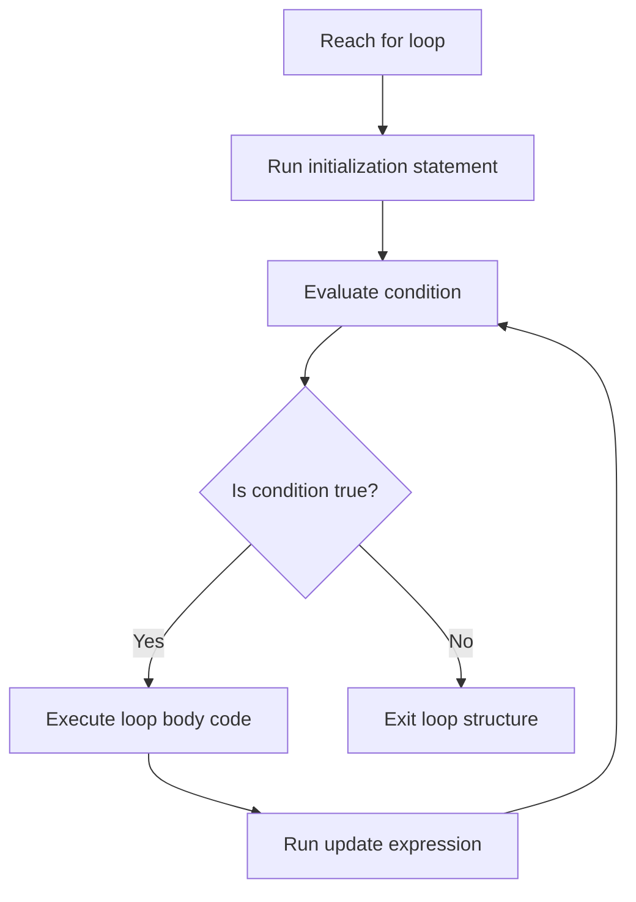

# The For Loop in Java

This guide details the specifications of the counter-controlled `for` loop, its execution stages, nested pattern loop nesting, and comparisons with while loops.

---

## Introduction

In software development, certain operations must be repeated multiple times—such as printing numbers, scanning list entries, or generating rows of dynamic data. Writing the same statement repeatedly is error-prone and hard to maintain.

In Java, counter-based iteration is automated using the **`for`** loop.

---

## Syntax and Structure

```java
for (initialization; condition; update) {
    // Body of loop executed while condition is true
}
```

* **`initialization`**: Executes once at the start. Usually declares and initializes the loop control variable (counter).
* **`condition`**: Evaluated before each iteration. If `true`, the loop body executes; if `false`, the loop terminates.
* **`update`**: Executes after each iteration of the loop body. Usually increments or decrements the loop control variable.

---

## Workflow Mechanics

A `for` loop executes in a defined, repeating lifecycle:



---

## Basic Loop Code Examples

### 1. Counter Progression (1 to 5)
```java
public class Counter {
    public static void main(String[] args) {
        for (int i = 1; i <= 5; i++) {
            System.out.println("Iteration: " + i);
        }
    }
}
```

### 2. Counting Down (10 to 1)
```java
public class CountDown {
    public static void main(String[] args) {
        for (int i = 10; i >= 1; i--) {
            System.out.println("Seconds: " + i);
        }
    }
}
```

### 3. Iteration with Modulo (Even Numbers)
```java
public class Evens {
    public static void main(String[] args) {
        for (int i = 2; i <= 10; i += 2) {
            System.out.println("Even number: " + i);
        }
    }
}
```

---

## Nested For Loops

You can place one loop inside another. The inner loop executes completely for each individual iteration of the outer loop.

```java
public class GridPattern {
    public static void main(String[] args) {
        for (int row = 1; row <= 3; row++) {
            for (int col = 1; col <= 3; col++) {
                System.out.print("* ");
            }
            System.out.println(); // Line break after inner loop completes
        }
    }
}
```

### Output
```text
* * * 
* * * 
* * * 
```

---

## The Infinite For Loop

If the terminating condition is omitted or never becomes `false`, the loop executes indefinitely, consuming CPU resources and potentially freezing the application:

```java
// Anti-Pattern: Infinite Loop
for (;;) {
    System.out.println("This runs forever.");
}
```

---

## Common Semicolon Mistake

> [!CAUTION]
> ### Semicolon Directly after Loop Header
> ```java
> for (int i = 1; i <= 5; i++); { // Rogue Semicolon!
>     System.out.println("Hello");
> }
> ```
> Adding a semicolon at the end of the loop header decouples the header from the code block. The loop runs an empty statement 5 times, then the brace block executes once unconditionally.

---

## Practice Challenges

### Challenge 1: Accumulator Sum
Write a program that calculates and prints the sum of all integers from `1` to `100` using a `for` loop.

### Challenge 2: Multiplication Table
Write a program that takes an integer variable `number` and prints its multiplication table from 1 to 10 (e.g., `5 x 1 = 5`).

### Challenge 3: Reverse Odd Generator
Write a program that prints all odd numbers between `50` and `1` in descending order.

---

**Back to Module Home:** [Control Flow Statements](README.md)
