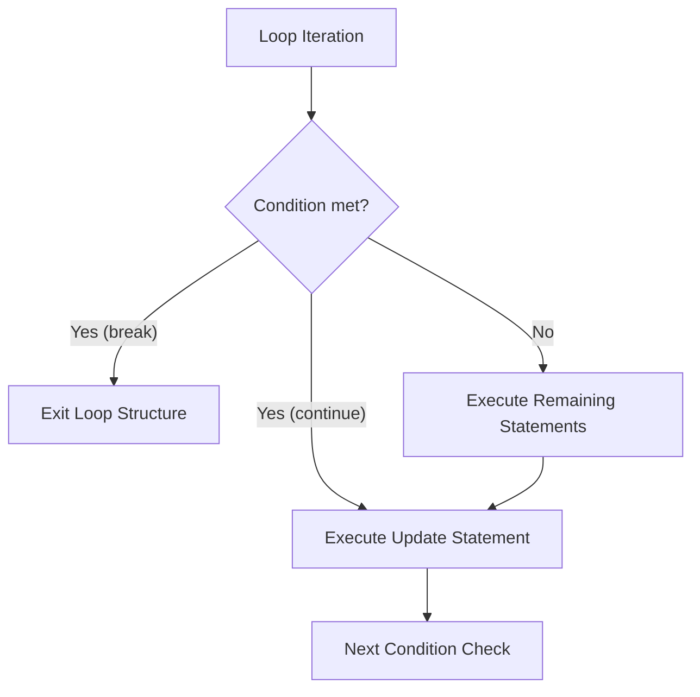

# Advanced For Loop Concepts in Java

This guide details advanced iteration patterns, including multiple loop control variables, loop labeling for nested structures, early branching (`break` and `continue`), and multidimensional pattern generation.

---

## Multiple Loop Control Variables

A `for` loop can initialize, evaluate, and update multiple variables simultaneously. This is useful for algorithms that process data from both ends of a structure (e.g. string reversal, array partitioning).

### Syntax
```java
for (initialization1, initialization2; condition; update1, update2) {
    // Body of loop
}
```

* **Rules**: All variables declared in the initialization section must be of the **same data type**.

### Code Example: Two-Pointer Counter
```java
public class MultiVariableLoop {
    public static void main(String[] args) {
        // Runs while i is less than j, incrementing i and decrementing j on each step
        for (int i = 0, j = 10; i < j; i++, j--) {
            System.out.println("i: " + i + " | j: " + j);
        }
    }
}
```

### Output
```text
i: 0 | j: 10
i: 1 | j: 9
i: 2 | j: 8
i: 3 | j: 7
i: 4 | j: 6
```

---

## Labeled Loop Control

In Java, you can attach labels to loops. When processing nested loops, a standard `break` or `continue` statement affects only the innermost loop containing it. By using **Labels**, you can control outer loops directly from within nested blocks.

### Syntax
```java
labelName:
for (int i = 0; i < 5; i++) {
    for (int j = 0; j < 5; j++) {
        if (condition) {
            break labelName; // Exits the outer loop directly
        }
    }
}
```

### Labeled Break Example
```java
public class LabeledBreakDemo {
    public static void main(String[] args) {
        outerLoop:
        for (int row = 1; row <= 3; row++) {
            for (int col = 1; col <= 3; col++) {
                if (row == 2 && col == 2) {
                    System.out.println("Terminating outer loop at: row=" + row + ", col=" + col);
                    break outerLoop; // Exit the outerLoop directly
                }
                System.out.println("Row: " + row + ", Col: " + col);
            }
        }
    }
}
```

### Output
```text
Row: 1, Col: 1
Row: 1, Col: 2
Row: 1, Col: 3
Row: 2, Col: 1
Terminating outer loop at: row=2, col=2
```

---

## Early Branching: Break vs. Continue

* **`break`**: Immediately terminates the loop and transfers control to the next line of code below the loop.
* **`continue`**: Skips the remaining statements in the current iteration of the loop body and jumps directly to the update expression, preparing for the next condition check.



### Code Example: Filtering and Early Exit
```java
public class SearchDemo {
    public static void main(String[] args) {
        System.out.println("Searching for number (skipping evens, stopping above 7)...");

        for (int i = 1; i <= 10; i++) {
            if (i % 2 == 0) {
                continue; // Skip even numbers
            }
            if (i > 7) {
                break; // Stop loop once index exceeds 7
            }
            System.out.println("Processing odd number: " + i);
        }
    }
}
```

### Output
```text
Searching for number (skipping evens, stopping above 7)...
Processing odd number: 1
Processing odd number: 3
Processing odd number: 5
Processing odd number: 7
```

---

## Practice Challenges

### Challenge 1: Number Swapping Search
Write a program that uses a two-pointer `for` loop (`i` starting at 1, `j` starting at 100) to find the point where `i` and `j` cross each other, print that value, and exit the loop.

### Challenge 2: Grid Search with Labeled Break
Create a $5 \times 5$ matrix search loop using nested loops. Search for the coordinate where `row * col == 12`. Print the coordinates and use a labeled break to exit the search outer loop immediately upon discovery.

### Challenge 3: Prime Skip
Write a program that prints numbers from 1 to 50 but uses `continue` to skip numbers that are multiples of 3 or 5.

---

**Back to Module Home:** [Control Flow Statements](file:///d:/New%20folder/PROJECTS/JAVA_Zero-to-Advanced/04_control-flow-statements/README.md)
