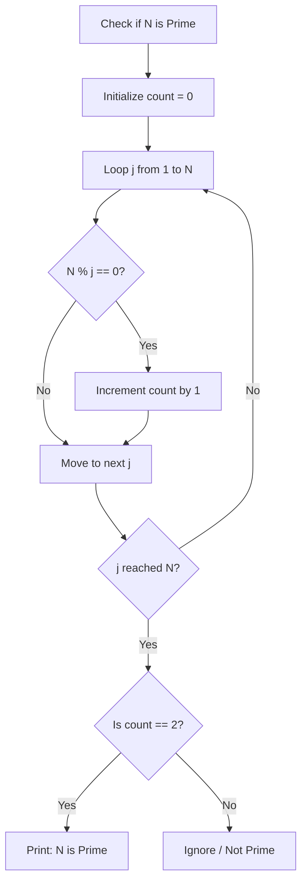

# For Loop Challenge 1: Prime Number Finder

This document details a coding challenge designed to implement a prime number identifier using loops, checking division remainders, and printing results.

---

## Challenge Goal

Write a program that evaluates and prints all prime numbers in the range **1 to 100** using a modular method design.

---

## Mathematical Definition

A **Prime Number** is a natural number greater than `1` that has exactly two positive divisors:
1. `1`
2. The number itself

If a number has any other divisors, it is called a **Composite Number**.

* **Prime Numbers**: `2`, `3`, `5`, `7`, `11`, `13`, `17`, `19`...
* **Composite Numbers**: `4` (divisors: 1, 2, 4), `6` (divisors: 1, 2, 3, 6), `8`, `9`...

---

## Logical Flow

To check if a number $N$ is prime, you can count the number of integer values between $1$ and $N$ that divide $N$ without a remainder:



---

## Complete Solution

```java
public class PrimeFinder {
    public static void main(String[] args) {
        int limit = 100;
        System.out.println("Printing all prime numbers below " + limit + ":");

        for (int i = 1; i <= limit; i++) {
            checkAndPrintPrime(i);
        }
    }

    public static void checkAndPrintPrime(int number) {
        if (number <= 1) {
            return; // 1 and negative numbers are not prime
        }

        int divisorCount = 0;

        for (int j = 1; j <= number; j++) {
            if (number % j == 0) {
                divisorCount++;
            }
        }

        if (divisorCount == 2) {
            System.out.println(number + " is a prime number.");
        }
    }
}
```

### Output Snippet
```text
Printing all prime numbers below 100:
2 is a prime number.
3 is a prime number.
5 is a prime number.
...
97 is a prime number.
```

---

## Optimization Strategy: Early Exit Check

The naive algorithm checks all numbers up to $N$, resulting in an execution complexity of $O(N)$ per number. We can optimize this:

* **Rule 1**: No factor of $N$ (except $N$ itself) can be greater than $N/2$. You only need to check division up to $N/2$.
* **Rule 2**: If you find *any* divisor other than `1` during the check, you can immediately conclude the number is not prime and exit the check loop using the **`break`** keyword.

```java
// Optimized Check Method
public static boolean isPrimeOptimized(int number) {
    if (number <= 1) {
        return false;
    }
    
    // Check divisors up to number / 2
    for (int divisor = 2; divisor <= number / 2; divisor++) {
        if (number % divisor == 0) {
            return false; // Found a factor, exit early
        }
    }
    return true; // No factors found, it is prime
}
```

---

## Practice Extensions

### Extension 1: Print Count
Modify the program to count and print the *total number* of primes found between 1 and 100.

### Extension 2: Square Root Limit Optimization
Research why you only need to check factors up to the square root of $N$ ($\sqrt{N}$) to prove if a number is prime. Implement this check in Java.

---

**Back to Module Home:** [Control Flow Statements](file:///d:/New%20folder/PROJECTS/JAVA_Zero-to-Advanced/04_control-flow-statements/README.md)
