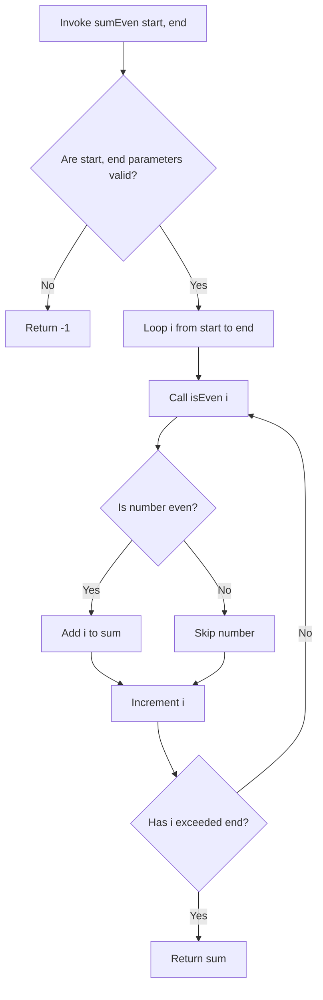

# For Loop Challenge 2: Sum of Even Numbers

This document details a coding challenge designed to practice modular programming by combining helper boolean validation methods with `for` loop ranges logic.

---

## Challenge Specifications

Write a program containing two static methods:

### Method 1: `isEven`
* **Purpose**: Checks if a given integer is positive and even.
* **Signature**: `public static boolean isEven(int number)`
* **Rules**: Return `true` if the number is positive and even; return `false` if it is odd, negative, or zero.

### Method 2: `sumEven`
* **Purpose**: Calculates the sum of all even numbers within a given range (inclusive).
* **Signature**: `public static int sumEven(int start, int end)`
* **Rules**: 
  * Validate parameters: both `start` and `end` must be greater than `0`, and `end` must be greater than or equal to `start`.
  * If the range is invalid, return `-1`.
  * Loop from `start` to `end`, check each number using `isEven()`, and accumulate the sum of even numbers.
  * Return the final accumulated sum.

---

## Logical Pipeline

The program structure divides responsibility into two layers:



---

## Complete Solution

```java
public class EvenAccumulator {
    public static void main(String[] args) {
        System.out.println("Sum (1 to 100):   " + sumEven(1, 100)); // Expected: 2550
        System.out.println("Sum (-1 to 100):  " + sumEven(-1, 100)); // Expected: -1 (invalid)
        System.out.println("Sum (10 to 10):   " + sumEven(10, 10)); // Expected: 10
    }

    public static boolean isEven(int number) {
        if (number <= 0) {
            return false;
        }
        return number % 2 == 0;
    }

    public static int sumEven(int start, int end) {
        // Range validation
        if (start <= 0 || end <= 0 || end < start) {
            return -1;
        }

        int sum = 0;

        for (int i = start; i <= end; i++) {
            if (isEven(i)) {
                sum += i;
            }
        }

        return sum;
    }
}
```

### Output
```text
Sum (1 to 100):   2550
Sum (-1 to 100):  -1
Sum (10 to 10):   10
```

---

## Trace Analysis

If you call `sumEven(1, 10)`:
1. Inputs `1` and `10` are checked: both are $> 0$ and $10 \geq 1$. Range is valid.
2. The loop runs from `i = 1` up to `10`.
3. For each iteration:
   * `isEven(1)` returns `false` (skipped).
   * `isEven(2)` returns `true` $\rightarrow$ `sum` becomes $0 + 2 = 2$.
   * `isEven(3)` returns `false` (skipped).
   * `isEven(4)` returns `true` $\rightarrow$ `sum` becomes $2 + 4 = 6$.
   * ...
   * `isEven(10)` returns `true` $\rightarrow$ `sum` becomes $20 + 10 = 30$.
4. The method returns `30`.

---

**Back to Module Home:** [Control Flow Statements](README.md)
