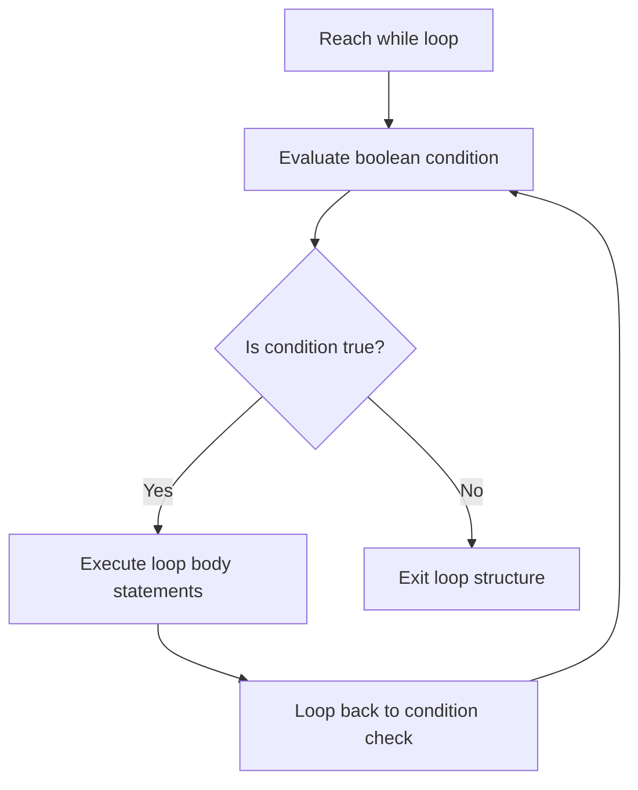

# The While Loop in Java

This guide details the specifications of the condition-controlled `while` loop, pre-test evaluation mechanics, execution flows, and structural differences compared to `for` loops.

---

## Introduction

In many software applications, you need to repeat a block of statements without knowing exactly how many times the loop should run beforehand. Examples include reading characters from a network stream until the buffer is empty, or prompting a user to re-enter a PIN until a valid code is submitted.

In Java, condition-controlled iteration is implemented using the **`while`** loop.

---

## Syntax and Structure

```java
while (condition) {
    // Body of loop executed while condition is true
}
```

* **`condition`**: A boolean expression evaluated *before* entering the loop body.
* **Pre-Test Nature**: Because the condition is checked first, if it evaluates to `false` initially, the loop body will not execute at all (zero executions).

---

## Workflow Mechanics

The `while` loop follows a pre-test checking cycle:



---

## Basic Loop Code Examples

### 1. Counter Progression (1 to 5)
```java
public class Counter {
    public static void main(String[] args) {
        int i = 1; // Initialization

        while (i <= 5) { // Condition
            System.out.println("Value: " + i);
            i++; // Update variable to avoid infinite loop
        }
    }
}
```

### 2. Login Retry Loop
```java
public class LoginLock {
    public static void main(String[] args) {
        int attempt = 1;
        int maxAttempts = 3;

        while (attempt <= maxAttempts) {
            System.out.println("Processing login attempt: " + attempt);
            attempt++;
        }
        System.out.println("System lock: max attempts reached.");
    }
}
```

---

## The Infinite While Loop

An infinite loop occurs when the condition never resolves to `false`. This usually happens when you forget to update the control variable inside the loop body:

```java
// Anti-Pattern: Infinite Loop
int i = 1;
while (i <= 5) {
    System.out.println(i);
    // Missing i++ update! i remains 1 forever.
}
```

---

## Comparisons: For Loop vs. While Loop

| Feature | `for` Loop | `while` Loop |
| :--- | :--- | :--- |
| **Primary Use Case** | When the iteration count is known beforehand. | When the iteration count is variable or unknown. |
| **Variable Scope** | Variables declared in loop header are local to the loop. | Loop control variables must be declared outside the header. |
| **Syntax Compactness** | High (initialization, condition, update in header). | Separate (initialization is external, update is internal). |

---

## Practice Challenges

### Challenge 1: Downward Counter
Write a program that uses a `while` loop to print numbers from `50` to `1` in descending order.

### Challenge 2: Range Sum
Write a program that calculates the sum of all odd integers between `1` and `100` using a `while` loop.

### Challenge 3: Factorial Calculator
Write a program that calculates and prints the factorial of a positive integer variable `n` (e.g., $5! = 5 \times 4 \times 3 \times 2 \times 1$) using a `while` loop.

---

**Back to Module Home:** [Control Flow Statements](README.md)
