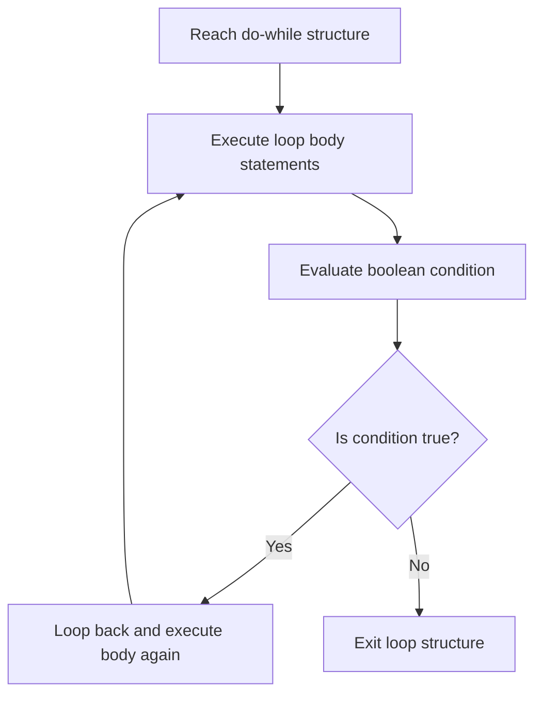

# The Do-While Loop in Java

This guide details the specifications of the post-test `do-while` loop, its at-least-once execution guarantee, syntax requirements, and structural comparison differences with pre-test `while` loops.

---

## Introduction

In some program architectures, a block of statements must execute *at least once* before evaluating a termination criteria. A classic example is a console menu interface: the menu must render and prompt for a choice before the application checks if the user selected the exit command.

In Java, post-test condition iteration is implemented using the **`do-while`** loop.

---

## Syntax and Structure

```java
do {
    // Body of loop executed at least once
} while (condition); // Notice the mandatory terminating semicolon!
```

* **Post-Test Nature**: The statements inside the `do` block are executed first. Afterwards, the `while` condition is evaluated.
* **`while (condition);`**: Requires a terminating semicolon `;` at the end of the line. Omitting this semicolon results in a compilation error.

---

## Workflow Mechanics

The `do-while` loop executes the body prior to evaluating the conditional expression:



---

## Basic Loop Code Examples

### 1. Guarantee of Single Execution
Even if the condition is false initially, the loop body runs once:

```java
public class SingleExecution {
    public static void main(String[] args) {
        int i = 10;

        do {
            System.out.println("Execution value: " + i);
            i++;
        } while (i < 5); // False initially (10 is not less than 5)
    }
}
```

### Output
```text
Execution value: 10
```

### 2. Menu Input Interaction
```java
import java.util.Scanner;

public class ConsoleMenu {
    public static void main(String[] args) {
        Scanner input = new Scanner(System.in);
        int choice;

        do {
            System.out.println("--- System Options ---");
            System.out.println("1. Start Diagnostics");
            System.out.println("2. System Exit");
            System.out.print("Enter choice: ");
            choice = input.nextInt();
        } while (choice != 2);

        System.out.println("Exiting Console menu.");
        input.close();
    }
}
```

---

## Comparisons: While vs. Do-While

| Feature | `while` Loop | `do-while` Loop |
| :--- | :--- | :--- |
| **Check Position** | Pre-test (evaluated at entry). | Post-test (evaluated at exit). |
| **Minimum Runs** | 0 iterations. | 1 iteration (guaranteed). |
| **Semicolon Rule** | No semicolon allowed after condition. | Semicolon is mandatory after condition. |
| **Best For** | Processing records, streams (where empty is possible). | User menus, interactive input prompts. |

---

## Practice Challenges

### Challenge 1: Upward Progress
Write a program that prints numbers from `1` to `20` using a `do-while` loop.

### Challenge 2: Range Accumulator
Write a program that calculates the sum of all integers between `1` and `100` using a `do-while` loop.

### Challenge 3: Password retry check
Write a program that prompts for user input password (e.g. read via Scanner inside `do`). Keep prompting if password is not equal to `"12345"`. Print `"Unlocked"` once correct password is submitted.

---

**Back to Module Home:** [Control Flow Statements](README.md)
