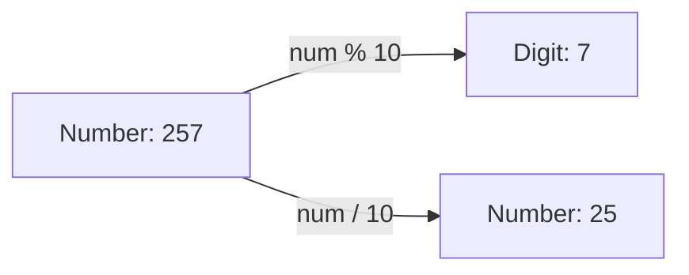

# Number-Based Loop Challenges in Java

This document details practical number-manipulation challenges, exploring digit extraction algorithms, modulus division metrics, and Greatest Common Divisor computations using loops.

---

## Technical Concept: Digit Manipulation

To process numbers digit-by-digit in binary computers, developers rely on base-10 mathematics:
* **Extract Last Digit**: `number % 10` returns the remainder when divided by 10 (which is the rightmost digit).
* **Remove Last Digit**: `number / 10` performs integer division by 10, dropping the fractional part and effectively shifting the number one decimal place to the right.

### Digit Shift Pipeline


---

## Challenge 1: Sum of First and Last Digit

### Problem Statement
Write a method that takes a positive integer and returns the sum of its first (leftmost) and last (rightmost) digits. If the input is negative, return `-1`.

### Method Signature
```java
public static int sumFirstAndLastDigit(int number)
```

### Reference Implementation
```java
public static int sumFirstAndLastDigit(int number) {
    if (number < 0) {
        return -1;
    }

    int lastDigit = number % 10;
    int firstDigit = number;

    // Shift digits leftwards until only one digit remains
    while (firstDigit >= 10) {
        firstDigit /= 10;
    }

    return firstDigit + lastDigit;
}
```

---

## Challenge 2: Sum of Odd Digits

### Problem Statement
Write a method that extracts all digits from a number, checks if they are odd, and returns their sum. If the number is negative, return `-1`.

### Method Signature
```java
public static int oddSum(int number) {
    if (number < 0) {
        return -1;
    }

    int sum = 0;

    while (number != 0) {
        int digit = number % 10; // Extract digit
        if (digit % 2 != 0) {    // Check if odd
            sum += digit;
        }
        number /= 10;            // Remove processed digit
    }

    return sum;
}
```

---

## Challenge 3: Shared Digit Checker

### Problem Statement
Write a method that accepts two positive integers, each in the range `10` to `99` (inclusive), and determines if they share at least one digit. Return `true` if they share a digit; return `false` otherwise.

### Method Signature
```java
public static boolean hasSharedDigit(int n1, int n2) {
    if (n1 < 10 || n1 > 99 || n2 < 10 || n2 > 99) {
        return false;
    }

    int left1 = n1 / 10;
    int right1 = n1 % 10;

    int left2 = n2 / 10;
    int right2 = n2 % 10;

    return left1 == left2 || left1 == right2 || right1 == left2 || right1 == right2;
}
```

---

## Challenge 4: Greatest Common Divisor (GCD)

### Problem Statement
Write a method that calculates the Greatest Common Divisor (GCD) of two integers. The inputs must be greater than or equal to `10`. If either input is less than 10, return `-1`.

### Method Signature
```java
public static int getGreatestCommonDivisor(int first, int second) {
    if (first < 10 || second < 10) {
        return -1;
    }

    int gcd = 1;

    // Test all divisors up to the smaller of the two numbers
    for (int divisor = 1; divisor <= first && divisor <= second; divisor++) {
        if (first % divisor == 0 && second % divisor == 0) {
            gcd = divisor; // Found common factor, update gcd
        }
    }

    return gcd;
}
```

---

## Verification Test Program

This class runs test scenarios for each number challenge:

```java
public class NumberChallengeSuite {
    public static void main(String[] args) {
        System.out.println("First + Last (257):     " + sumFirstAndLastDigit(257));     // Expected: 9
        System.out.println("Sum of Odd Digits (1234):" + oddSum(1234));                 // Expected: 4 (1 + 3)
        System.out.println("Shared Digit (12, 23):   " + hasSharedDigit(12, 23));       // Expected: true
        System.out.println("GCD (12, 30):            " + getGreatestCommonDivisor(12, 30)); // Expected: 6
    }

    public static int sumFirstAndLastDigit(int number) {
        if (number < 0) return -1;
        int lastDigit = number % 10;
        while (number >= 10) {
            number /= 10;
        }
        return number + lastDigit;
    }

    public static int oddSum(int number) {
        if (number < 0) return -1;
        int sum = 0;
        while (number != 0) {
            int digit = number % 10;
            if (digit % 2 != 0) {
                sum += digit;
            }
            number /= 10;
        }
        return sum;
    }

    public static boolean hasSharedDigit(int n1, int n2) {
        if (n1 < 10 || n1 > 99 || n2 < 10 || n2 > 99) return false;
        int l1 = n1 / 10, r1 = n1 % 10;
        int l2 = n2 / 10, r2 = n2 % 10;
        return l1 == l2 || l1 == r2 || r1 == l2 || r1 == r2;
    }

    public static int getGreatestCommonDivisor(int first, int second) {
        if (first < 10 || second < 10) return -1;
        int gcd = 1;
        for (int i = 1; i <= first && i <= second; i++) {
            if (first % i == 0 && second % i == 0) {
                gcd = i;
            }
        }
        return gcd;
    }
}
```

---

**Back to Module Home:** [Control Flow Statements](README.md)
