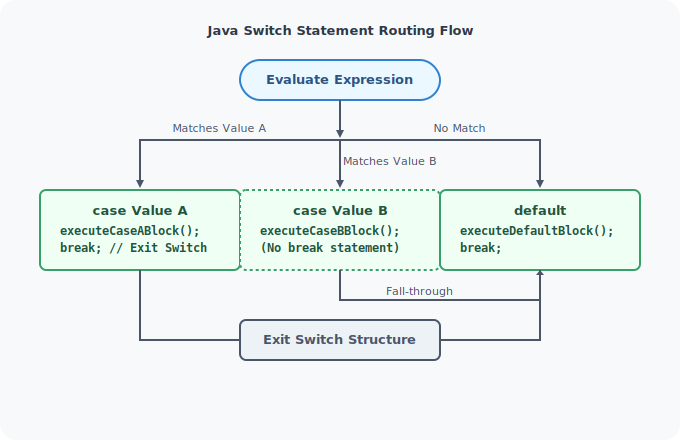
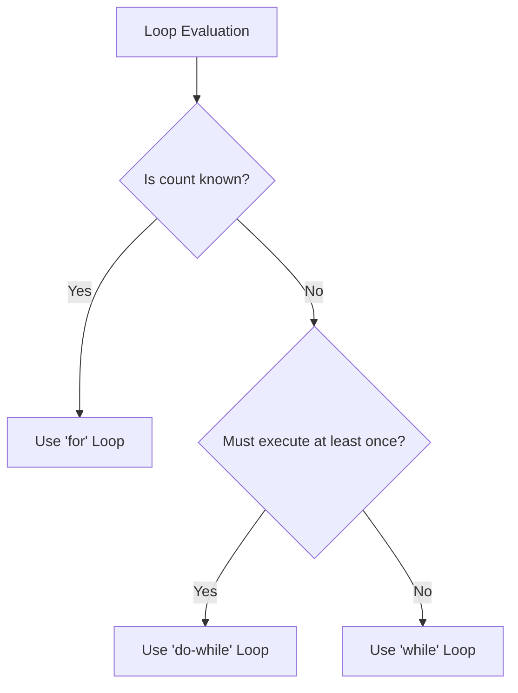

# Control Flow Statements in Java

This module details Java's control structures: conditional branching (if-else, switch-case), looping statements (for, while, do-while), and logical loops challenges.

---

## Learning Objectives

By the end of this module, you will be able to:
* Implement conditional checks using `if`, `else if`, and `else` statements.
* Construct multi-way branches using `switch` statements and avoid fall-through errors.
* Differentiate between count-controlled loops (`for`) and condition-controlled loops (`while`, `do-while`).
* Trace and explain pre-test versus post-test loop execution flows.
* Optimize loop processing using branching keywords (`break`, `continue`).
* Build complex numeric and modular logic (e.g., prime checks, digit extraction).

---

## Topics Index

Below is the directory map of the lessons contained in this module:

| Lesson File | Core Concepts Covered | Link |
| :--- | :--- | :--- |
| **01. If Statement** | Basic single-condition evaluations, truth-value routing. | [Open Guide](file:///d:/New%20folder/PROJECTS/JAVA_Zero-to-Advanced/04_control-flow-statements/01_If-Statement.md) |
| **02. If-Else Statement** | Binary decision forks, else-if ladders, nested structures. | [Open Guide](file:///d:/New%20folder/PROJECTS/JAVA_Zero-to-Advanced/04_control-flow-statements/02_If-Else-Statement.md) |
| **03. Switch Statement** | Switch routing, case evaluation, break keywords, fall-through features. | [Open Guide](file:///d:/New%20folder/PROJECTS/JAVA_Zero-to-Advanced/04_control-flow-statements/03_Switch-Statement.md) |
| **04. For Loop** | Counter-controlled loops, initialization, loop parameters. | [Open Guide](file:///d:/New%20folder/PROJECTS/JAVA_Zero-to-Advanced/04_control-flow-statements/04_For-Loop.md) |
| **05. For Loop Advanced** | Nested loop patterns, multi-variable loops, break/continue scopes. | [Open Guide](file:///d:/New%20folder/PROJECTS/JAVA_Zero-to-Advanced/04_control-flow-statements/05_for-loop-advanced.md) |
| **06. Prime Numbers Challenge** | Optimizing loops to check number factors, using early loop exit flags. | [Open Guide](file:///d:/New%20folder/PROJECTS/JAVA_Zero-to-Advanced/04_control-flow-statements/06_For-Loop-Challenge-1-Prime-Numbers.md) |
| **07. Sum of Even Numbers Challenge**| Accumulator loops, checking evens via modulo inside loops. | [Open Guide](file:///d:/New%20folder/PROJECTS/JAVA_Zero-to-Advanced/04_control-flow-statements/07_For-Loop-Challenge-2-Sum-of-Even-Numbers.md) |
| **08. While Loop** | Pre-test iteration mechanics, execution conditional flags. | [Open Guide](file:///d:/New%20folder/PROJECTS/JAVA_Zero-to-Advanced/04_control-flow-statements/08_While-Loop.md) |
| **09. Do-While Loop** | Post-test iteration mechanics, guarantee of executing at least once. | [Open Guide](file:///d:/New%20folder/PROJECTS/JAVA_Zero-to-Advanced/04_control-flow-statements/09_Do-While-Loop.md) |
| **10. Number-Based Loop Challenges**| Digit extraction algorithm, loop accumulation logic. | [Open Guide](file:///d:/New%20folder/PROJECTS/JAVA_Zero-to-Advanced/04_control-flow-statements/10_Number-Based-Loop-Challenges.md) |

---

## Core Theory Summary

### 1. Conditionals: If-Else vs. Switch

* **If-Else Ladders**: Best for range checks (e.g., `score > 90`), complex logic evaluations (using `&&`, `||`), or checking boolean states.
* **Switch Statements**: Best for evaluating a single variable against multiple discrete values (integers, strings, enums). It is highly optimized by the JVM using jump tables.

---

### 2. Loops: For vs. While vs. Do-While

#### Comparison of Loop Types

| Loop Type | Evaluation Timing | Execution Guarantee | Best Use Case |
| :--- | :--- | :--- | :--- |
| **`for`** | Pre-test (before entering block) | 0 or more times | Iterating a fixed number of times (e.g. counters, array indexing). |
| **`while`** | Pre-test (before entering block) | 0 or more times | Iterating until a specific condition becomes false (e.g. read streams). |
| **`do-while`** | Post-test (after running block) | 1 or more times | Running code that must execute at least once (e.g. user menus). |

---

## Best Practices for Control Flow

* **Use Braces `{}` Always**: Even for single-line statements inside `if` or loops, always write braces to prevent logical errors during code modification.
* **Avoid Nested Loops Where Possible**: Nested loops increase time complexity exponentially ($O(n^2)$). Try to extract inner loops into helper methods or optimize data structures.
* **Use Switch Breaks**: Always include `break;` in switch cases unless you are intentionally implementing a fall-through design. Document fall-throughs explicitly.
* **Prevent Infinite Loops**: Ensure loop conditions contain updating variables (e.g. index increments, buffer reads) that eventually evaluate to `false`.

---

**Next Module:** Let's learn about classes, variables scope, and class members in [05_building-blocks-of-java](file:///d:/New%20folder/PROJECTS/JAVA_Zero-to-Advanced/05_building-blocks-of-java)
