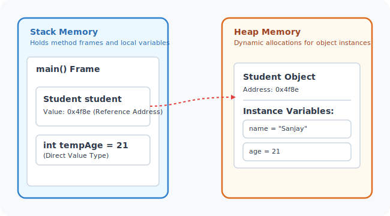
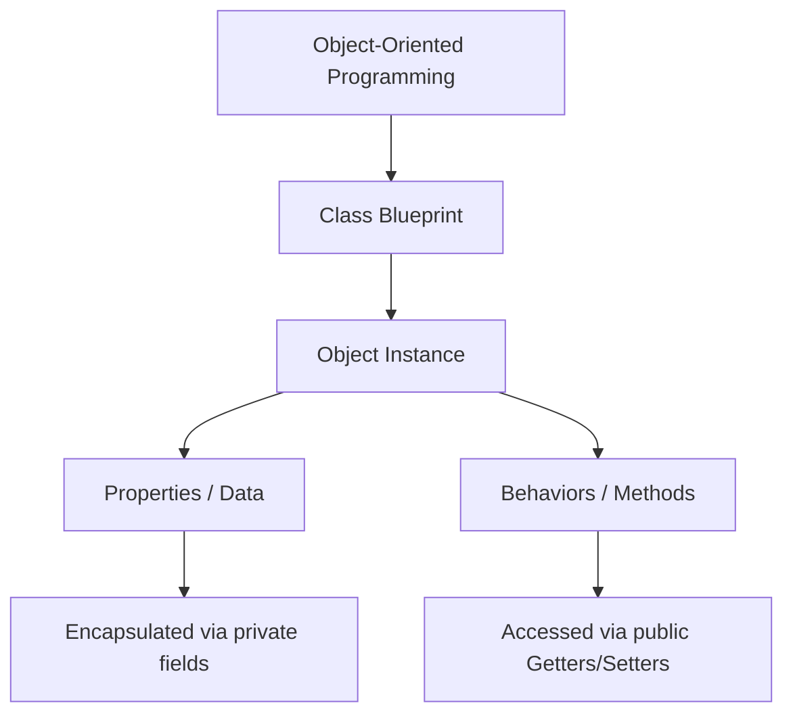

# Classes and Objects in Java

## Introduction

In the real world, everything around us can be represented as an **object**. Examples include a Car, a Mobile Phone, a Student, an Employee, or a Bank Account. In software development, Object-Oriented Programming (OOP) allows us to model these real-world objects in code.

Each real-world object possesses two characteristics:
1. **Properties (State/Data)**: What the object knows or holds (e.g., a phone's model, color, RAM).
2. **Behaviors (Actions)**: What the object can do (e.g., a phone can call, send a message, or take photos).

```text
Mobile Phone
├── Properties: Model, Color, RAM, Processor
└── Behaviors: Call(), Message(), PlayMusic(), TakePhoto()
```

Java uses **Classes** to define these object templates. Classes are the foundation of Object-Oriented Programming.

---

## What is a Class?

A **Class** is a blueprint, template, or prototype used to create objects. Think of a class as a design plan or a schema. It describes the data structures and methods that the objects created from it will possess, but it does not represent any physical object itself. It occupies no heap memory space until instantiated.

### Real-World Analogy: The House Blueprint

Before building a house, an architect creates a blueprint. The blueprint defines the layout (rooms, doors, windows, dimensions), but it is not an actual house you can live in. You can use that single blueprint to build one, ten, or a hundred physical houses.

Similarly, a class is the blueprint, and objects are the actual physical houses built from it.

---

## What is an Object?

An **Object** is a physical instance of a class. When you create an object, you are creating a concrete entity that occupies space in heap memory and holds its own unique state data.

```text
Class: Cellphone
├── Object 1 (Instance): OnePlus (RAM: 12GB, Color: Black)
├── Object 2 (Instance): Apple (RAM: 8GB, Color: Silver)
└── Object 3 (Instance): Samsung (RAM: 16GB, Color: Grey)
```

### Class and Object Relationship

The process of creating an object from a class blueprint is called **Instantiation**. In Java, this is done using the `new` keyword:

```java
Cellphone phone1 = new Cellphone();
Cellphone phone2 = new Cellphone();
```

Here, `Cellphone` is the class (blueprint), and `phone1` and `phone2` are reference variables pointing to separate object instances in heap memory.

---

## Why Classes Are Needed

Without classes, organizing and maintaining data for complex structures is extremely difficult. For example, if you wanted to track data for three different mobile phones, you would have to declare loose, unrelated variables for each:

```java
String phone1Model = "Nord";
int phone1Ram = 12;

String phone2Model = "iPhone 15";
int phone2Ram = 8;
```

Managing this for hundreds of objects is impossible. By using a class, you group related data and behaviors into a single, cohesive type:

```java
class Cellphone {
    String model;
    int ram;
    
    void makeCall() {
        System.out.println("Calling...");
    }
}
```

Now you can easily declare and group variables:

```java
Cellphone phone1 = new Cellphone();
Cellphone phone2 = new Cellphone();
```

---

## Basic Class Syntax

A class definition consists of access modifiers, the `class` keyword, the class name, variables (fields), and methods (behaviors).

```java
public class Student {
    // Instance Variables (Properties)
    String name;
    int age;

    // Methods (Behaviors)
    void study() {
        System.out.println(name + " is studying.");
    }
}
```

---

## Memory Representation of Objects

When you instantiate a class in Java using `new`, memory is allocated in two distinct JVM areas:
1. **Stack Memory**: Stores the reference variable (the pointer).
2. **Heap Memory**: Stores the actual object data (the state values of its fields).

```java
Cellphone onePlus = new Cellphone();
```



### What does the `new` keyword do?
The `new` keyword dynamically allocates memory on the Heap for the object, initializes its fields to their default values (e.g. `0` for numbers, `null` for objects), and returns a reference (memory address) to the newly created object.

---

## Encapsulation: Shielding Object Data

In professional Java design, object fields are rarely exposed directly. Exposing fields directly (e.g., `onePlus.model = "Nord"`) makes the object vulnerable to corrupt data or bypasses verification.

**Encapsulation** is the practice of bundling data and methods inside a class, and hiding implementation details from the outside world. This is achieved by:
* Marking variables as `private` (restricting access to the class itself).
* Exposing controlled access via `public` getter and setter methods.

```java
public class Cellphone {
    // Private properties (encapsulated)
    private String model;
    private int ram;

    // Public Setter (modifies data with validation)
    public void setModel(String model) {
        String validModel = model.toLowerCase();
        if (validModel.equals("nord") || validModel.equals("7pro")) {
            this.model = model;
        } else {
            this.model = "unknown";
        }
    }

    // Public Getter (reads data)
    public String getModel() {
        return this.model;
    }
}
```

### Understanding the `this` Keyword
In the statement `this.model = model;`:
* `this.model` refers to the **instance variable** belonging to the current object.
* `model` refers to the **local parameter** passed into the method.
The `this` keyword resolves naming conflicts and references the current instance executing the code.

---

## Complete Executable Example

Here is a complete program demonstrating class instantiation, encapsulation, and validation:

```java
public class Cellphone {
    private String model;
    private int ram;

    public void setModel(String model) {
        String validModel = model.toLowerCase();
        if (validModel.equals("nord") || validModel.equals("7pro")) {
            this.model = model;
        } else {
            this.model = "unknown";
        }
    }

    public String getModel() {
        return this.model;
    }
}

public class Main {
    public static void main(String[] args) {
        Cellphone onePlus = new Cellphone();
        Cellphone apple = new Cellphone();

        // Attempting to set an invalid model
        onePlus.setModel("8max");
        System.out.println("onePlus model: " + onePlus.getModel()); // Output: unknown

        // Setting a valid model
        apple.setModel("7pro");
        System.out.println("apple model: " + apple.getModel());     // Output: 7pro
    }
}
```

---

## Class vs. Object Comparison

| Feature | Class | Object |
| :--- | :--- | :--- |
| **What it is** | Blueprint / Template | Real physical instance |
| **Entity type** | Logical entity | Physical entity |
| **Creation** | Declared once in code | Created multiple times using `new` |
| **Memory** | No memory allocated for data | Allocated memory on the heap |

---

## Common Mistakes

### 1. Accessing Private Variables Directly
```java
// WRONG (Will result in compilation error)
phone.model = "Nord";

// CORRECT
phone.setModel("Nord");
```

### 2. Calling Methods on Uninitialized References (NullPointerException)
```java
// WRONG
Cellphone phone;
phone.setModel("Nord"); // Runtime Error: Variable not initialized

// CORRECT
Cellphone phone = new Cellphone();
phone.setModel("Nord");
```

---

## Concept Map



---

## Interview Questions (FAQ)

### What is a class?
A class is a logical blueprint, template, or design plan used to instantiate objects. It defines the state (fields) and behavior (methods) that all objects of its type will have.

### What is an object?
An object is a physical instance of a class. It represents a real-world entity, resides on the Heap memory, and maintains its own separate copy of variables.

### What does the `new` keyword do?
The `new` keyword instantiates a class. It allocates memory on the Heap for the object, runs the constructor, and returns the reference address.

### What is encapsulation?
Encapsulation is the process of wrapping data (variables) and code (methods) together into a single unit (class) while hiding inner details. Direct access to data is blocked using the `private` modifier, and controlled access is provided via `public` getter and setter methods.

---

## Practice Challenges

1. **Car Class**: Create a `Car` class with private fields `brand`, `engineSize`, and `isElectric`. Add public getters/setters. Enforce that `engineSize` must be positive.
2. **BankAccount Class**: Create a class representing a bank account with a private `balance` field. Implement a setter `deposit(double amount)` that rejects negative deposits, and a getter.
3. **Encapsulated Employee**: Create an `Employee` class containing `id`, `name`, and `salary`. Validate that `salary` cannot be less than zero.

---

## Key Takeaways

* **Classes** act as blueprints; **Objects** are instances.
* Objects are instantiated on the Heap using `new`, while reference pointers reside on the Stack.
* Use `private` fields and `public` getters/setters to implement **Encapsulation**.
* The `this` keyword refers to the current object instance and resolves naming conflicts.

---

**Back to Module Home:** [Building Blocks of Java](README.md)
