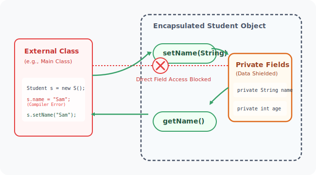
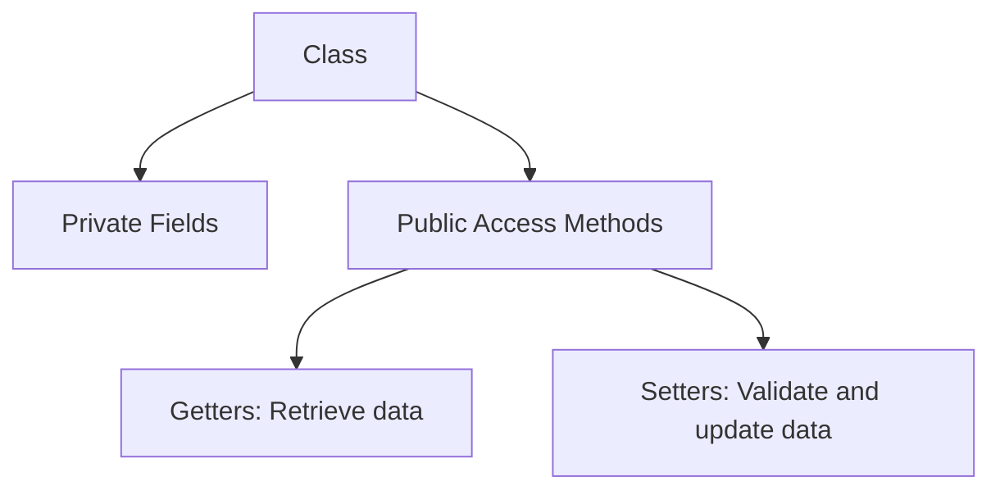

# Getters and Setters in Java

## Introduction

In Object-Oriented Programming (OOP), objects represent real-world entities. These objects contain data (instance variables) and methods (actions). In a professional application, direct access to an object's internal variables from external classes is discouraged. Instead, we use getters and setters to control how data is read and updated.

---

## Why Do We Need Getters and Setters?

Imagine an application where an external class can modify an object's properties directly:

```java
// Direct field access (Vulnerable)
student.age = -5;
bankAccount.balance = -1000.00;
```

Allowing direct modifications can lead to corrupted object states (e.g., negative ages, negative account balances). To prevent this, we declare fields as `private` and expose access via `public` getter and setter methods. This approach is called **Encapsulation**.



---

## What is a Setter?

A **Setter** is a public method inside a class used to update or write the value of a private variable. Setters usually do not return any value (`void`) and accept a parameter representing the new value.

### Setter Benefits:
* **Validation**: You can write rules to reject invalid inputs.
* **Control**: You can make fields read-only by simply omitting the setter method.

### Setter Syntax

```java
public void setVariable(Type variable) {
    this.variable = variable;
}
```

---

## What is a Getter?

A **Getter** is a public method inside a class used to read or retrieve the value of a private variable. Getters must return the same data type as the variable and do not accept parameters.

### Getter Syntax

```java
public Type getVariable() {
    return this.variable;
}
```

---

## Real-World Example: Student Age Validation

Let's look at a class that enforces a validation rule: a student's age must be greater than zero.

```java
public class Student {
    private String name;
    private int age;

    // Setter for name
    public void setName(String name) {
        this.name = name;
    }

    // Getter for name
    public String getName() {
        return this.name;
    }

    // Setter for age with validation
    public void setAge(int age) {
        if (age > 0) {
            this.age = age;
        } else {
            System.out.println("Error: Age must be positive. Defaulting to 1.");
            this.age = 1;
        }
    }

    // Getter for age
    public int getAge() {
        return this.age;
    }
}
```

### Main Program Usage

```java
public class Main {
    public static void main(String[] args) {
        Student student = new Student();

        // Attempting to set valid data
        student.setName("Sanjay");
        student.setAge(21);
        System.out.println(student.getName() + " is " + student.getAge() + " years old.");
        // Output: Sanjay is 21 years old.

        // Attempting to set invalid data
        student.setAge(-5);
        System.out.println("Corrected Age: " + student.getAge());
        // Output: Error: Age must be positive. Defaulting to 1.
        // Output: Corrected Age: 1
    }
}
```

---

## Advanced Example: Bank Account Transactions

Here is a more advanced example demonstrating a bank account class where deposits and withdrawals are validated.

```java
public class BankAccount {
    private String accountNumber;
    private double balance;

    public void setAccountNumber(String accountNumber) {
        this.accountNumber = accountNumber;
    }

    public String getAccountNumber() {
        return this.accountNumber;
    }

    // deposit acts as a controlled setter
    public void deposit(double amount) {
        if (amount > 0) {
            this.balance += amount;
        } else {
            System.out.println("Invalid deposit amount.");
        }
    }

    // withdraw acts as a controlled setter
    public void withdraw(double amount) {
        if (amount > 0 && amount <= this.balance) {
            this.balance -= amount;
        } else {
            System.out.println("Insufficient funds or invalid withdrawal amount.");
        }
    }

    public double getBalance() {
        return this.balance;
    }
}
```

---

## Getter vs. Setter Comparison

| Getter | Setter |
| :--- | :--- |
| **Operation** | Read operation | Write operation |
| **Return Type** | Returns the field's data type | Typically returns `void` |
| **Parameters** | Does not take parameters | Accepts a parameter to set |
| **Prefix** | Starts with `get` (or `is` for booleans) | Starts with `set` |

---

## Common Mistakes

### 1. Forgetting the `this` Keyword
```java
// WRONG
public void setName(String name) {
    name = name; // Assigns the parameter to itself; instance field remains unchanged
}

// CORRECT
public void setName(String name) {
    this.name = name;
}
```

### 2. Bypassing Setters Inside the Class
Even within the class methods, it is best practice to use getters/setters when updating fields to ensure validation rules are always triggered.

### 3. Exposing Mutable Objects Directly
Returning a direct reference to a mutable private object (like an array or arraylist) allows external users to bypass getters/setters. Consider returning a copy instead.

---

## Concept Map



---

## Interview Questions (FAQ)

### What is a getter?
A public method used to retrieve the value of a private instance variable.

### What is a setter?
A public method used to update the value of a private instance variable.

### Why do we make class variables private?
To prevent external classes from accessing or modifying variables directly. This protects the internal state of the object, ensuring high data integrity.

### What is encapsulation?
Encapsulation is one of the four main OOP concepts. It is the mechanism of wrapping code and data together in a single unit (class) while keeping variables hidden (`private`) and exposing them only via public interfaces (`getters/setters`).

---

## Practice Challenges

1. **Car Class**: Create a `Car` class with private properties `model`, `color`, and `fuelLevel`. Enforce a rule that `fuelLevel` must be between `0.0` and `100.0`.
2. **Employee Class**: Create an `Employee` class with private variables `name` and `salary`. Enforce that the salary setter rejects negative values.
3. **Smart TV Class**: Design a `SmartTV` class with a private field `channel`. Enforce a rule that channels can only range from `1` to `999`.

---

## Key Takeaways

* **Getters** retrieve private data.
* **Setters** update private data after validation checks.
* Private variables restrict direct access, improving code safety.
* Using getters and setters is a core design standard in Java programming.

---

**Back to Module Home:** [Building Blocks of Java](README.md)
