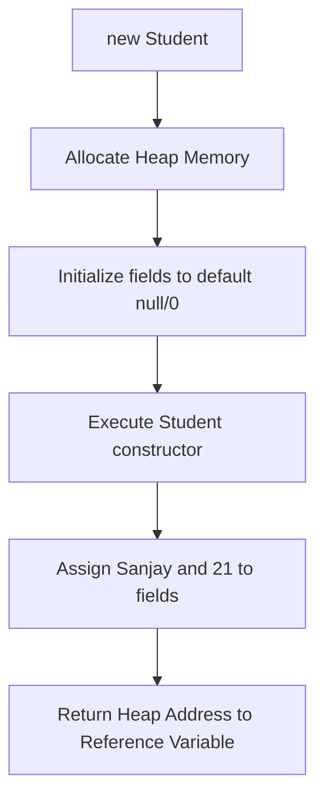
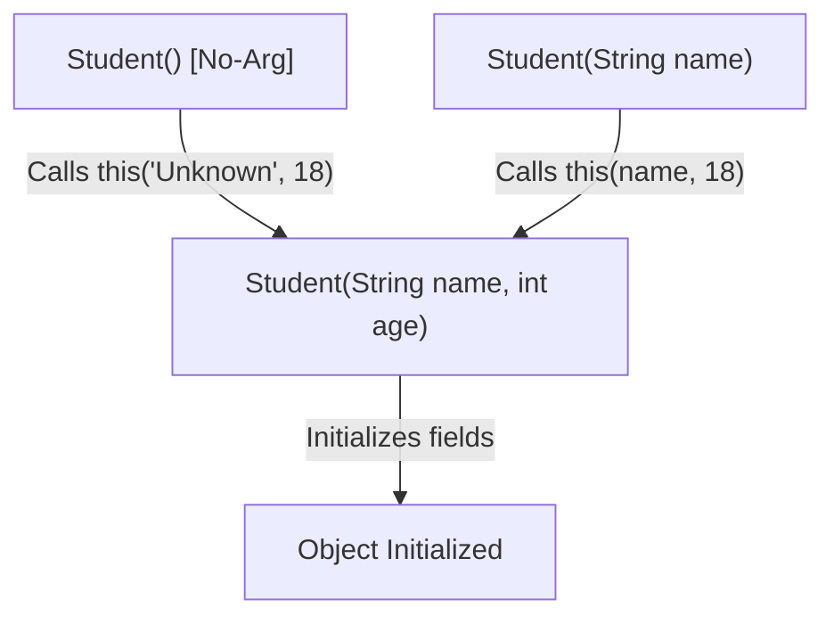

# Constructors in Java

## Introduction

In previous guides, we explored classes, objects, and encapsulation. When an object is instantiated, Java dynamically allocates memory on the Heap and initializes all instance variables to their default values (e.g. `0` for numbers, `null` for objects, `false` for booleans).

However, in real-world applications, we rarely want objects to start with blank or default states. We want our objects to start with meaningful, valid values immediately upon creation. To achieve this, Java provides a special construct called a **Constructor**.

---

## What is a Constructor?

A **Constructor** is a special block of code, similar to a method, that is executed automatically when an object is instantiated using the `new` keyword. Its primary purpose is to initialize the state (instance variables) of the object.

### Key Rules of Constructors:
1. The constructor name **must exactly match** the class name (case-sensitive).
2. Constructors **must not have a return type** (not even `void`).
3. They are called **automatically** at the time of object creation and cannot be invoked explicitly like standard class methods.

### Real-World Analogy: New Mobile Phone Setup
When you buy a new mobile phone, it does not come with empty systems. During manufacturing (object instantiation), setup logic (the constructor) runs automatically to set the default language, OS version, pre-loaded configurations, and model identifier so that the phone is ready for immediate use.

---

## Constructor Execution Flow

When you write `Student student = new Student("Sanjay", 21);`, the execution sequence goes as follows:



---

## Types of Constructors

Java supports three categories of constructors depending on how they are defined:

### 1. Default Constructor
If you do not define any constructor in your class, the Java compiler (`javac`) automatically generates a public, no-argument constructor during compilation. This is called the **Default Constructor**.

```java
// Written by Developer:
public class Student {
    String name;
}

// Generated by Compiler in Student.class:
public class Student {
    String name;
    
    public Student() {
        // Empty body - sets fields to default values (name = null)
    }
}
```

> [!WARNING]
> If you write **any** custom constructor (parameterized or no-arg), the compiler will **not** generate the default constructor. You must define a no-arg constructor manually if you still want to allow object instantiation without arguments.

### 2. No-Argument (No-Arg) Constructor
A no-argument constructor is written manually by the developer to initialize default state values.

```java
public class Student {
    private String name;

    // No-argument constructor
    public Student() {
        this.name = "Unknown";
    }
}
```

### 3. Parameterized Constructor
A constructor that accepts arguments, allowing you to pass initial values directly when instantiating the object.

```java
public class Student {
    private String name;
    private int age;

    // Parameterized constructor
    public Student(String name, int age) {
        this.name = name;
        this.age = age;
    }
}
```

Usage:
```java
// Instantiating with specific values
Student s = new Student("Sanjay", 21);
```

---

## Constructor Overloading

Just like methods, constructors can be **overloaded**. Constructor Overloading means declaring multiple constructors in the same class, each having a different parameter list (different number, order, or types of parameters). This provides flexibility in how objects are initialized.

```java
public class Student {
    private String name;
    private int age;

    // No-argument constructor
    public Student() {
        this.name = "Unknown";
        this.age = 0;
    }

    // Parameterized constructor (Name only)
    public Student(String name) {
        this.name = name;
        this.age = 18; // Default age
    }

    // Parameterized constructor (Name and Age)
    public Student(String name, int age) {
        this.name = name;
        this.age = age;
    }
}
```

---

## Constructor Chaining and the `this()` Keyword

**Constructor Chaining** is the process of calling one constructor from another constructor within the same class (or parent class). 

In Java, chaining to another constructor in the same class is done using the **`this()`** keyword. This helps avoid duplicate initialization code.



### Implementation Example:
```java
public class Student {
    private String name;
    private int age;

    // Main constructor that handles all field initializations
    public Student(String name, int age) {
        this.name = name;
        this.age = age;
    }

    // No-arg constructor delegates to main constructor
    public Student() {
        this("Unknown", 18); // Calls Student(String, int)
    }

    // Single-parameter constructor delegates to main constructor
    public Student(String name) {
        this(name, 18);      // Calls Student(String, int)
    }
}
```

> [!IMPORTANT]
> The call `this()` (or `super()`) **must be the very first statement** in the constructor body, or the code will fail to compile.

---

## Constructor vs. Method Comparison

| Feature | Constructor | Method |
| :--- | :--- | :--- |
| **Purpose** | Initializes object state | Performs operations / behavior |
| **Name** | Must match the Class name exactly | Can be any valid identifier |
| **Return Type** | Has no return type (not even `void`) | Must declare a return type (or `void`) |
| **Execution** | Called automatically by `new` | Called explicitly on an object reference |

---

## Common Mistakes

### 1. Adding a Return Type to a Constructor
Adding a return type (even `void`) turns the constructor into a standard method. It will not run during object instantiation.
```java
// WRONG - Declared as void
public class Student {
    public void Student() { 
        // This is a method named Student, NOT a constructor!
    }
}
```

### 2. Forgetting that Custom Constructors Suppress the Default Constructor
```java
public class Student {
    public Student(String name) { ... }
}

// In Main:
Student s = new Student(); // COMPILER ERROR: No default constructor exists
```

---

## Interview Questions (FAQ)

### What is constructor chaining?
Constructor chaining is calling one constructor from another constructor. Inside the same class, this is achieved using `this(...)`. Under inheritance, calling a parent constructor is done using `super(...)`.

### Can a constructor be private?
Yes. A private constructor prevents a class from being instantiated from outside its body. This is a core pattern in implementing **Utility Classes** (like `Math`) or design patterns like the **Singleton Pattern**.

### Why is the call to `this()` required to be the first statement?
Java requires fields to be initialized in a strict order to guarantee that parent initialization and class-level defaults run before specific sub-constructors configure fields. Placing `this()` or `super()` first enforces this order.

---

## Practice Challenges

1. **E-Commerce Product Class**: Create a `Product` class with `id`, `name`, and `price`. Implement constructor overloading (no-arg, name only, all three parameters) using constructor chaining (`this()`).
2. **Book Catalog**: Create a `Book` class with `title`, `author`, and `pages`. Build a parameterized constructor. Ensure that `pages` is validated to be greater than zero inside the constructor (reusing setter validation if possible).

---

## Key Takeaways

* **Constructors** initialize state when objects are created using `new`.
* If no constructor is written, the compiler generates a blank **Default Constructor**.
* Custom constructors suppress compiler-generated default constructors.
* **Constructor Overloading** allows multiple initialization paths.
* Use **`this(...)`** at the very first line of a constructor to chain constructors and avoid duplicate code.

---

**Back to Module Home:** [Building Blocks of Java](README.md)
