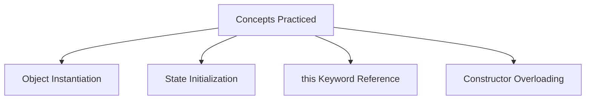

# Constructor Practice Challenges

## Introduction

Constructors are used to initialize objects when they are created. Practicing building class blueprints and implementing constructors helps reinforce your understanding of class templates, memory allocation, and object state.

These challenges will test your ability to design parameterized constructors, overload constructors, set default values, and apply object-oriented concepts to model real-world entities.

---

## Challenge 1: Student Constructor

### Problem Statement
Create a `Student` class with fields `name` (String) and `age` (int). Initialize both values using a single constructor and print them.

### Expected Output
```text
Name : Sanjay
Age  : 21
```

### Solution
```java
class Student {
    String name;
    int age;

    public Student(String name, int age) {
        this.name = name;
        this.age = age;
    }
}

public class Main {
    public static void main(String[] args) {
        Student student = new Student("Sanjay", 21);
        System.out.println("Name : " + student.name);
        System.out.println("Age  : " + student.age);
    }
}
```

---

## Challenge 2: Car Constructor

### Problem Statement
Create a `Car` class with fields `brand` (String), `model` (String), and `price` (double). Initialize all fields using a constructor.

### Solution
```java
class Car {
    String brand;
    String model;
    double price;

    public Car(String brand, String model, double price) {
        this.brand = brand;
        this.model = model;
        this.price = price;
    }
}
```

---

## Challenge 3: Mobile Constructor

### Problem Statement
Create a `Mobile` class with fields `model` (String), `ram` (int), and `storage` (int). Initialize all properties using a constructor.

### Solution
```java
class Mobile {
    String model;
    int ram;
    int storage;

    public Mobile(String model, int ram, int storage) {
        this.model = model;
        this.ram = ram;
        this.storage = storage;
    }
}
```

---

## Challenge 4: Employee Constructor

### Problem Statement
Create an `Employee` class with fields `name` (String), `department` (String), and `salary` (double). Initialize all properties using a constructor.

### Solution
```java
class Employee {
    String name;
    String department;
    double salary;

    public Employee(String name, String department, double salary) {
        this.name = name;
        this.department = department;
        this.salary = salary;
    }
}
```

---

## Challenge 5: Book Constructor

### Problem Statement
Create a `Book` class with fields `title` (String), `author` (String), and `price` (double). Initialize all fields using a constructor.

### Solution
```java
class Book {
    String title;
    String author;
    double price;

    public Book(String title, String author, double price) {
        this.title = title;
        this.author = author;
        this.price = price;
    }
}
```

---

## Challenge 6: Bank Account Constructor

### Problem Statement
Create a `BankAccount` class with fields `accountNumber` (String), `holderName` (String), and `balance` (double). Initialize all fields using a constructor.

### Solution
```java
class BankAccount {
    String accountNumber;
    String holderName;
    double balance;

    public BankAccount(String accountNumber, String holderName, double balance) {
        this.accountNumber = accountNumber;
        this.holderName = holderName;
        this.balance = balance;
    }
}
```

---

## Challenge 7: Constructor Overloading

### Problem Statement
Create a `Student` class containing a `name` field. Implement two constructors:
1. A no-argument constructor that sets `name` to `"Unknown"`.
2. A parameterized constructor that accepts a custom `name`.

### Solution
```java
class Student {
    String name;

    public Student() {
        this.name = "Unknown";
    }

    public Student(String name) {
        this.name = name;
    }
}
```

---

## Challenge 8: Laptop Constructor

### Problem Statement
Create a `Laptop` class with fields `brand` (String), `processor` (String), and `ram` (int). Initialize using a constructor.

### Solution
```java
class Laptop {
    String brand;
    String processor;
    int ram;

    public Laptop(String brand, String processor, int ram) {
        this.brand = brand;
        this.processor = processor;
        this.ram = ram;
    }
}
```

---

## Challenge 9: Circle Constructor

### Problem Statement
Create a `Circle` class with a `radius` field. Implement a constructor to initialize the radius, and a method `area()` that calculates and returns the circle's area. (Use `Math.PI`).

### Solution
```java
class Circle {
    double radius;

    public Circle(double radius) {
        this.radius = radius;
    }

    public double area() {
        return Math.PI * radius * radius;
    }
}
```

---

## Challenge 10: Rectangle Constructor

### Problem Statement
Create a `Rectangle` class with fields `length` (int) and `breadth` (int). Initialize them via a constructor, and write a method `area()` to return the area of the rectangle.

### Solution
```java
class Rectangle {
    int length;
    int breadth;

    public Rectangle(int length, int breadth) {
        this.length = length;
        this.breadth = breadth;
    }

    public int area() {
        return length * breadth;
    }
}
```

---

## Challenge Difficulty Progression

The challenges are structured in order of progressive difficulty:
1. **Student / Car**: Simple two/three-parameter setups.
2. **Mobile / Employee / Book / BankAccount**: Multi-field initializations.
3. **Constructor Overloading**: Managing multiple constructors.
4. **Laptop / Circle / Rectangle**: Combining initializations with functional methods.

---

## Concepts Practiced



---

## Interview Questions (FAQ)

### Why do we use constructors?
Constructors are used to set default or specific initial values for an object's instance variables at the exact moment the object is allocated memory on the Heap.

### Can a constructor return a value?
No. Constructors do not declare return types and cannot return values, as their output is implicitly the address of the newly initialized object.

### Can constructors be overloaded?
Yes. Multiple constructors can exist within the same class as long as they have different parameter counts, orders, or types.

---

## Key Takeaways

* Constructors guarantee that an object enters a valid state immediately upon instantiation.
* Constructor signatures must have matching names with the class and omit return types.
* Constructor overloading provides multiple ways to set up an object depending on available input data.

---

## Conclusion

These challenges provide practical experience with basic constructors and object initialization in Java. Mastering constructors prepares you for advanced OOP concepts, such as inheritance, polymorphism, and object lifecycle management.

---

**Back to Module Home:** [Building Blocks of Java](README.md)
