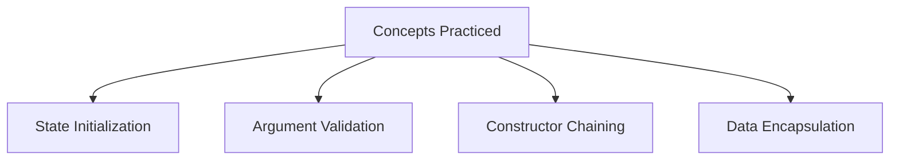

# Advanced Constructor Challenges

## Introduction

In real-world applications, constructors are rarely used only to assign values. They often validate incoming arguments, execute initial setup business logic, interact with overloaded constructors, and establish secure starting states.

These advanced challenges simulate real-world scenarios, testing your ability to write bulletproof constructors that protect objects from invalid initialization.

---

## Challenge 1: Student Management System

### Problem Statement
Create a `Student` class with private properties `name` (String), `rollNumber` (int), and `marks` (int). 
* Initialize them via a constructor.
* Write a method `getGrade()` returning:
  * `'A'` for marks $\ge 90$
  * `'B'` for marks $\ge 75$
  * `'C'` for marks $\ge 50$
  * `'F'` otherwise.
* Implement a `display()` method that prints all student info and their grade.

### Solution
```java
class Student {
    private String name;
    private int rollNumber;
    private int marks;

    public Student(String name, int rollNumber, int marks) {
        this.name = name;
        this.rollNumber = rollNumber;
        this.marks = marks;
    }

    public char getGrade() {
        if (marks >= 90) return 'A';
        if (marks >= 75) return 'B';
        if (marks >= 50) return 'C';
        return 'F';
    }

    public void display() {
        System.out.println("Name : " + name);
        System.out.println("Roll : " + rollNumber);
        System.out.println("Marks: " + marks);
        System.out.println("Grade: " + getGrade());
    }
}

public class Main {
    public static void main(String[] args) {
        Student student = new Student("Sanjay", 101, 88);
        student.display();
    }
}
```

### Output
```text
Name : Sanjay
Roll : 101
Marks: 88
Grade: B
```

---

## Challenge 2: Bank Account with Validation

### Problem Statement
Create a `BankAccount` class with fields `accountNumber` (String), `holderName` (String), and `balance` (double).
* Write a constructor that validates the initial balance: if the balance is negative, set it to `0.0` and display a warning.

### Solution
```java
class BankAccount {
    private String accountNumber;
    private String holderName;
    private double balance;

    public BankAccount(String accountNumber, String holderName, double balance) {
        this.accountNumber = accountNumber;
        this.holderName = holderName;
        if (balance >= 0) {
            this.balance = balance;
        } else {
            System.out.println("Warning: Initial balance cannot be negative. Defaulting to 0.0");
            this.balance = 0.0;
        }
    }

    public void display() {
        System.out.println("Account Number : " + accountNumber);
        System.out.println("Holder Name    : " + holderName);
        System.out.println("Balance        : " + balance);
    }
}

public class Main {
    public static void main(String[] args) {
        BankAccount account = new BankAccount("ACC1001", "Sanjay", -500);
        account.display();
    }
}
```

### Output
```text
Warning: Initial balance cannot be negative. Defaulting to 0.0
Account Number : ACC1001
Holder Name    : Sanjay
Balance        : 0.0
```

---

## Challenge 3: Constructor Overloading in Employee System

### Problem Statement
Create an `Employee` class with fields `name` (String) and `department` (String). Provide a no-argument constructor that sets defaults (`"Unknown"`, `"Not Assigned"`) and a parameterized constructor. Use constructor chaining with `this()`.

### Solution
```java
class Employee {
    private String name;
    private String department;

    // Default constructor chaining to parameterized constructor
    public Employee() {
        this("Unknown", "Not Assigned");
    }

    public Employee(String name, String department) {
        this.name = name;
        this.department = department;
    }

    public void display() {
        System.out.println(name + " - " + department);
    }
}

public class Main {
    public static void main(String[] args) {
        Employee emp1 = new Employee();
        Employee emp2 = new Employee("Sanjay", "IT");

        emp1.display();
        emp2.display();
    }
}
```

### Output
```text
Unknown - Not Assigned
Sanjay - IT
```

---

## Challenge 4: Laptop Inventory System

### Problem Statement
Create a `Laptop` class with fields `brand`, `processor`, `ram`, and `price`.
* Initialize all parameters via a constructor.
* Create a method `priceCategory()` that prints `"Premium Laptop"` if the price is above 80,000, and `"Budget Laptop"` otherwise.

### Solution
```java
class Laptop {
    private String brand;
    private String processor;
    private int ram;
    private double price;

    public Laptop(String brand, String processor, int ram, double price) {
        this.brand = brand;
        this.processor = processor;
        this.ram = ram;
        this.price = price;
    }

    public void display() {
        System.out.println(brand + " " + processor + " " + ram + "GB");
    }

    public void priceCategory() {
        if (price > 80000) {
            System.out.println("Premium Laptop");
        } else {
            System.out.println("Budget Laptop");
        }
    }
}

public class Main {
    public static void main(String[] args) {
        Laptop laptop = new Laptop("Dell", "i7", 16, 90000);
        laptop.display();
        laptop.priceCategory();
    }
}
```

### Output
```text
Dell i7 16GB
Premium Laptop
```

---

## Challenge 5: University Course Registration System

### Problem Statement
Create a `Course` class with private fields: `courseName`, `courseCode`, `maxSeats`, and `enrolledStudents`.
* Implement a constructor where `enrolledStudents` is validated to ensure it does not exceed `maxSeats`. If it does, limit `enrolledStudents` to `maxSeats`.

### Solution
```java
class Course {
    private String courseName;
    private String courseCode;
    private int maxSeats;
    private int enrolledStudents;

    public Course(String courseName, String courseCode, int maxSeats, int enrolledStudents) {
        this.courseName = courseName;
        this.courseCode = courseCode;
        this.maxSeats = maxSeats;
        if (enrolledStudents <= maxSeats) {
            this.enrolledStudents = enrolledStudents;
        } else {
            System.out.println("Warning: Enrolled students exceed capacity. Capping at max seats.");
            this.enrolledStudents = maxSeats;
        }
    }

    public void display() {
        System.out.println("Course : " + courseName);
        System.out.println("Code   : " + courseCode);
        System.out.println("Seats  : " + enrolledStudents + "/" + maxSeats);
    }
}

public class Main {
    public static void main(String[] args) {
        Course javaCourse = new Course("Java Programming", "CS201", 60, 75);
        javaCourse.display();
    }
}
```

### Output
```text
Warning: Enrolled students exceed capacity. Capping at max seats.
Course : Java Programming
Code   : CS201
Seats  : 60/60
```

---

## Challenge 6: Car Showroom System

### Problem Statement
Create a `Car` class with `brand`, `model`, and `price`.
* Implement a no-argument constructor setting defaults.
* Implement a parameterized constructor that validates `price` (must be greater than 0; otherwise default to 0).

### Solution
```java
class Car {
    private String brand;
    private String model;
    private double price;

    public Car() {
        this("Unknown", "Unknown", 0.0);
    }

    public Car(String brand, String model, double price) {
        this.brand = brand;
        this.model = model;
        if (price > 0) {
            this.price = price;
        } else {
            this.price = 0.0;
        }
    }

    public void display() {
        System.out.println(brand + " " + model + " ₹" + price);
    }
}

public class Main {
    public static void main(String[] args) {
        Car car1 = new Car();
        Car car2 = new Car("Hyundai", "Creta", 1500000);
        car1.display();
        car2.display();
    }
}
```

### Output
```text
Unknown Unknown ₹0.0
Hyundai Creta ₹1500000.0
```

---

## Concepts Practiced



---

## Interview Questions (FAQ)

### Why use constructors for validation?
Using constructors for validation ensures that objects are never created in an invalid state. This prevents runtime issues later in the object's lifecycle.

### Can constructors call class methods?
Yes, a constructor can call instance or static methods of the class. However, care must be taken when calling instance methods under inheritance, as subclass overrides might execute before the object is fully initialized.

### Can a constructor be private?
Yes. Private constructors prevent instantiation from classes outside the class definition. This is used in utility classes (only static members) or to implement singleton design patterns.

---

## Key Takeaways

* Constructors can enforce constraints and validate parameter data before assigning values to fields.
* Constructor overloading provides flexibility when instantiating objects with different amounts of initialization data.
* Chaining constructors via `this()` reduces duplicate code and makes class designs cleaner.

---

## Conclusion

These challenges illustrate how constructors function in real-world application architectures. Instead of merely copying arguments to variables, constructors enforce constraints and validate parameters. Mastering these patterns is essential before moving to inheritance, polymorphism, and advanced object-oriented design.

---

**Back to Module Home:** [Building Blocks of Java](README.md)
