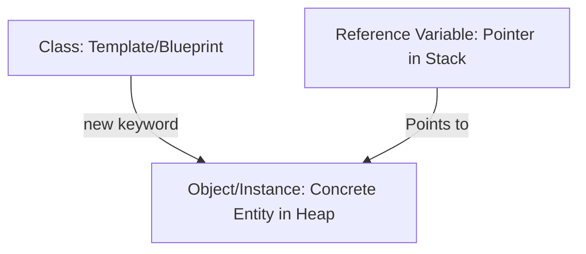

# Reference vs Class vs Object vs Instance in Java

## Introduction

When learning Object-Oriented Programming (OOP) in Java, beginners often use the terms **Class**, **Object**, **Instance**, and **Reference** interchangeably. Although they are closely related, they represent distinct concepts in compilation and execution.

Understanding the difference between these terms is essential for mastering memory management, inheritance, polymorphism, and Java collections.



---

## What is a Class?

A **Class** is a compile-time template or blueprint. It declares the properties (fields) and behaviors (methods) that objects built from it will share, but it does not represent a physical object. It occupies no heap memory space.

```java
// Blueprint Class Definition
class Student {
    String name;
    int age;
}
```

Here, `Student` is a Class.

---

## What is an Object?

An **Object** is a runtime entity created from a class. It occupies physical memory space on the Heap and stores data. An object is created using the `new` keyword.

```java
new Student(); // This expression instantiates and allocates a Student object
```

---

## What is an Instance?

An **Instance** is simply another name for an object created from a class. 
* **Object** is the generic term for the heap-allocated block of data.
* **Instance** emphasizes the relationship of that object to its originating class (e.g. "student1 is an *instance* of the class `Student`").

---

## What is a Reference?

A **Reference** is a variable that stores the memory address of an object. It does not contain the object itself, but rather points to the location on the Heap where the object resides.

```java
Student student1 = new Student();
```

Here, `student1` is the **Reference Variable** stored on the Stack. It holds the address (e.g., `0x4f8e`) of the physical `Student` object stored on the Heap.

---

## Deconstructing the Object Instantiation Line

Let's break down a single line of code to see exactly what each component represents:

```java
Student student1 = new Student();
```

| Component | Role / Definition |
| :--- | :--- |
| **`Student`** | The **Class** (data type template). |
| **`student1`** | The **Reference Variable** (holds the pointer/address on the Stack). |
| **`new`** | The operator that allocates memory for the **Object** on the Heap. |
| **`Student()`** | The **Constructor** call that initializes the fields of the object. |
| **`new Student()`** | The resulting **Object / Instance** allocated in memory. |

---

## Memory Representation: References vs. Objects

```java
Dog myDog = new Dog();
```

Memory is separated into two areas:
* **Stack**: Holds the reference variable `myDog` (which holds a value like `0x7a3f`).
* **Heap**: Holds the actual `Dog` object (which holds its internal instance variables).

```text
Stack (Reference)           Heap (Actual Object)
┌──────────────┐            ┌──────────────────┐
│ myDog: 0x7a3f│ ─────────> │ Dog Object       │
└──────────────┘            │ name = null      │
                            └──────────────────┘
```

> [!IMPORTANT]
> A reference variable is **not** the object itself. It is a pointer to the object. Multiple references can point to the same single object.

---

## Comprehensive Example: Shared References

Let's look at how reference assignment behavior differs from object copying.

```java
class Building {
    private String color;

    public Building(String color) {
        this.color = color;
    }

    public String getColor() {
        return color;
    }

    public void setColor(String color) {
        this.color = color;
    }
}

public class Main {
    public static void main(String[] args) {
        // Step 1: Create a single building object
        Building redBuilding = new Building("red");

        // Step 2: Copy the reference (NOT the object)
        Building anotherBuilding = redBuilding;

        System.out.println(redBuilding.getColor());     // Output: red
        System.out.println(anotherBuilding.getColor()); // Output: red

        // Step 3: Modifying via the second reference modifies the shared object
        anotherBuilding.setColor("yellow");

        System.out.println(redBuilding.getColor());     // Output: yellow
        System.out.println(anotherBuilding.getColor()); // Output: yellow

        // Step 4: Reassigning a reference to a new object
        Building greenBuilding = new Building("green");
        anotherBuilding = greenBuilding;

        System.out.println(redBuilding.getColor());     // Output: yellow
        System.out.println(greenBuilding.getColor());   // Output: green
        System.out.println(anotherBuilding.getColor()); // Output: green
    }
}
```

### Visualizing Step 2 (Shared Reference):
When `anotherBuilding = redBuilding;` is executed, both references point to the same object address on the Heap.

```text
redBuilding ────┐
                ├──> [ Building Object: color = "yellow" ]
anotherBuilding ┘
```

### Visualizing Step 4 (Reassigning Reference):
When `anotherBuilding = greenBuilding;` is executed, `anotherBuilding` points to the new green building object, while `redBuilding` continues to point to the original yellow building.

```text
redBuilding ───────> [ Building Object 1: color = "yellow" ]

greenBuilding ──┬──> [ Building Object 2: color = "green" ]
anotherBuilding ┘
```

---

## Common Mistakes

### 1. Dereferencing Null (NullPointerException)
Attempting to access a field or method on a reference variable that does not point to any object (has a value of `null`) throws a `NullPointerException`.
```java
// WRONG
Student s1 = null;
s1.name = "Sanjay"; // Throws NullPointerException!

// CORRECT
Student s1 = new Student();
s1.name = "Sanjay";
```

### 2. Assuming Reference Assignment Copies Objects
Writing `b2 = b1` copies only the memory address pointer. Any changes made through `b2` affect the object pointed to by `b1`.

---

## Interview Questions (FAQ)

### What is the difference between a class and an object?
A class is a compile-time design template. An object is a runtime instance created from the class template that occupies memory on the Heap.

### What is the difference between an object and a reference?
An object is the physical instance storing state data in the Heap. A reference is a local stack variable that stores the memory address pointing to that object.

### Where are references and objects stored?
Reference variables (local scope variables) are stored on the **Stack**. Objects are allocated dynamically on the **Heap**.

### Does copying a reference copy the object?
No. Copying a reference variable copies the memory address it points to. Both variables then reference the exact same object in Heap memory.

---

## Practice Challenges

1. **Object Tracking**: Write a program where you instantiate one object and create three references pointing to it. Modify the fields using the third reference, and print them using the first reference.
2. **Null Reference Trigger**: Write a class `Tester`. Create a reference variable, set it to `null`, and intentionally try to access a method on it to trigger and examine a `NullPointerException`.

---

## Key Takeaways

* A **Class** is the blueprint.
* An **Object / Instance** is the concrete data block allocated on the Heap.
* A **Reference** is the Stack pointer holding the address of the Heap object.
* Assigning reference variables copies the pointer address, not the underlying object data.

---

**Back to Module Home:** [Building Blocks of Java](README.md)
