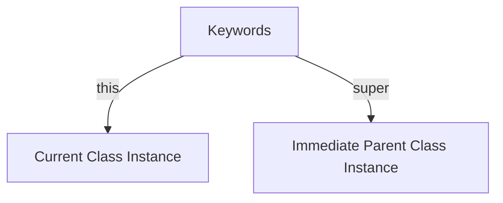

# this vs super in Java

## Introduction

In Java, two special reference keywords are heavily used in Object-Oriented programming to manage scopes: **`this`** and **`super`**. 

Although both are reference variables pointing to memory blocks, they reference different class segments. Understanding when and how to use them is essential for implementing inheritance, constructors, method overriding, and constructor chaining.



---

## What is the `this` Keyword?

The **`this`** keyword is a reference variable that points to the current object instance executing the method or constructor.

### Common Uses of `this`:
1. **To Access Instance Fields**: Resolves naming conflicts (instance variables hidden by local variables/parameters).
2. **To Invoke Current Class Methods**: Invokes instance methods on the current object.
3. **To Chain Constructors**: Call another constructor in the same class using `this()`.

### Example: Resolving Field Shadowing
If a constructor parameter has the same name as an instance variable, the parameter *shadows* the instance variable. Java gets confused unless you specify the instance scope using `this`:

```java
class Student {
    private String name;

    public Student(String name) {
        // this.name refers to the private instance field
        // name refers to the constructor parameter
        this.name = name; 
    }

    public void display() {
        // Calls the current class method
        System.out.println("Student Name: " + this.name);
    }
}
```

---

## What is the `super` Keyword?

The **`super`** keyword is a reference variable that points to the immediate parent class of the current object.

### Common Uses of `super`:
1. **To Access Parent Fields**: Accesses fields in the parent class that have been shadowed/hidden by fields of the same name in the child class.
2. **To Call Parent Methods**: Invokes parent class versions of overridden methods.
3. **To Invoke Parent Constructors**: Calls the parent class constructor using `super()`.

### Example: Accessing Shadowed Fields and Methods
Suppose you have a base class `Animal` and a subclass `Dog`. If both define the `color` field and the `sound()` method:

```java
class Animal {
    String color = "White";

    public void sound() {
        System.out.println("Animal Sound");
    }
}

class Dog extends Animal {
    String color = "Black"; // Shadowing parent field

    @Override
    public void sound() {
        System.out.println("Dog Bark");
    }

    public void display() {
        // Accessing child color vs parent color
        System.out.println("Dog color (this): " + this.color);   // Output: Black
        System.out.println("Animal color (super): " + super.color); // Output: White

        // Calling overridden sound() vs parent sound()
        this.sound();  // Output: Dog Bark
        super.sound(); // Output: Animal Sound
    }
}
```

---

## Using `this` and `super` in Constructors

Constructors execute in a strict hierarchy. A parent class constructor must execute before a child class constructor to ensure base properties are set up safely.

```java
class Animal {
    public Animal() {
        System.out.println("Animal constructor called.");
    }
}

class Dog extends Animal {
    public Dog() {
        super(); // Invokes Animal() constructor (must be the first statement)
        System.out.println("Dog constructor called.");
    }
}
```

Instantiation:
```java
Dog d = new Dog();
```

Output:
```text
Animal constructor called.
Dog constructor called.
```

```mermaid
graph TD
    Inst[new Dog()] -->|Calls| ChildConst[Dog Constructor]
    ChildConst -->|super() first line| ParentConst[Animal Constructor]
    ParentConst -->|Initializes parent fields| ChildBody[Execute Dog Constructor Body]
    ChildBody --> Ready[Object Ready in Heap]
```

> [!IMPORTANT]
> You **cannot** call both `this()` and `super()` in the same constructor. Since both must be the first statement of the constructor, calling them together results in a compilation error. If you write neither, the compiler automatically inserts a call to `super()` (the parent no-arg constructor).

---

## this vs. super Comparison

| Feature | `this` | `super` |
| :--- | :--- | :--- |
| **Reference Target** | Current class object instance | Immediate parent class instance |
| **Field Access** | Accesses current class variables | Accesses parent class variables |
| **Method Invocation** | Calls current class methods | Calls parent class methods |
| **Constructor Call** | Chains constructors inside the same class (`this()`) | Calls parent constructor (`super()`) |
| **Context** | Used in any class | Used only inside child classes (inheritance) |

---

## Common Mistakes

### 1. Using `super` in classes without a parent
Attempting to use `super` in a class that does not extend any user-defined class (except implicitly `java.lang.Object`) to access non-existent base fields will fail compilation.

### 2. Constructor calls not on the first line
Placing logic or prints before `this(...)` or `super(...)` inside a constructor body:
```java
// WRONG (Compiler Error)
public Dog() {
    System.out.println("Initializing...");
    super(); 
}
```

---

## Concept Map

```mermaid
graph TD
    Ref[Object Instance Keywords]
    Ref --> This[this: Current instance]
    Ref --> Super[super: Parent instance]
    This --> T1[Access local variables]
    This --> T2[Call local methods]
    This --> T3[Chain constructors with this()]
    Super --> S1[Access parent variables]
    Super --> S2[Call parent methods]
    Super --> S3[Call parent constructors with super()]
```

---

## Interview Questions (FAQ)

### What is the difference between `this()` and `super()`?
`this()` is used to invoke a constructor in the same class (constructor overloading/chaining). `super()` is used to invoke the constructor of the immediate parent class. Both must be the first statement in a constructor.

### Can we use `this` and `super` inside static methods?
No. Static methods belong to the class template, not to any specific object instance. Since `this` and `super` point to active object instances, they cannot be used in a static context.

### What happens if we do not call `super()` explicitly in a subclass constructor?
If you do not call `super()` explicitly, the Java compiler automatically inserts an implicit no-argument `super()` call at the first line of the child constructor. If the parent class has no no-argument constructor defined, a compiler error will occur.

---

## Practice Challenges

1. **Person-Employee Chaining**: Create a `Person` class with a parameterized constructor. Create an `Employee` class extending `Person` and pass the name to the parent constructor using `super()`.
2. **Vehicle Shadowing**: Create a `Vehicle` class containing `maxSpeed = 120`. Create a `Car` class extending `Vehicle` containing `maxSpeed = 180`. Write a method displaying both speeds using `this` and `super`.
3. **Overridden Method Calling**: Implement a parent class `Printer` with method `print()`. Override it in `3DPrinter` and call `super.print()` inside the overridden method to output both messages.

---

## Key Takeaways

* `this` references the current instance; `super` references the parent instance.
* Use `this()` to resolve shadowing variables and chain constructors locally.
* Use `super()` to call parent constructors and access overridden methods or hidden fields.
* Constructor calls (`this()` / `super()`) must always occupy the first statement of the constructor block.

---

**Back to Module Home:** [Building Blocks of Java](README.md)
