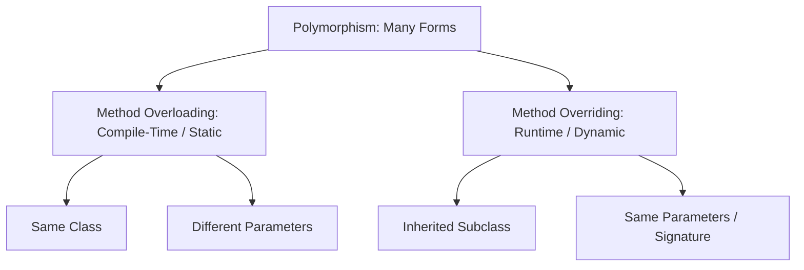

# Method Overloading vs Method Overriding in Java

## Introduction

As Java applications grow, we often encounter situations where multiple methods must perform similar tasks with different inputs, or child classes must customize the behavior inherited from parent classes. 

Java addresses these requirements through two core features: **Method Overloading** and **Method Overriding**. Together, they form the basis of **Polymorphism** (one of the four pillars of Object-Oriented Programming).



---

## What is Method Overloading?

**Method Overloading** is the practice of defining multiple methods in the same class with the **same name** but **different parameter lists** (signatures).

### Why Use Method Overloading?
Instead of forcing developers to remember different method names for similar operations (e.g., `addInts()`, `addDoubles()`, `addThreeInts()`), we can overload the `add()` method. This improves code readability and usability.

### Valid Ways to Overload:
To overload a method, the parameter list **must change** in one of the following ways:
1. **Different number of parameters**:
   ```java
   add(int a, int b)
   add(int a, int b, int c)
   ```
2. **Different parameter data types**:
   ```java
   add(int a, int b)
   add(double a, double b)
   ```
3. **Different order of parameters**:
   ```java
   display(int age, String name)
   display(String name, int age)
   ```

### Overloading Code Example

```java
public class Calculator {
    // Overloaded version 1: 2 int parameters
    public int add(int a, int b) {
        return a + b;
    }

    // Overloaded version 2: 3 int parameters
    public int add(int a, int b, int c) {
        return a + b + c;
    }

    // Overloaded version 3: 2 double parameters
    public double add(double a, double b) {
        return a + b;
    }

    public static void main(String[] args) {
        Calculator calc = new Calculator();
        System.out.println(calc.add(5, 10));         // Output: 15 (Calls version 1)
        System.out.println(calc.add(5, 10, 15));     // Output: 30 (Calls version 2)
        System.out.println(calc.add(5.5, 4.5));      // Output: 10.0 (Calls version 3)
    }
}
```

> [!WARNING]
> You **cannot** overload a method by changing only its return type. The method signature consists only of the method name and parameter types. If two methods have the same name and parameters but different return types, the compiler will throw a duplicate method error.

---

## What is Method Overriding?

**Method Overriding** occurs when a subclass (child class) provides a specific implementation for a method that is already defined in its superclass (parent class).

The overriding method must have the **same name, same parameters, and same return type** (or covariant return type) as the parent method.

### Why Use Method Overriding?
Method overriding allows a subclass to inherit a general behavior from a parent class and modify it to suit its specific needs.

```text
Parent Class: Animal -> sound() { prints "Animal Sound" }
                  │
        ┌─────────┴─────────┐
        ▼                   ▼
Subclass: Dog        Subclass: Cat
sound() {            sound() {
  prints "Bark"        prints "Meow"
}                    }
```

### Overriding Code Example

```java
class Animal {
    public void sound() {
        System.out.println("Animal makes a sound");
    }
}

class Dog extends Animal {
    @Override // Compiler check that ensures overloading is not accidentally written
    public void sound() {
        System.out.println("Dog barks");
    }
}

public class Main {
    public static void main(String[] args) {
        Animal myAnimal = new Animal();
        Animal myDog = new Dog(); // Upcasting

        myAnimal.sound(); // Output: Animal makes a sound
        myDog.sound();    // Output: Dog barks (Dynamic Method Dispatch)
    }
}
```

### Dynamic Method Dispatch (Runtime Polymorphism)
In `Animal myDog = new Dog();`, `myDog` is a reference variable of type `Animal` pointing to a `Dog` object. When `myDog.sound()` is executed, Java decides which method to run **at runtime** based on the actual object type in Heap memory (which is `Dog`), rather than the compile-time reference type (`Animal`).

---

## Rules for Method Overriding

To successfully override a parent method, the following rules must be met:
1. **Inheritance is Mandatory**: Overriding can only happen in subclass-superclass relationships (`extends` or `implements`).
2. **Access Modifier Restrictions**: The overriding subclass method cannot be more restrictive than the parent method (e.g. if the parent method is `protected`, the child method can be `protected` or `public`, but not `private` or default).
3. **Cannot Override Final or Static Methods**:
   * Methods marked `final` cannot be overridden.
   * Methods marked `static` belong to class templates and cannot be overridden (redeclaring them in subclasses is called *method hiding*).
4. **Exception Handling Rules**: The overriding method cannot throw broader checked exceptions than the parent class method, though it can throw fewer or narrower exceptions.

---

## Overloading vs. Overriding Comparison

| Feature | Method Overloading | Method Overriding |
| :--- | :--- | :--- |
| **Polymorphism Type** | Compile-Time (Static Binding) | Runtime (Dynamic Binding) |
| **Location** | Defined inside the same class | Defined across Parent and Child classes |
| **Method Name** | Must be the same | Must be the same |
| **Method Parameters** | Must be different | Must be the same |
| **Return Type** | Can be different | Must be compatible (covariant) |
| **Inheritance** | Not required | Mandatory |
| **Modifier Restrictions** | No restrictions | Subclass modifier cannot be more restrictive |

---

## Common Mistakes

### 1. Overloading only by Return Type
```java
// WRONG (Compiler Error: Duplicate method)
public int add(int a, int b) { return a + b; }
public double add(int a, int b) { return a + b; }
```

### 2. Typo in Overriding Method Signatures
If the parameter list differs by even a single type, the subclass method will overload the method rather than override it.
```java
class Parent {
    public void display(int value) {}
}

class Child extends Parent {
    // WRONG - Overloads the method instead of overriding it
    public void display(double value) {} 
}
```
> [!TIP]
> Always use the **`@Override`** annotation. It forces the compiler to check that the method signature matches a parent method, catching typos during compilation.

---

## Interview Questions (FAQ)

### Can we overload the `main()` method?
Yes. You can write multiple `main()` methods with different parameter lists. However, the JVM will only execute the standard signature `public static void main(String[] args)` automatically as the application entry point.

### Can static methods be overridden?
No. Static methods belong to the class, not to object instances. If you define a static method in a subclass with the same signature as a static method in the superclass, it is called **Method Hiding**, not overriding.

### What is covariant return type in method overriding?
Starting from Java 5, an overriding method in a subclass can return a subtype of the object returned by the parent method. This is known as a covariant return type.

---

## Practice Challenges

1. **Shape Area Overloading**: Create a `ShapeCalculator` class. Implement overloaded versions of an `area()` method to calculate the area of:
   * A square (one `int` parameter).
   * A rectangle (two `int` parameters).
   * A circle (one `double` parameter).
2. **E-Commerce Checkout Overriding**: Create a parent class `PaymentProcessor` with a method `processPayment(double amount)`. Extend it with `CreditCardProcessor` and `PayPalProcessor` subclasses, overriding the method to display customized processing logs.

---

## Key Takeaways

* **Method Overloading** occurs in the same class and changes the parameter list. It supports compile-time polymorphism.
* **Method Overriding** occurs in child classes and maintains the exact same signature. It supports runtime polymorphism.
* Use `@Override` to ensure correct overridden method signatures.
* Static, final, and private methods cannot be overridden in Java.

---

**Back to Module Home:** [Building Blocks of Java](README.md)
