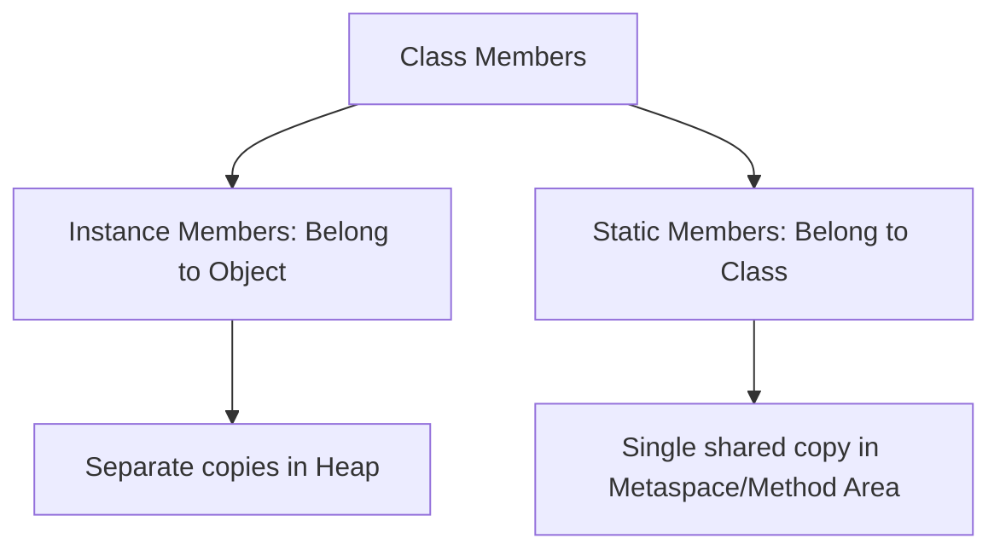
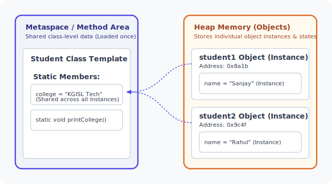

# Static vs Instance Members in Java

## Introduction

When writing classes in Java, one of the most critical design decisions is determining whether a field or method should belong to the **class template** itself, or to **individual object instances**.

Java separates these scopes into two categories:
* **`instance` members** (default): Belong to object instances.
* **`static` members**: Belong to the class itself.

Understanding the difference is key to managing memory efficiency, variable sharing, and designing entry points (like `main()`).



---

## What is an Instance Member?

An **Instance Member** is a variable or method declared without the `static` keyword. 
* **Instance Variables**: Represent properties unique to each object. Every object allocated on the Heap maintains its own separate copy of these variables.
* **Instance Methods**: Represent behaviors that interact with individual object states. They must be invoked on an active object reference.

### Example: Individual Student Names
```java
class Student {
    String name; // Instance variable
}
```

Usage:
```java
Student s1 = new Student();
Student s2 = new Student();

s1.name = "Sanjay";
s2.name = "Rahul";

System.out.println(s1.name); // Output: Sanjay
System.out.println(s2.name); // Output: Rahul
```
Here, modifying `s1.name` has no effect on `s2.name` because they point to completely separate memory blocks on the Heap.

---

## What is a Static Member?

A **Static Member** is a variable, method, or block marked with the **`static`** keyword.
* **Static Variables**: Also known as *class variables*. Only a single copy of a static variable is allocated in the Metaspace (Method Area) of the JVM, regardless of how many object instances are created. All instances share this single copy.
* **Static Methods**: Also known as *class methods*. They can be invoked directly using the class name, without allocating or referring to any object instance.

### Example: Shared College Name
```java
class Student {
    static String college = "KGISL Institute of Technology"; // Static variable
}
```

Usage:
```java
// Accessed directly using the Class name:
System.out.println(Student.college); // Output: KGISL Institute of Technology
```

---

## Memory Representation: Metaspace vs. Heap

In the JVM, static variables live in a separate memory area (Metaspace/Method Area), while objects and their instance variables live in the Heap.



### Memory Efficiency:
If a class has 1,000 objects, and each object contains a duplicate string literal `"KGISL"`, it wastes memory. By making it `static`, only one string reference is created in the class template scope, reducing the Heap footprint of all 1,000 objects.

---

## Static Blocks

A **Static Block** (or static initialization block) is a block of code enclosed in curly braces prefixed by the `static` keyword. It is executed automatically by the JVM **once** when the class is loaded into memory, before any constructors run or objects are instantiated. It is typically used to initialize complex static variables.

```java
class DatabaseConfig {
    static String dbUrl;
    static int port;

    // Static initialization block
    static {
        System.out.println("Loading database configuration...");
        dbUrl = "jdbc:mysql://localhost:3306/mydb";
        port = 3306;
    }
}
```

---

## Practical Static Pattern: Object Counter

One of the most common applications of static variables is tracking the number of instances created for a class.

```java
class Employee {
    private String name;
    // Shared counter across all objects
    public static int employeeCount = 0;

    public Employee(String name) {
        this.name = name;
        employeeCount++; // Increments the shared counter
    }
}

public class Main {
    public static void main(String[] args) {
        new Employee("Sanjay");
        new Employee("Arun");
        new Employee("Rahul");

        // Access via the Class name
        System.out.println("Total Employees: " + Employee.employeeCount); // Output: 3
    }
}
```

---

## Static vs. Instance Variable Comparison

| Feature | Static Variables | Instance Variables |
| :--- | :--- | :--- |
| **Scope** | Belongs to the Class | Belongs to individual Objects |
| **Memory Allocation** | Allocated once when class is loaded | Allocated on Heap every time `new` runs |
| **Number of Copies** | Exactly one shared copy | One copy per object instance |
| **Access** | Via `ClassName.variableName` | Via `objectReference.variableName` |

---

## Static vs. Instance Method Comparison

| Feature | Static Methods | Instance Methods |
| :--- | :--- | :--- |
| **Scope** | Belongs to the Class | Belongs to the Object |
| **Object Required** | No object required to invoke | Must be called on an object reference |
| **Access to Fields** | Can **only** access other static fields directly | Can access both static and instance fields |
| **Use of `this` / `super`** | **Cannot** use `this` or `super` | Can use `this` and `super` keywords |

---

## Critical Access Rule

> [!IMPORTANT]
> A static method **cannot** access instance variables or call instance methods directly. Because static methods execute without any object context, Java does not know *which* object's state to read.

### Wrong (Compilation Error):
```java
class Student {
    String name = "Sanjay"; // Instance variable

    public static void printName() {
        System.out.println(name); // COMPILER ERROR: non-static variable cannot be referenced from static context
    }
}
```

### Correct:
To access instance fields inside a static method, you must explicitly instantiate or pass an object reference:
```java
class Student {
    String name = "Sanjay";

    public static void printName(Student s) {
        System.out.println(s.name); // Correct - accessed via reference
    }
}
```

---

## Why is the `main()` Method Static?

The entry point of any Java program is:
```java
public static void main(String[] args)
```
The `main()` method must be static because the JVM needs to start executing the program before any objects are created. If `main()` were an instance method, Java would have a "chicken-and-egg" problem: it would need to create an object of the class to run `main()`, but it wouldn't know how or where to start the program without running `main()` first.

---

## Common Mistakes

### 1. Calling Static Members on Object Instances
Although Java allows accessing static variables via object references (e.g., `s1.college`), it is considered poor coding style. It hides the fact that the member is static, leading developers to think it is instance-specific. Always access static members via the Class name: `Student.college`.

### 2. Accessing `this` inside Static Contexts
```java
public static void display() {
    System.out.println(this.hashCode()); // Compiler Error: 'this' cannot be referenced from static context
}
```

---

## Interview Questions (FAQ)

### Can we overload static methods?
Yes, static methods can be overloaded just like instance methods.

### Can static methods be overridden?
No, static methods belong to the class, not object instances. While you can declare a static method in a subclass with the same signature, this is called **Method Hiding**, not overriding.

### When should a method be declared static?
A method should be declared static when it does not depend on the state (instance variables) of any individual object. Excellent examples are utility methods like `Math.sqrt()` or `Arrays.sort()`.

---

## Practice Challenges

1. **Static Counter**: Write a `Product` class with `id` and `name`. Automatically assign a unique sequential ID to each product using a private static counter that increments inside the constructor.
2. **Calculator Utility**: Create a `MathUtils` class with static methods `square(double)`, `cube(double)`, and a static constant `double PI`. Execute them in a separate runner class without creating a `MathUtils` object.
3. **Company Template**: Build a `Company` class with a static field `companyName` and instance fields `employeeName` and `salary`. Add a static method to update `companyName`.

---

## Key Takeaways

* **Static** members belong to the class; **Instance** members belong to objects.
* Static variables have one shared copy in JVM memory, saving memory for common constants or configurations.
* Static methods cannot access non-static variables or methods directly.
* Static blocks are run exactly once when the class is loaded.
* The `main()` method must be static to run before any objects are created.

---

**Back to Module Home:** [Building Blocks of Java](README.md)
