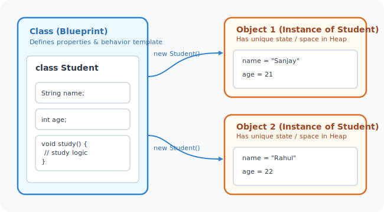
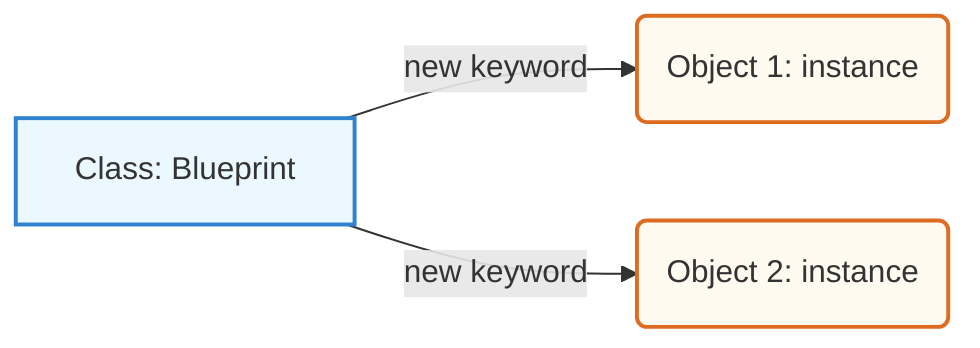

# Building Blocks of Java (Classes, Objects, and OOP Foundations)

This module explores the core constructs of Object-Oriented Programming (OOP) in Java. You will learn how to design robust blueprints (classes), instantiate unique objects, protect data boundaries (encapsulation), initialize objects cleanly (constructors), and manage class-level vs instance-level scopes (static vs instance).

---

## Learning Objectives

By the end of this module, you will be able to:
* **Distinguish** clearly between classes, objects, reference variables, and instances.
* **Implement Encapsulation** by hiding fields with `private` modifiers and exposing controlled access via getters and setters with validation logic.
* **Design Constructors** using parameter overloading and clean chaining with the `this()` keyword.
* **Differentiate** between the `this` and `super` keywords for local vs parent class access.
* **Analyze JVM Memory Allocations** for stack frames, heap objects, and static class-level metadata (Metaspace/Method Area).
* **Apply Polymorphism** via compile-time method overloading and runtime method overriding.

---

## Module Index

Below is the directory map of the lessons contained in this module:

| Lesson File | Core Concepts Covered | Link |
| :--- | :--- | :--- |
| **01. Classes &amp; Objects** | Class blueprint declarations, object creation with `new`, heap/stack allocations. | [Open Guide](01_Classes-and-Objects.md) |
| **02. Getters &amp; Setters** | Encapsulation, shielding fields, parameter validations, naming rules. | [Open Guide](02_Getters-and-Setters.md) |
| **03. Constructors in Java** | Default constructors, parameter overloading, constructor chaining with `this()`. | [Open Guide](03_Constructors-in-Java.md) |
| **04. Constructor Challenges** | Logic practices for basic initialization and field management. | [Open Guide](04_Constructor-Challenges.md) |
| **05. Advanced Constructor Challenges** | Multi-variable configurations, chaining parameters under inheritance. | [Open Guide](05_Advanced-Constructor-Challenges.md) |
| **06. Reference vs Class vs Object vs Instance** | Core definition comparisons, address pointer mappings. | [Open Guide](06_Reference-vs-Class-vs-Object-vs-Instance.md) |
| **07. This vs. Super** | Scope boundaries, accessing local vs parent constructors/methods. | [Open Guide](07_This-vs-Super.md) |
| **08. Overloading vs. Overriding** | Compile-time polymorphism vs runtime polymorphism, signature/return rules. | [Open Guide](08_Method-Overloading-vs-Method-Overriding.md) |
| **09. Overloading &amp; Overriding Challenges** | Coding challenges applying polymorphism rules and method overriding. | [Open Guide](09_Advanced-Method-Overloading-and-Overriding-Challenges.md) |
| **10. Static vs. Instance Members** | Shared class variables vs heap instances, static blocks, utility classes. | [Open Guide](10_Static-vs-Instance-Members.md) |

---

## Core Theory Summary

### 1. The Blueprint Principle (Class vs. Object)
A **Class** is a logical template or blueprint. It takes up no memory space for fields (except for metadata) until it is instantiated. An **Object** is a physical instance of that class allocated dynamically on the heap using the `new` keyword.

### 2. Encapsulation (Data Shielding)
Encapsulation prevents direct external manipulation of object internals. Instead of exposing raw fields, fields are marked `private` and wrapped in `public` setter and getter methods, enabling input validation and internal state protection.

### 3. Static vs. Instance Scopes
* **Instance Members**: Belong directly to individual object instances. Every object created on the Heap has its own separate copy of these variables.
* **Static Members**: Belong to the Class itself. They are loaded once into Class memory (Metaspace/Method Area) when the class loader loads the bytecode and are shared across all instances.

---

## Interview Questions (FAQ)

<b>1. What is the difference between an Object and a Reference Variable?</b>

 
A reference variable is a local pointer stored on the stack that holds the memory address of an object. The actual object is the block of memory allocated dynamically on the heap that contains the instance variables and data.

<b>2. Why are fields usually declared private in Java?</b>

 
Declaring fields private enforces **Encapsulation**. It prevents external classes from modifying the internal state of an object in invalid or unauthorized ways, ensuring that all data changes go through public setter methods where input validation can occur.

<b>3. What is constructor chaining and how is it implemented?</b>

 
Constructor chaining is the process of calling one constructor from another within the same class or a parent class. It is implemented using `this(...)` (to call another constructor in the same class) or `super(...)` (to call a constructor in the parent class). These calls must always be the first statement in the constructor.

<b>4. Can a static method call an instance method?</b>

 
No, static methods belong to the class template and are loaded when no object instances may yet exist. They do not have access to a `this` reference and cannot call instance methods directly without explicitly instantiating or passing an object reference.

---

**Next Module:** Let's learn about Object-Oriented inheritance, polymorphism, and composition in [06_OOPs-In-Java](../06_OOPs-In-Java)
