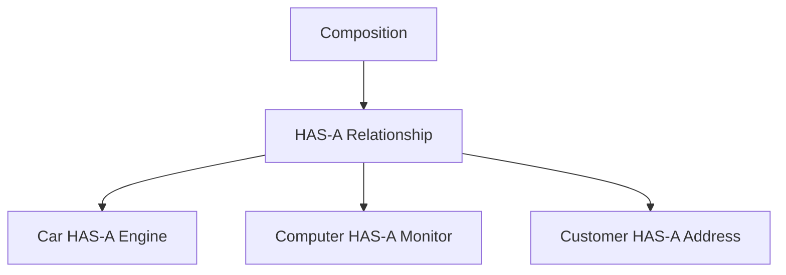

# Composition in Java

## Introduction

In Object-Oriented Programming (OOP), modeling relationships between different classes is a core task. While **Inheritance** represents an `IS-A` relationship (e.g., a Car is a Vehicle), **Composition** represents a **`HAS-A` relationship**.

Composition is a design technique where one class contains reference variables pointing to objects of other classes as instance variables. This allows us to build complex objects by combining simpler, specialized objects.


---

## Real-World Analogy: The Computer

A real-world computer is not a single, indivisible entity. It is composed of multiple specialized components working together:

* A Computer **HAS-A** Monitor
* A Computer **HAS-A** Keyboard
* A Computer **HAS-A** Motherboard
* A Computer **HAS-A** Processor

In Java, instead of writing all keyboard and monitor fields inside the `Computer` class, we design separate `Keyboard` and `Monitor` classes and include them as fields inside the `Computer` class.

---

## Composition vs. Inheritance

### Inheritance (IS-A)
Inheritance is used when a subclass is a specialized version of a superclass.
```java
class Vehicle {}
class Car extends Vehicle {} // Car IS-A Vehicle
```

### Composition (HAS-A)
Composition is used when a class contains other objects to construct its state.
```java
class Engine {}
class Car {
    private Engine engine; // Car HAS-A Engine
}
```

---

## Why Use Composition?

Using composition over deep inheritance hierarchies offers several key advantages:
* **Code Reusability**: Components like an `Address` class can be reused across different classes (e.g., `Customer`, `Employee`, `Supplier`).
* **Flexibility**: The internal object implementation can be replaced or updated at runtime.
* **Low Coupling**: Changing the internal code of the component class (e.g., `Engine`) does not break the container class (`Car`).
* **Avoids Fragile Base Class Problem**: Deep inheritance chains make sub-classes highly fragile to parent modifications. Composition avoids this.

---

## Basic Composition Example

Here is a basic program showing a `Car` containing a reference to an `Engine` object.

### Class Definitions:
```java
class Engine {
    public void start() {
        System.out.println("Engine started. Vroom!");
    }
}

class Car {
    private Engine engine; // HAS-A relationship

    public Car() {
        // Instantiate the dependent object inside the constructor
        this.engine = new Engine();
    }

    public void startCar() {
        engine.start(); // Delegating behavior
        System.out.println("Car is ready to drive.");
    }
}
```

### Main Class Execution:
```java
public class Main {
    public static void main(String[] args) {
        Car myCar = new Car();
        myCar.startCar();
    }
}
```

### Output:
```text
Engine started. Vroom!
Car is ready to drive.
```

---

## Memory Representation

When you instantiate a container object, memory is allocated on the Heap for the container, which contains references pointing to separate child objects on the Heap.


---

## Composition with Multiple Component Classes

Let's look at a computer model composed of a separate `Monitor` and `Keyboard`.

```java
class Monitor {
    public void display() {
        System.out.println("Display rendering pixels.");
    }
}

class Keyboard {
    public void type() {
        System.out.println("Keyboard sending key inputs.");
    }
}

class Computer {
    private Monitor monitor;
    private Keyboard keyboard;

    public Computer() {
        this.monitor = new Monitor();
        this.keyboard = new Keyboard();
    }

    public void bootSystem() {
        monitor.display();
        keyboard.type();
        System.out.println("Computer booted and ready for use.");
    }
}

public class Main {
    public static void main(String[] args) {
        Computer pc = new Computer();
        pc.bootSystem();
    }
}
```

### Output:
```text
Display rendering pixels.
Keyboard sending key inputs.
Computer booted and ready for use.
```

---

## Composition via Constructor Injection

Instead of instantiating components directly inside the constructor (which hard-codes the dependency), it is often better design to pass pre-created component objects into the constructor. This is called **Constructor Dependency Injection**.

```java
class Engine {
    public void start() {
        System.out.println("Engine started.");
    }
}

class Car {
    private Engine engine;

    // Engine is injected from the outside
    public Car(Engine engine) {
        this.engine = engine;
    }

    public void drive() {
        engine.start();
        System.out.println("Driving...");
    }
}

public class Main {
    public static void main(String[] args) {
        Engine V8 = new Engine();
        Car muscleCar = new Car(V8); // Injecting V8 engine
        muscleCar.drive();
    }
}
```

---

## Real-World Banking Example

In enterprise applications, data models are heavily composed. For example, a `Customer` has a contact `Address`.

```java
class Address {
    private String city;

    public Address(String city) {
        this.city = city;
    }

    public String getCity() {
        return city;
    }
}

class Customer {
    private String name;
    private Address address; // Composition

    public Customer(String name, Address address) {
        this.name = name;
        this.address = address;
    }

    public void displayCustomer() {
        System.out.println("Customer: " + name);
        System.out.println("City: " + address.getCity());
    }
}

public class Main {
    public static void main(String[] args) {
        Address addr = new Address("Chennai");
        Customer cust = new Customer("Sanjay", addr);
        cust.displayCustomer();
    }
}
```

---

## Composition vs. Aggregation

While both represent `HAS-A` relationships, they differ in relationship strength:

### 1. Composition (Strong HAS-A)
The child object's lifecycle is bound to the parent object's lifecycle. The child cannot exist independently.
* **Example**: A `House` has `Rooms`. If the house is demolished, the rooms cease to exist.

### 2. Aggregation (Weak HAS-A)
The child object can exist independently of the parent object.
* **Example**: A `Department` has `Teachers`. If the department is closed down, the teachers still exist.

---

## Common Mistakes

### 1. Inheriting when Composition is Appropriate
```java
// WRONG - Car IS NOT an Engine
class Car extends Engine {}

// CORRECT - Car HAS AN Engine
class Car {
    private Engine engine;
}
```

### 2. Failing to check for Null Reference
If components are injected or uninitialized, calling methods on them directly will throw a `NullPointerException`.
```java
class Car {
    private Engine engine; // Defaults to null
    
    public void start() {
        engine.start(); // Throws NullPointerException if V8 not passed!
    }
}
```

---

## Concept Map



---

## Interview Questions (FAQ)

### What is composition in Java?
Composition is a design technique in which a class contains reference variables pointing to instances of other classes as its fields, creating a `HAS-A` relationship.

### What is the difference between inheritance and composition?
Inheritance is an `IS-A` relationship where a class inherits directly from a parent class. Composition is a `HAS-A` relationship where a class wraps instance variables of other class types.

### Why is composition preferred over inheritance?
Composition provides better flexibility (components can be replaced at runtime), avoids multiple inheritance restrictions, does not expose parent implementation details to the outer scope, and reduces class coupling.

---

## Practice Challenges

1. **Mobile Battery System**: Create a `Battery` class with fields `capacity` (int) and `brand` (String). Create a `MobilePhone` class that contains a `Battery` reference and outputs battery statistics.
2. **Library Catalog**: Create a `Book` class containing `title` and `author`. Create a `Library` class containing an array of `Book` objects. Implement a method displaying all book titles in the library.

---

## Key Takeaways

* Composition represents a **`HAS-A`** relationship.
* One class contains objects of other classes as member fields.
* Composition promotes looser coupling and higher runtime flexibility.
* Favor composition over inheritance whenever modeling system configurations or structural parts.

---

**Back to Module Home:** [Object-Oriented Programming](README.md)
