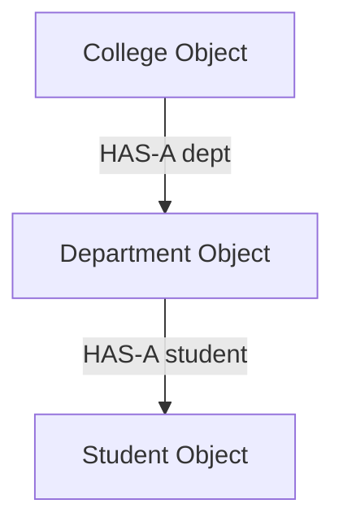
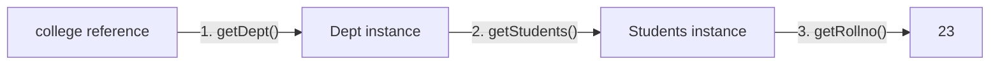

# Advanced Composition Program in Java

## Introduction

In previous guides, we learned that Composition represents a **`HAS-A` relationship** where one class references objects of other classes as its fields. 

In this chapter, we will build a small **College Management System** using composition to see how multiple classes collaborate to form a nested object model.



---

## Problem Statement

Design a college tracking system that models the following relationship:
* A `College` HAS-A `Department`.
* A `Department` HAS-A `Student`.

The program must instantiate these objects, wire their dependencies, and output:
1. The College name.
2. The Department opening date announcement.
3. The Student's roll number (accessed via nested getter method calls).

---

## Complete Java Solution

Here is the source code implementation structured across three class files and a main runner.

### 1. Student Class (`Students.java`)
```java
package composition;

public class Students {
    private String stdname;
    private int rollno;
    private int regno;

    public Students(String stdname, int roll, int reg) {
        this.stdname = stdname;
        this.rollno = roll;
        this.regno = reg;
    }

    public String getStdname() {
        return stdname;
    }

    public int getRollno() {
        return rollno;
    }

    public int getRegno() {
        return regno;
    }
}
```

### 2. Department Class (`Dept.java`)
```java
package composition;

public class Dept {
    private String deptName;
    private int deptFloor;
    private Students std; // Composition: Department HAS-A Student

    public Dept(String deptName, int floor, Students std) {
        this.deptName = deptName;
        this.deptFloor = floor;
        this.std = std;
    }

    public String getDeptname() {
        return deptName;
    }

    public int getDeptfloor() {
        return deptFloor;
    }

    public Students getStudents() {
        return std;
    }

    public void displayOpeningDate() {
        System.out.println("The Department opening date is 20th JAN");
    }
}
```

### 3. College Class (`Kgisl.java`)
```java
package composition;

public class Kgisl {
    private String name;
    private Dept dept; // Composition: College HAS-A Department

    public Kgisl(String name, Dept dept) {
        this.name = name;
        this.dept = dept;
    }

    public String getName() {
        return name;
    }

    public Dept getDept() {
        return dept;
    }
}
```

### 4. Main Runner (`Main.java`)
```java
package composition;

public class Main {
    public static void main(String[] args) {
        // Step 1: Create the base dependency (Student)
        Students student = new Students("sanjay", 23, 86);

        // Step 2: Inject Student into Department
        Dept dep = new Dept("AIDS", 6, student);

        // Step 3: Inject Department into College
        Kgisl college = new Kgisl("kgisl", dep);

        // Access and print values
        System.out.println("College: " + college.getName());
        college.getDept().displayOpeningDate();

        // Retrieve student roll number through nested getters (Method Chaining)
        System.out.println("Student Roll No: " + college.getDept().getStudents().getRollno());
    }
}
```

### Output:
```text
College: kgisl
The Department opening date is 20th JAN
Student Roll No: 23
```

---

## Deconstructing Nested Getter Calls

The statement `college.getDept().getStudents().getRollno()` is an example of method chaining. It resolves step-by-step:

1. **`college.getDept()`**:
   * References the `Kgisl` object on the Stack.
   * Looks up the `dept` reference variable.
   * Returns the `Dept` object address (e.g. `0x3a2b`).
2. **`...getStudents()`**:
   * Takes the returned `Dept` object.
   * Looks up the `std` reference variable.
   * Returns the `Students` object address (e.g. `0x5f8e`).
3. **`...getRollno()`**:
   * Takes the returned `Students` object.
   * Reads and returns the primitive `rollno` value (`23`).



---

## Memory Layout

Here is how the object allocations look on the Heap. The reference pointer values are copied during instantiation to establish the composition chain.

```text
Heap Memory
┌─────────────────────────────────────────────────────────────┐
│  Kgisl (College) Object                                     │
│  ┌──────────────────┐                                       │
│  │ name = "kgisl"   │                                       │
│  │ dept = 0x3a2b    │ ────────────────┐                     │
│  └──────────────────┘                 │                     │
├───────────────────────────────────────┼─────────────────────┤
│  Dept (Department) Object <───────────┘                     │
│  ┌──────────────────┐                                       │
│  │ deptName = "AIDS"│                                       │
│  │ deptFloor = 6    │                                       │
│  │ std = 0x5f8e     │ ────────────────┐                     │
│  └──────────────────┘                 │                     │
├───────────────────────────────────────┼─────────────────────┤
│  Students (Student) Object <──────────┘                     │
│  ┌──────────────────┐                                       │
│  │ stdname = "sanjay"│                                      │
│  │ rollno = 23      │                                       │
│  │ regno = 86       │                                       │
│  └──────────────────┘                                       │
└─────────────────────────────────────────────────────────────┘
```

---

## Why Use Composition Here?

If we did not use composition, the `Kgisl` class would have to declare all student and department variables directly:
```java
class Kgisl {
    String name;
    String deptName;
    int deptFloor;
    String studentName;
    int studentRollNo;
}
```
This design violates the **Single Responsibility Principle**. By separating student, department, and college definitions into dedicated classes, the code remains modular, reusable, and easy to maintain.

---

## Interview Questions (FAQ)

### Is KGISL inheriting Department?
No. There is no `extends` keyword. `Kgisl` simply holds a reference variable pointing to a `Dept` object in its instance variables.

### What is the advantage of using composition over inheritance for deep hierarchies?
Deep inheritance chains create high coupling: changes in the base parent classes can trigger unexpected compile errors down the tree (the Fragile Base Class Problem). Composition decouples the components, making them easier to refactor, test in isolation, and swap at runtime.

---

## Key Takeaways

* Complex application models are constructed by nesting simpler object types.
* Method chaining (e.g., `a.getB().getC()`) traverses the reference addresses on the Heap.
* Composition separates responsibilities, making classes clean and highly testable.

---

**Back to Module Home:** [Object-Oriented Programming](README.md)
