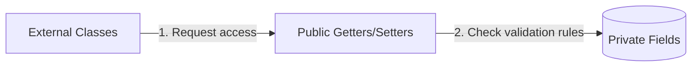
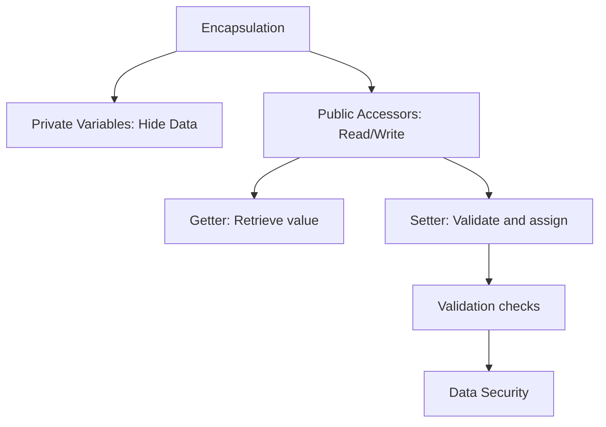

# Encapsulation in Java

## Introduction

Encapsulation is one of the four fundamental pillars of Object-Oriented Programming (OOP), alongside Inheritance, Polymorphism, and Abstraction. It is the process of binding data (variables) and methods (behaviors) together into a single unit (a class) while restricting direct access to the data from the outside world.

In simple terms, encapsulation is about **data hiding** and **controlled access**.

---

## Real-World Analogy: The ATM Machine

Think about an Automated Teller Machine (ATM). You interact with the ATM via a public interface to:
* Withdraw cash.
* Deposit funds.
* Check account balances.

However, you cannot directly access the bank's internal database, currency storage bins, or circuit boards. The ATM hides these internal implementation details and wraps them in a secure physical casing, exposing only a controlled, validated menu. This is exactly how encapsulation protects class data.

---

## Why Do We Need Encapsulation?

Without encapsulation, anyone can modify an object's properties directly, potentially corrupting its state:

```java
class Student {
    public String name;
    public int age;
}
```

Usage:
```java
Student s = new Student();
s.age = -100; // Invalid data accepted without error!
```

To prevent this data vulnerability, we enforce encapsulation by applying access modifiers and accessors.

---

## Implementing Encapsulation: The Two Rules

Encapsulation is implemented in Java by following two standard rules:
1. Declare all instance variables of the class as **`private`** (restricting direct external access).
2. Expose **`public` getter and setter methods** (allowing controlled, validated read and write operations).



---

## Getter and Setter Methods

* **Getter (Accessor)**: A public method used to read or retrieve the value of a private variable.
  ```java
  public String getName() {
      return name;
  }
  ```
* **Setter (Mutator)**: A public method used to update or write the value of a private variable, often containing validation logic.
  ```java
  public void setName(String name) {
      this.name = name;
  }
  ```

---

## Basic Encapsulation Example

```java
class Student {
    private String name; // Private field

    // Public setter
    public void setName(String name) {
        this.name = name;
    }

    // Public getter
    public String getName() {
        return name;
    }
}

public class Main {
    public static void main(String[] args) {
        Student student = new Student();
        student.setName("Sanjay"); // Write
        System.out.println("Student Name: " + student.getName()); // Read
    }
}
```

### Output:
```text
Student Name: Sanjay
```

---

## Encapsulation with Data Validation

One of the primary benefits of using setters is the ability to filter out corrupted or invalid data inputs before updating the object state.

```java
class Student {
    private int age;

    public void setAge(int age) {
        if (age > 0 && age < 120) {
            this.age = age;
        } else {
            System.out.println("Error: Invalid age value ignored.");
        }
    }

    public int getAge() {
        return age;
    }
}

public class Main {
    public static void main(String[] args) {
        Student student = new Student();
        student.setAge(-10); // Attempting invalid write
        System.out.println("Student Age: " + student.getAge()); // Defaults to 0
    }
}
```

### Output:
```text
Error: Invalid age value ignored.
Student Age: 0
```

---

## Real-World Example: Bank Account Transactions

In banking systems, balance modifications must only occur through verified transaction operations (deposits and withdrawals), never through direct assignment.

```java
class BankAccount {
    private double balance; // Secure field

    // Deposit method acts as a controlled setter
    public void deposit(double amount) {
        if (amount > 0) {
            balance += amount;
        } else {
            System.out.println("Error: Deposit amount must be positive.");
        }
    }

    // Public getter
    public double getBalance() {
        return balance;
    }
}

public class Main {
    public static void main(String[] args) {
        BankAccount account = new BankAccount();
        account.deposit(5000);
        System.out.println("Account Balance: " + account.getBalance());
    }
}
```

### Output:
```text
Account Balance: 5000.0
```

---

## Advantages of Encapsulation

* **Data Security**: External classes cannot access or modify fields directly, protecting internal data integrity.
* **Input Validation**: Setters can reject bad inputs, preventing invalid states.
* **Flexibility (Read-Only/Write-Only)**: Omitting getter methods creates write-only fields; omitting setter methods creates read-only properties.
* **Low Coupling**: The internal variable representations can change without breaking client code that calls the public getters/setters.

---

## Common Mistakes

### 1. Declaring Fields as public
Making fields public bypasses all access control and validation, violating encapsulation.
```java
// WRONG
public int age;

// CORRECT
private int age;
```

### 2. Skipping Validation inside Setters
Declaring variables `private` but writing blank setters that perform no checks fails to prevent data corruption.
```java
// WRONG
public void setAge(int age) {
    this.age = age; 
}
```

---

## Concept Map



---

## Interview Questions (FAQ)

### What is encapsulation?
Encapsulation is the OOP mechanism of bundling data (variables) and methods inside a single class, while restricting direct access to the data by marking fields `private` and exposing public getter/setter access.

### How does encapsulation differ from abstraction?
Encapsulation is about **data hiding** and securing access patterns. Abstraction is about **hiding implementation complexity** (e.g., exposing *what* an object does rather than *how* it does it via interfaces or abstract classes).

### Can we create a read-only class in Java?
Yes. You can make a class read-only by declaring all its instance variables as `private` and providing only getter methods. Omitting setter methods prevents any external modification.

---

## Practice Challenges

1. **Product Pricing Validation**: Create a `Product` class with `name` and `price`. Validate that `price` cannot be set to a negative value.
2. **Encapsulated Smart Device**: Create a `SmartTV` class with private properties `volume` and `channel`. Enforce rules where volume must stay within `0` to `100`, and channel within `1` to `999`.

---

## Key Takeaways

* Mark class variables as `private` to restrict unauthorized access.
* Expose public getter and setter methods to provide controlled, validated read/write access.
* Setters allow validation checks, protecting the class from corrupted state data.
* Encapsulation decouples classes, improving security, flexibility, and maintainability.

---

**Back to Module Home:** [Object-Oriented Programming](README.md)
