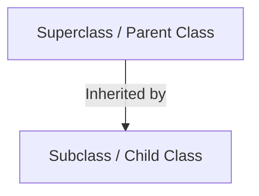
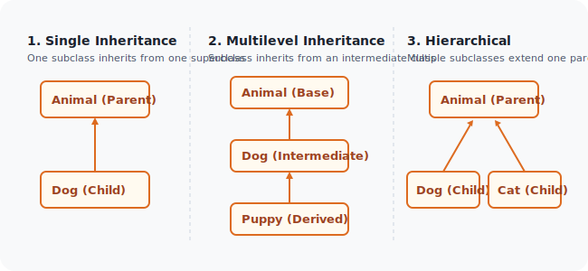
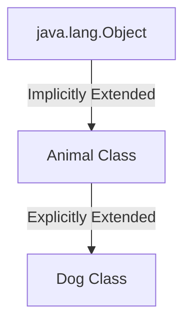
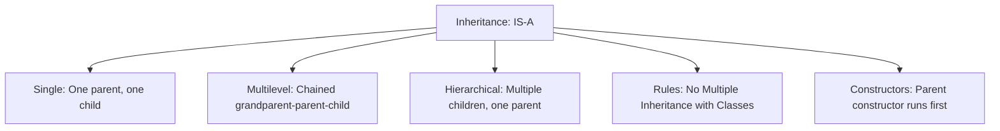

# Inheritance in Java

## Introduction

Inheritance is one of the four core pillars of Object-Oriented Programming (OOP), alongside Encapsulation, Polymorphism, and Abstraction. It is a mechanism that allows a new class (subclass) to inherit the state (fields) and behavior (methods) of an existing class (superclass).

By establishing relationships between classes, inheritance enables code reuse, reduces redundancy, and forms the basis for runtime polymorphism.

---

## What is Inheritance?

Inheritance models an **`IS-A` relationship** between classes. It is the connection between a general class (parent) and a specialized class (child).

### Examples:
* A `Dog` **IS-A** `Animal`.
* A `Car` **IS-A** `Vehicle`.
* A `Student` **IS-A** `Person`.

---

## Why Do We Need Inheritance?

Consider a scenario without inheritance where you write code for different animal types:

```java
class Dog {
    String name;
    public void eat() {
        System.out.println("Eating food...");
    }
}

class Cat {
    String name;
    public void eat() {
        System.out.println("Eating food...");
    }
}
```

This design leads to duplicate code. If you have fifty different animal classes, you would have to copy and paste the `name` field and the `eat()` method fifty times.

### The Inheritance Solution:
We factor out the common states and behaviors into a single, shared parent class (`Animal`) and extend it:

```java
class Animal {
    String name;
    public void eat() {
        System.out.println("Eating food...");
    }
}

// Inherit common fields and methods
class Dog extends Animal {}
class Cat extends Animal {}
```

Now, both `Dog` and `Cat` automatically inherit `name` and `eat()`, eliminating code duplication.

---

## Parent Class vs. Child Class

An inheritance relationship consists of two classes:
1. **Superclass (Parent / Base Class)**: The class whose properties and methods are inherited.
2. **Subclass (Child / Derived Class)**: The class that inherits properties from the superclass. A subclass can add its own unique variables and methods in addition to those inherited.



---

## Syntax

In Java, inheritance is implemented using the **`extends`** keyword:

```java
class Subclass extends Superclass {
    // Unique subclass properties and methods
}
```

---

## First Inheritance Program

Here is a complete executable program demonstrating a subclass inheriting a method from its superclass.

```java
// Superclass
class Animal {
    public void eat() {
        System.out.println("Animal is eating.");
    }
}

// Subclass
class Dog extends Animal {
    // Inherited eat() is implicitly present here
}

public class Main {
    public static void main(String[] args) {
        Dog myDog = new Dog();
        myDog.eat(); // Invokes the inherited eat() method
    }
}
```

### Output:
```text
Animal is eating.
```

### Method Lookup Mechanics:
When `myDog.eat()` is invoked, the JVM performs a lookup:
1. It searches the `Dog` class for the `eat()` method.
2. Since `eat()` is not found locally, the JVM traverses up the hierarchy to the parent `Animal` class.
3. The method is found in the `Animal` class and executed.

---

## Types of Inheritance Supported in Java

Java supports three primary types of inheritance using classes:



### 1. Single Inheritance
A subclass inherits from a single superclass.
```java
class Animal {}
class Dog extends Animal {}
```

### 2. Multilevel Inheritance
A subclass inherits from a parent class, which in turn inherits from another grandparent class.
```java
class Animal {}
class Dog extends Animal {}
class Puppy extends Dog {}
```

### 3. Hierarchical Inheritance
Multiple subclasses extend a single parent class.
```java
class Animal {}
class Dog extends Animal {}
class Cat extends Animal {}
```

---

## Multiple Inheritance Restriction in Java

Java **does not** support multiple inheritance with classes. A single class cannot extend more than one class:

```java
// WRONG (Will result in Compilation Error)
class C extends A, B {}
```

### Why is Multiple Inheritance Blocked?
This restriction prevents the **Diamond Problem** (ambiguity). If class `A` and class `B` both contain a method with the same signature `print()`, and class `C` extends both, calling `c.print()` would cause ambiguity because Java wouldn't know which parent's implementation to execute. To avoid this, Java supports multiple inheritance only through **Interfaces**.

---

## Constructors under Inheritance

When you instantiate a child class object, the parent class constructor executes **first**, followed by the child class constructor.

```java
class Animal {
    public Animal() {
        System.out.println("Animal (Parent) Constructor Executed");
    }
}

class Dog extends Animal {
    public Dog() {
        // super(); is implicitly called here by the compiler
        System.out.println("Dog (Child) Constructor Executed");
    }
}

public class Main {
    public static void main(String[] args) {
        Dog d = new Dog();
    }
}
```

### Output:
```text
Animal (Parent) Constructor Executed
Dog (Child) Constructor Executed
```

---

## The Object Class: The Universal Ancestor

Every class in Java that does not explicitly extend another class implicitly extends **`java.lang.Object`**. The `Object` class is the root of the entire Java class hierarchy.



Because of this, every class in Java inherits fundamental methods like `toString()`, `equals()`, and `hashCode()`.

---

## Inheritance vs. Composition

| Metric | Inheritance | Composition |
| :--- | :--- | :--- |
| **Relationship** | `IS-A` relationship | `HAS-A` relationship |
| **Syntax** | Class signature uses `extends` | Field references instances of other classes |
| **Binding** | Compile-time (Static binding) | Runtime (Dynamic binding) |
| **Coupling** | Tight coupling | Loose coupling |

---

## Concept Map



---

## Interview Questions (FAQ)

### What is inheritance?
Inheritance is the OOP mechanism where a subclass inherits fields and behaviors from a parent superclass.

### Which keyword is used to implement inheritance?
The `extends` keyword is used.

### Why does Java not support multiple inheritance with classes?
To prevent the ambiguity known as the **Diamond Problem**, where a subclass inherits conflicting method implementations from multiple parents.

---

## Practice Challenges

1. **Person-Student Hierarchy**: Create a `Person` class with fields `name` and `age`. Create a `Student` subclass extending `Person` with a unique `grade` field. Implement a method in `Student` that prints all three fields.
2. **Vehicle Classification**: Create a `Vehicle` base class with a method `honk()`. Extend it with a `Car` subclass. Call `honk()` using a `Car` object.

---

## Key Takeaways

* Inheritance represents an **`IS-A`** relationship.
* Subclasses reuse code from parent classes, reducing code duplication.
* Subclass constructors implicitly call their parent constructor (`super()`) on the first line.
* Java supports Single, Multilevel, and Hierarchical inheritance, but rejects Multiple inheritance with classes.

---

**Back to Module Home:** [Object-Oriented Programming](README.md)
