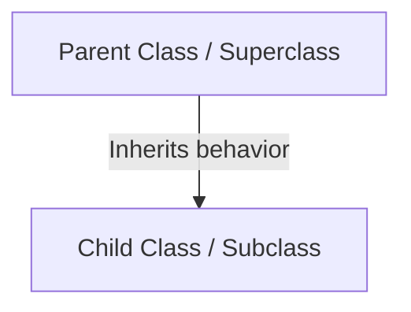
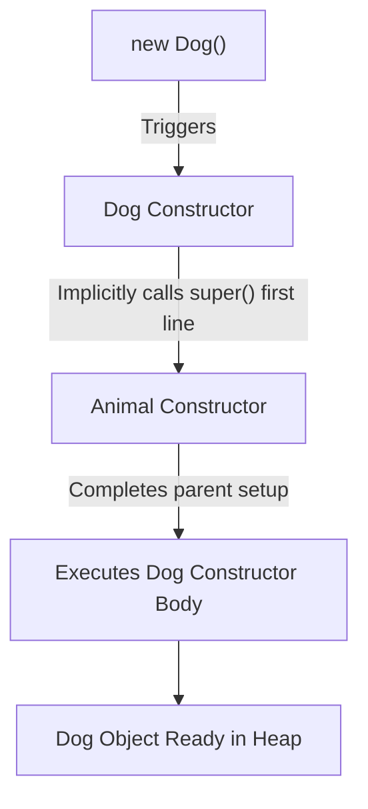
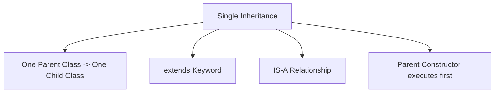

# Single Inheritance in Java

## Introduction

Inheritance creates a logical `IS-A` relationship between classes. The simplest and most common form of this relationship is **Single Inheritance**, where a single child subclass inherits directly from a single parent superclass.

This guide explores the structure, execution flow, memory details, and advantages of implementing single inheritance in Java.

---

## What is Single Inheritance?

Single Inheritance is a design structure where one subclass extends exactly one superclass. 



### Real-World Models:
* **Student** IS-A **Person**: A `Student` subclass inherits base properties (like name and age) from a `Person` superclass.
* **Car** IS-A **Vehicle**: A `Car` subclass inherits base actions (like start and stop) from a `Vehicle` superclass.
* **Dog** IS-A **Animal**: A `Dog` subclass inherits properties (like weight and breed) from an `Animal` superclass.

---

## Basic Single Inheritance Example

Here is a simple example showing a subclass inheriting a method from its superclass:

```java
// Superclass
class Animal {
    public void eat() {
        System.out.println("Animal is eating.");
    }
}

// Subclass inheriting from Animal
class Dog extends Animal {}

public class Main {
    public static void main(String[] args) {
        Dog dog = new Dog();
        dog.eat(); // Method eat() is inherited from Animal class
    }
}
```

### Output:
```text
Animal is eating.
```

### Subclass Method Resolution Flow:
When `dog.eat()` is executed:
1. Java searches the `Dog` class template on the Heap/Metaspace for the `eat()` method.
2. Finding no local implementation, Java traverses up the inheritance link to the `Animal` superclass.
3. The method is found in `Animal` and executed.

---

## Inheriting Fields and Methods Together

Inheriting both fields and methods enables child classes to reuse variables as well.

```java
// Parent Class
class Person {
    String name = "Sanjay";

    public void displayInfo() {
        System.out.println("Person Name: " + name);
    }
}

// Child Class extending Person
class Student extends Person {}

public class Main {
    public static void main(String[] args) {
        Student student = new Student();
        student.displayInfo(); // Accessing inherited method
    }
}
```

### Output:
```text
Person Name: Sanjay
```

---

## Constructor Execution Flow in Single Inheritance

When instantiating a subclass object, the parent class constructor executes **first**, followed by the child class constructor.

```java
class Animal {
    public Animal() {
        System.out.println("Animal (Parent) Constructor Called");
    }
}

class Dog extends Animal {
    public Dog() {
        // super() is called implicitly here by the compiler
        System.out.println("Dog (Child) Constructor Called");
    }
}

public class Main {
    public static void main(String[] args) {
        Dog dog = new Dog();
    }
}
```

### Output:
```text
Animal (Parent) Constructor Called
Dog (Child) Constructor Called
```



---

## Parameterized Constructors & the `super()` Keyword

If the parent class constructor has parameters, the child constructor must call the parent constructor explicitly using the **`super(...)`** keyword on the first line of the child constructor.

```java
class Person {
    protected String name; // protected modifier allows direct subclass access

    public Person(String name) {
        this.name = name;
    }

    public void displayPerson() {
        System.out.println("Name: " + name);
    }
}

class Student extends Person {
    private int rollNo;

    public Student(String name, int rollNo) {
        super(name); // Explicitly calling the parent constructor
        this.rollNo = rollNo;
    }

    public void displayStudent() {
        displayPerson(); // Accessing parent method
        System.out.println("Roll No: " + rollNo);
    }
}

public class Main {
    public static void main(String[] args) {
        Student student = new Student("Sanjay", 23);
        student.displayStudent();
    }
}
```

### Output:
```text
Name: Sanjay
Roll No: 23
```

---

## Advantages of Single Inheritance

* **Reusability**: Subclasses inherit existing fields/methods, reducing redundant code.
* **Low Redundancy**: Common features are maintained in one centralized superclass.
* **Organized Structure**: The class hierarchy naturally mirrors real-world relationships.
* **Simplicity**: With only one parent class, name shadowing conflicts and debugging are straightforward.

---

## Common Mistakes

### 1. Forgetting that Private Variables Are Not Inherited Directly
Subclasses cannot access `private` parent variables directly. Use `protected` variables or `public` getter/setter methods.
```java
class Parent {
    private String secret;
}

class Child extends Parent {
    public void print() {
        System.out.println(secret); // COMPILER ERROR: secret has private access in Parent
    }
}
```

### 2. Violating the IS-A Relationship
Do not use inheritance when classes do not have an `IS-A` relationship. For example, an `Engine` is not a `Car`. Use Composition instead.
```java
// WRONG
class Engine extends Car {}
```

---

## Concept Map



---

## Interview Questions (FAQ)

### What is single inheritance?
Single inheritance is a type of class design where a subclass inherits state and behavior from exactly one parent superclass.

### Can a parent class access members of a child class?
No. Inheritance is one-way: subclasses inherit from superclasses. A parent class has no knowledge of variables or methods defined in its child classes.

### What is the purpose of the `super` keyword in constructors?
The `super(...)` call is used to invoke a parent class's constructor from a subclass constructor, allowing parent fields to be initialized correctly.

---

## Practice Challenges

1. **Animal Sound System**: Create a parent class `Animal` with a method `sound()`. Create a `Dog` subclass that overrides `sound()` to print `"Bark"`.
2. **Employee Structure**: Create a parent class `Employee` with fields `name` and `salary` initialized via a constructor. Create a subclass `Manager` that adds a `bonus` field and utilizes `super()` to initialize the employee details.

---

## Key Takeaways

* Single inheritance represents an **`IS-A`** relationship with one parent class and one child class.
* The `extends` keyword establishes the inheritance hierarchy.
* Private parent members are not directly accessible; use `protected` or getter/setter methods instead.
* Subclass constructors call parent constructors (`super()`) before running their own initialization code.

---

**Back to Module Home:** [Object-Oriented Programming](README.md)
