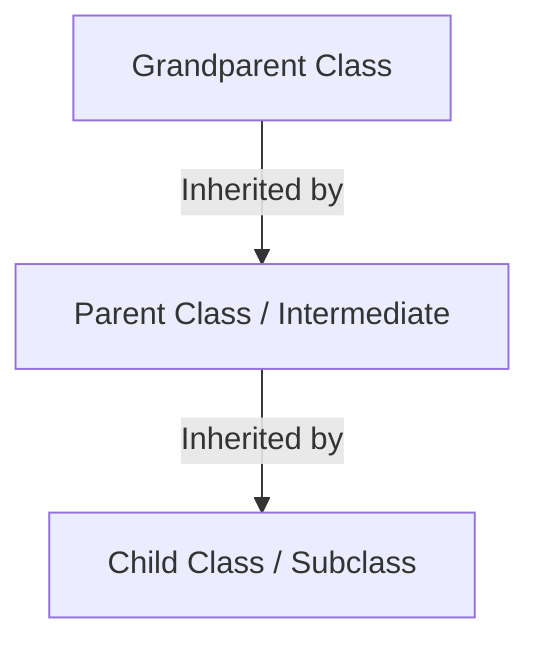
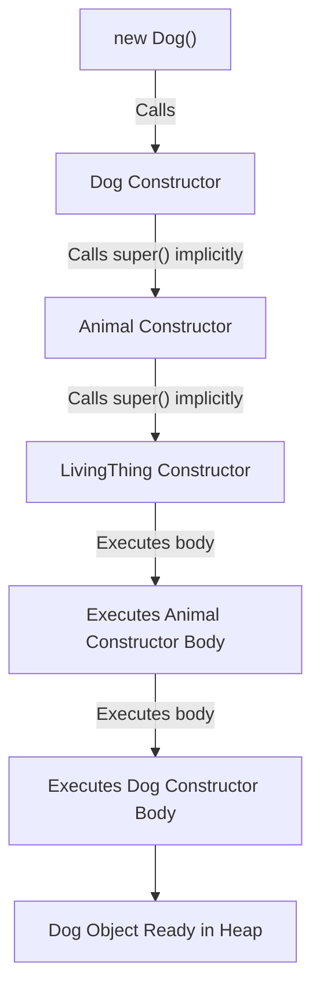
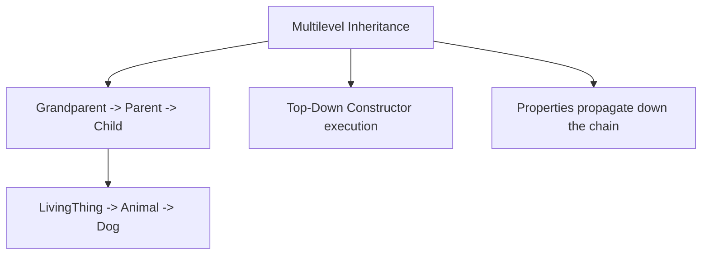

# Multilevel Inheritance in Java

## Introduction

In previous guides, we explored **Single Inheritance**, where one subclass inherits directly from one parent class. 

Java also supports **Multilevel Inheritance**, which extends the inheritance hierarchy into a chain: a child class is derived from a parent class, which in turn is derived from another grandparent class.



---

## What is Multilevel Inheritance?

Multilevel Inheritance occurs when a subclass extends another subclass, establishing a multi-tier chain of parent-child relationships. 

### Real-World Example:
* **LivingThing** (Grandparent Class)
  * $\rightarrow$ **Animal** (Parent Class / Intermediate)
    * $\rightarrow$ **Dog** (Child Class / Subclass)

In this structure:
* All `LivingThing` objects can `breathe()`.
* All `Animal` objects can also `eat()` (and breathe).
* All `Dog` objects can also `bark()` (and eat and breathe).

---

## Multilevel Inheritance Example

Here is a complete program demonstrating how intermediate classes act as both children and parents in the hierarchy chain.

```java
// Grandparent Class
class LivingThing {
    public void breathe() {
        System.out.println("Breathing oxygen...");
    }
}

// Parent Class extending LivingThing
class Animal extends LivingThing {
    public void eat() {
        System.out.println("Eating organic food...");
    }
}

// Child Class extending Animal
class Dog extends Animal {
    public void bark() {
        System.out.println("Barking... Woof!");
    }
}

public class Main {
    public static void main(String[] args) {
        Dog dog = new Dog();
        
        // Invoking methods from all three levels of the chain
        dog.breathe(); // Inherited from LivingThing
        dog.eat();     // Inherited from Animal
        dog.bark();    // Local to Dog
    }
}
```

### Output:
```text
Breathing oxygen...
Eating organic food...
Barking... Woof!
```

---

## Memory Representation

When a subclass at the bottom of the chain is instantiated, it inherits all properties and methods from its parent and grandparent classes.

```text
Dog Object on the Heap
┌──────────────────────────────────────┐
│ Inherited from LivingThing:          │
│ - breathe()                          │
├──────────────────────────────────────┤
│ Inherited from Animal:               │
│ - eat()                              │
├──────────────────────────────────────┤
│ Local to Dog:                        │
│ - bark()                             │
└──────────────────────────────────────┘
```

---

## Constructor Execution Flow in Multilevel Inheritance

Under multilevel inheritance, constructors execute in sequence from top-level parent to bottom-level child (top-down ordering).

```java
class LivingThing {
    public LivingThing() {
        System.out.println("LivingThing Constructor Executed");
    }
}

class Animal extends LivingThing {
    public Animal() {
        System.out.println("Animal Constructor Executed");
    }
}

class Dog extends Animal {
    public Dog() {
        System.out.println("Dog Constructor Executed");
    }
}

public class Main {
    public static void main(String[] args) {
        Dog dog = new Dog();
    }
}
```

### Output:
```text
LivingThing Constructor Executed
Animal Constructor Executed
Dog Constructor Executed
```



---

## Accessing Parent Variables Through Levels

State variables declared in higher-level classes travel down the inheritance chain, remaining accessible to descendant child classes (provided they are not private).

```java
class A {
    int x = 10;
}

class B extends A {}

class C extends B {}

public class Main {
    public static void main(String[] args) {
        C obj = new C();
        System.out.println("Value of x: " + obj.x); // Output: Value of x: 10
    }
}
```

---

## Advantages of Multilevel Inheritance

* **Deep Code Reuse**: Subclasses automatically acquire all functionality declared across the entire ancestry chain.
* **Granular Organization**: Methods can be declared at the exact conceptual level they belong to (e.g. `breathe()` in LivingThing, `eat()` in Animal).
* **Maintainability**: Changes in the grandparent class propagate down through all child classes automatically.

---

## Common Mistakes

### 1. Creating Excessively Deep Inheritance Chains
Designing deep chains (e.g. $A \rightarrow B \rightarrow C \rightarrow D \rightarrow E \rightarrow F$) creates tight coupling. This makes the code fragile, hard to debug, and difficult to maintain. Limit multilevel inheritance to reasonable depths (usually 2–3 levels).

### 2. Violating the IS-A Relationship in Intermediate Steps
Every step in the chain must satisfy the `IS-A` relationship.
```java
// WRONG - Engine is not a Car
class Vehicle {}
class Car extends Vehicle {}
class Engine extends Car {}
```

---

## Concept Map



---

## Interview Questions (FAQ)

### What is multilevel inheritance?
A type of inheritance where a subclass inherits from another subclass, forming a sequential parent-child inheritance chain.

### Do constructors execution orders change in multilevel inheritance?
No. Java always enforces top-down constructor execution: grandparent constructor runs first, then parent, and finally child.

### Can a child class bypass the parent and call grandparent methods directly?
Yes, inherited methods are part of the subclass's environment and can be called directly. However, if the intermediate parent class overrides the grandparent method, the subclass will invoke the overridden parent version. To bypass this and access the grandparent's overridden method directly is not possible in Java (e.g. `super.super.method()` is a compile error).

---

## Practice Challenges

1. **Academic Student Hierarchy**: Create a grandparent class `Person` with a method `talk()`. Create a parent class `Student` extending `Person` with `study()`. Create a child class `CollegeStudent` extending `Student` with `research()`. Instantiate `CollegeStudent` and invoke all three methods.
2. **Vehicle Category Chaining**: Design a `Vehicle` grandparent class, a `Car` parent class, and a `SportsCar` child class. Add unique methods to each class and demonstrate multilevel inheritance execution.

---

## Key Takeaways

* Multilevel inheritance establishes a sequential chain of parent-child relationships.
* The subclass at the bottom of the chain inherits members from all ancestor classes.
* Constructors execute starting from the top-most superclass down to the bottom subclass.
* Every step in the multilevel chain must satisfy the `IS-A` relationship.

---

**Back to Module Home:** [Object-Oriented Programming](README.md)
