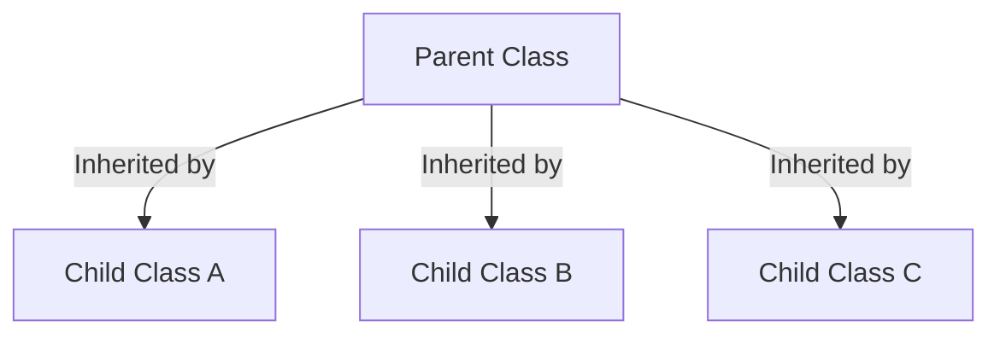
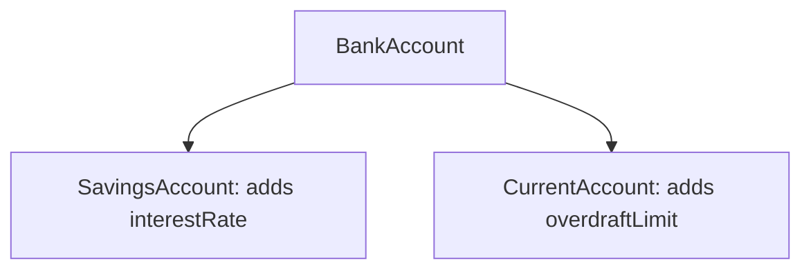
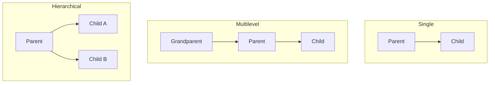
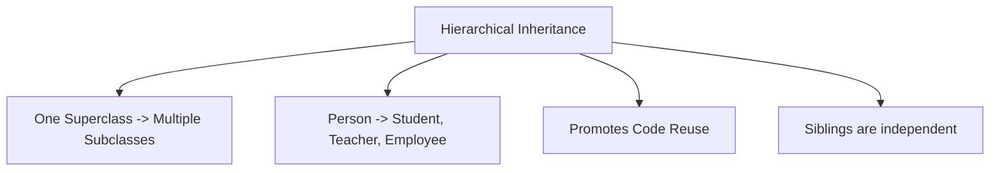

# Hierarchical Inheritance in Java

## Introduction

In previous guides, we explored **Single Inheritance** (one parent, one child) and **Multilevel Inheritance** (chained ancestor relationships). 

Java also supports **Hierarchical Inheritance**, where multiple child subclasses extend a single, shared parent superclass. This type of inheritance is highly effective for sharing common traits across multiple specialized entity types.



---

## What is Hierarchical Inheritance?

Hierarchical Inheritance is a class design pattern where a single superclass serves as the base for multiple distinct subclasses.

### Real-World Examples:
* **Animal** $\rightarrow$ `Dog`, `Cat`, `Horse`
* **Employee** $\rightarrow$ `Developer`, `Tester`, `Manager`
* **Account** $\rightarrow$ `SavingsAccount`, `CurrentAccount`, `LoanAccount`
* **Product** $\rightarrow$ `Electronics`, `Clothing`, `Grocery`

---

## Hierarchical Inheritance Example

Here is a complete program demonstrating how three separate classes inherit a base method from a common parent class:

```java
// Parent Superclass
class Animal {
    public void eat() {
        System.out.println("Animal is eating.");
    }
}

// Subclass A
class Dog extends Animal {
    public void bark() {
        System.out.println("Dog is barking.");
    }
}

// Subclass B
class Cat extends Animal {
    public void meow() {
        System.out.println("Cat is meowing.");
    }
}

// Subclass C
class Horse extends Animal {
    public void run() {
        System.out.println("Horse is running.");
    }
}

public class Main {
    public static void main(String[] args) {
        Dog dog = new Dog();
        Cat cat = new Cat();
        Horse horse = new Horse();

        // All subclasses execute the inherited eat() method
        dog.eat();
        dog.bark();

        cat.eat();
        cat.meow();

        horse.eat();
        horse.run();
    }
}
```

### Output:
```text
Animal is eating.
Dog is barking.
Animal is eating.
Cat is meowing.
Animal is eating.
Horse is running.
```

---

## Memory Representation

When you instantiate subclass objects in hierarchical inheritance, each subclass maintains its own separate block of memory on the Heap, carrying both the inherited properties and local properties.

```text
Dog Object (0x2a3b)        Cat Object (0x4c5d)        Horse Object (0x6e7f)
┌──────────────────┐        ┌──────────────────┐        ┌──────────────────┐
│ eat() (Inherited)│        │ eat() (Inherited)│        │ eat() (Inherited)│
│ bark() (Local)   │        │ meow() (Local)   │        │ run() (Local)    │
└──────────────────┘        └──────────────────┘        └──────────────────┘
```

---

## Constructor Execution Flow

Each instantiation of a subclass object triggers the parent class constructor followed by the subclass constructor. Instantiating one subclass does not affect the other subclasses.

```java
class Animal {
    public Animal() {
        System.out.println("Animal Constructor Executed");
    }
}

class Dog extends Animal {
    public Dog() {
        System.out.println("Dog Constructor Executed");
    }
}

class Cat extends Animal {
    public Cat() {
        System.out.println("Cat Constructor Executed");
    }
}

public class Main {
    public static void main(String[] args) {
        Dog dog = new Dog();
        System.out.println("---");
        Cat cat = new Cat();
    }
}
```

### Output:
```text
Animal Constructor Executed
Dog Constructor Executed
---
Animal Constructor Executed
Cat Constructor Executed
```

---

## Real-World Case Study: Banking Accounts

Hierarchical inheritance is a standard architecture for banking applications. All account types inherit base transaction data, but compute interest or limits differently.



---

## Advantages of Hierarchical Inheritance

* **Eliminates Code Duplication**: Core features (e.g. `eat()`, `start()`, `getBalance()`) are declared once in the parent class.
* **Organized Structures**: Keeps class responsibilities clearly separated.
* **Scalability**: A new child subclass (e.g., `Sheep` extending `Animal`) can be added with zero impact on existing siblings like `Dog` or `Cat`.

---

## Common Mistakes

### 1. Assuming Siblings Share Subclass Properties
Subclasses do not inherit from one another. A `Cat` object has no access to the `bark()` method defined in the `Dog` class.
```java
// WRONG
Cat cat = new Cat();
cat.bark(); // COMPILER ERROR: cannot find symbol method bark()
```

### 2. Violating the IS-A Relationship
Ensure every subclass extends a conceptual parent. A `Wheel` is not a `Car`. Use Composition instead.

---

## Single vs. Multilevel vs. Hierarchical Inheritance



---

## Concept Map



---

## Interview Questions (FAQ)

### What is hierarchical inheritance?
Hierarchical inheritance is a class structure where multiple subclasses extend a single, shared parent class.

### Can child classes in hierarchical inheritance access each other's members?
No. Siblings share a parent class, but their subclass declarations are independent. They cannot access each other's fields or methods.

### Can static variables be shared across all subclasses in hierarchical inheritance?
Yes. If the parent class defines a static variable, all subclasses and their instances share access to that single memory address.

---

## Practice Challenges

1. **E-Commerce Classification**: Create a `Product` parent class containing `price` and `display()`. Create subclasses `Electronics` and `Clothing` extending `Product`, each adding unique attributes.
2. **Vehicle Classification System**: Create a parent class `Vehicle` with a method `start()`. Extend it with subclasses `Car`, `Motorcycle`, and `Truck`. Instantiate objects for each and verify method access.

---

## Key Takeaways

* Hierarchical inheritance maps one superclass to multiple subclasses.
* Subclasses share parent features but remain completely independent of their siblings.
* This type of inheritance promotes modularity, code reuse, and easy system extensions.
* Subclass constructors invoke parent constructors (`super()`) on the first line.

---

**Back to Module Home:** [Object-Oriented Programming](README.md)
