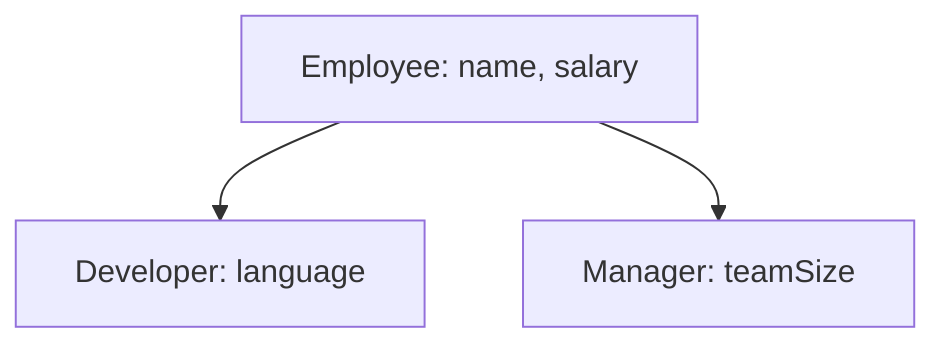
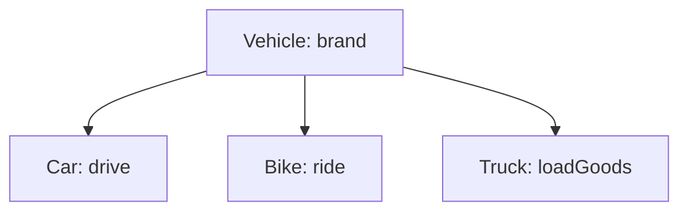
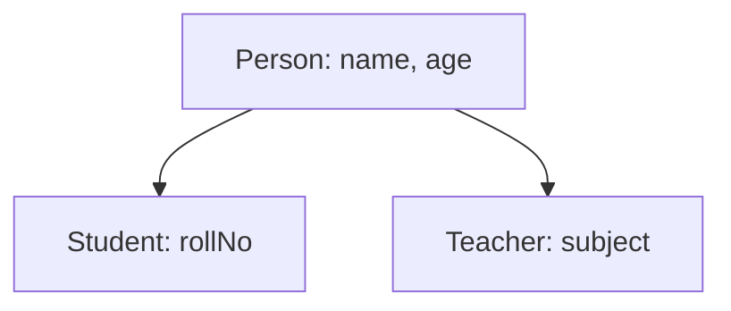
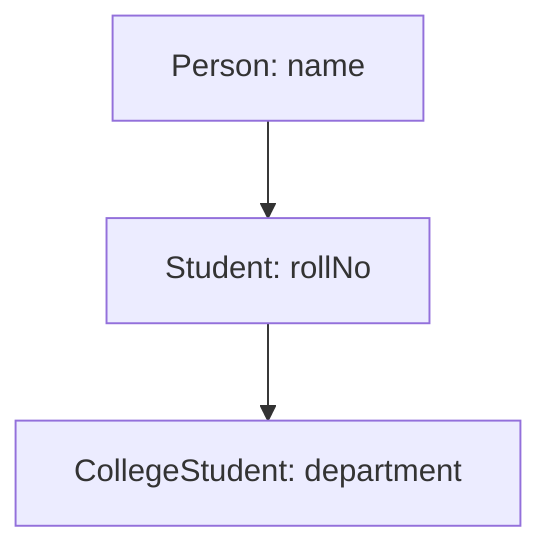
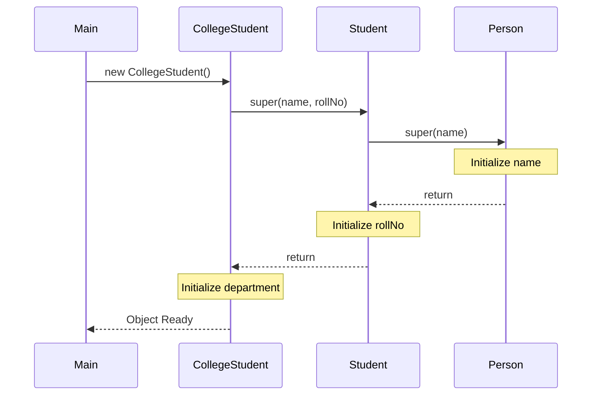

# Advanced Inheritance Practice Challenges

## Introduction

Now that we have covered Single, Multilevel, and Hierarchical inheritance, it is time to build real-world programs using inheritance. These challenges simulate designs used in professional software systems, showing how base properties and behaviors propagate through class hierarchies.

---

## Challenge 1: Employee Management System

### Problem Statement
Design an employee registry that models the following hierarchical relationship:
* An `Employee` superclass stores `name` (String) and `salary` (double).
* A `Developer` subclass inherits from `Employee` and adds `language` (String).
* A `Manager` subclass inherits from `Employee` and adds `teamSize` (int).



### Solution
```java
class Employee {
    protected String name;
    protected double salary;

    public Employee(String name, double salary) {
        this.name = name;
        this.salary = salary;
    }

    public void displayInfo() {
        System.out.println("Name   : " + name);
        System.out.println("Salary : $" + salary);
    }
}

class Developer extends Employee {
    private String language;

    public Developer(String name, double salary, String language) {
        super(name, salary); // Invoke parent constructor
        this.language = language;
    }

    public void displayDeveloper() {
        displayInfo(); // Invoke parent method
        System.out.println("Language: " + language);
    }
}

class Manager extends Employee {
    private int teamSize;

    public Manager(String name, double salary, int teamSize) {
        super(name, salary); // Invoke parent constructor
        this.teamSize = teamSize;
    }

    public void displayManager() {
        displayInfo(); // Invoke parent method
        System.out.println("Team Size: " + teamSize);
    }
}

public class Main {
    public static void main(String[] args) {
        Developer dev = new Developer("Sanjay", 60000, "Java");
        Manager mgr = new Manager("Rahul", 90000, 12);

        dev.displayDeveloper();
        System.out.println("---");
        mgr.displayManager();
    }
}
```

### Output:
```text
Name   : Sanjay
Salary : $60000.0
Language: Java
---
Name   : Rahul
Salary : $90000.0
Team Size: 12
```

---

## Challenge 2: Vehicle Management System

### Problem Statement
Design a vehicle hierarchy:
* A `Vehicle` parent class containing a `brand` field.
* Subclasses `Car`, `Bike`, and `Truck` that extend `Vehicle` and add unique methods: `drive()`, `ride()`, and `loadGoods()`, respectively.



### Solution
```java
class Vehicle {
    protected String brand;

    public Vehicle(String brand) {
        this.brand = brand;
    }

    public void start() {
        System.out.println(brand + " started.");
    }
}

class Car extends Vehicle {
    public Car(String brand) {
        super(brand);
    }

    public void drive() {
        System.out.println("Driving the car...");
    }
}

class Bike extends Vehicle {
    public Bike(String brand) {
        super(brand);
    }

    public void ride() {
        System.out.println("Riding the bike...");
    }
}

class Truck extends Vehicle {
    public Truck(String brand) {
        super(brand);
    }

    public void loadGoods() {
        System.out.println("Loading cargo onto the truck...");
    }
}
```

---

## Challenge 3: College Management System

### Problem Statement
Create a base `Person` class holding general demographics. Derive specialized classes `Student` and `Teacher` from it.
* `Person`: stores `name` and `age`.
* `Student`: inherits `Person` and adds `rollNo`.
* `Teacher`: inherits `Person` and adds `subject`.



### Solution
```java
class Person {
    protected String name;
    protected int age;

    public Person(String name, int age) {
        this.name = name;
        this.age = age;
    }

    public void displayPerson() {
        System.out.println("Name : " + name);
        System.out.println("Age  : " + age);
    }
}

class Student extends Person {
    private int rollNo;

    public Student(String name, int age, int rollNo) {
        super(name, age);
        this.rollNo = rollNo;
    }

    public void displayStudent() {
        displayPerson();
        System.out.println("Roll No: " + rollNo);
    }
}

class Teacher extends Person {
    private String subject;

    public Teacher(String name, int age, String subject) {
        super(name, age);
        this.subject = subject;
    }

    public void displayTeacher() {
        displayPerson();
        System.out.println("Subject: " + subject);
    }
}
```

---

## Challenge 4: Banking System

### Problem Statement
Build an account hierarchy where:
* `Account` stores `holder` name and `balance`.
* `SavingsAccount` and `CurrentAccount` extend `Account` and output their respective account types.

### Solution
```java
class Account {
    protected String holder;
    protected double balance;

    public Account(String holder, double balance) {
        this.holder = holder;
        this.balance = balance;
    }

    public void displayAccount() {
        System.out.println("Holder  : " + holder);
        System.out.println("Balance : $" + balance);
    }
}

class SavingsAccount extends Account {
    public SavingsAccount(String holder, double balance) {
        super(holder, balance);
    }

    public void accountType() {
        System.out.println("Account Type: Savings Account");
    }
}

class CurrentAccount extends Account {
    public CurrentAccount(String holder, double balance) {
        super(holder, balance);
    }

    public void accountType() {
        System.out.println("Account Type: Current Account");
    }
}
```

---

## Challenge 5: University System (Multilevel Inheritance)

### Problem Statement
Construct a multilevel hierarchy (`Person` $\rightarrow$ `Student` $\rightarrow$ `CollegeStudent`).
* `Person` contains `name`.
* `Student` adds `rollNo`.
* `CollegeStudent` adds `department` and prints the final student sheet.



### Solution
```java
class Person {
    protected String name;

    public Person(String name) {
        this.name = name;
    }
}

class Student extends Person {
    protected int rollNo;

    public Student(String name, int rollNo) {
        super(name);
        this.rollNo = rollNo;
    }
}

class CollegeStudent extends Student {
    private String department;

    public CollegeStudent(String name, int rollNo, String department) {
        super(name, rollNo);
        this.department = department;
    }

    public void display() {
        System.out.println("Name       : " + name);
        System.out.println("Roll No    : " + rollNo);
        System.out.println("Department : " + department);
    }
}

public class Main {
    public static void main(String[] args) {
        CollegeStudent student = new CollegeStudent("Sanjay", 23, "AIDS");
        student.display();
    }
}
```

---

## Understanding Constructor Chaining

When you execute `new CollegeStudent("Sanjay", 23, "AIDS")`:
1. `CollegeStudent` constructor is called.
2. It delegates to the `Student` constructor using `super(name, rollNo)`.
3. `Student` constructor delegates to `Person` using `super(name)`.
4. `Person` constructor initializes the `name` field.
5. Control flows back down, initializing `rollNo` and `department` sequentially.



---

## Common Mistakes

### 1. Forgetting to pass arguments via super()
If a parent constructor requires parameters, the child constructor must explicitly call `super(arguments)` on its very first line.
```java
// WRONG - Compiler error if Person lacks a no-arg constructor
public Student() { 
    // Implicit super() fails!
} 
```

### 2. Violating data hiding rules
Using `private` variables in the parent class and attempting to access them directly in subclasses will fail. Use `protected` variables or public getters.

---

## Key Takeaways

* Inheritance structures reuse functionality across multiple codebases.
* Subclasses delegate variable initialization to parent constructors using `super()`.
* Protected variables allow subclasses to access fields directly while restricting access to unrelated class packages.
* Use multilevel and hierarchical structures to model complex real-world classifications.

---

**Back to Module Home:** [Object-Oriented Programming](README.md)
