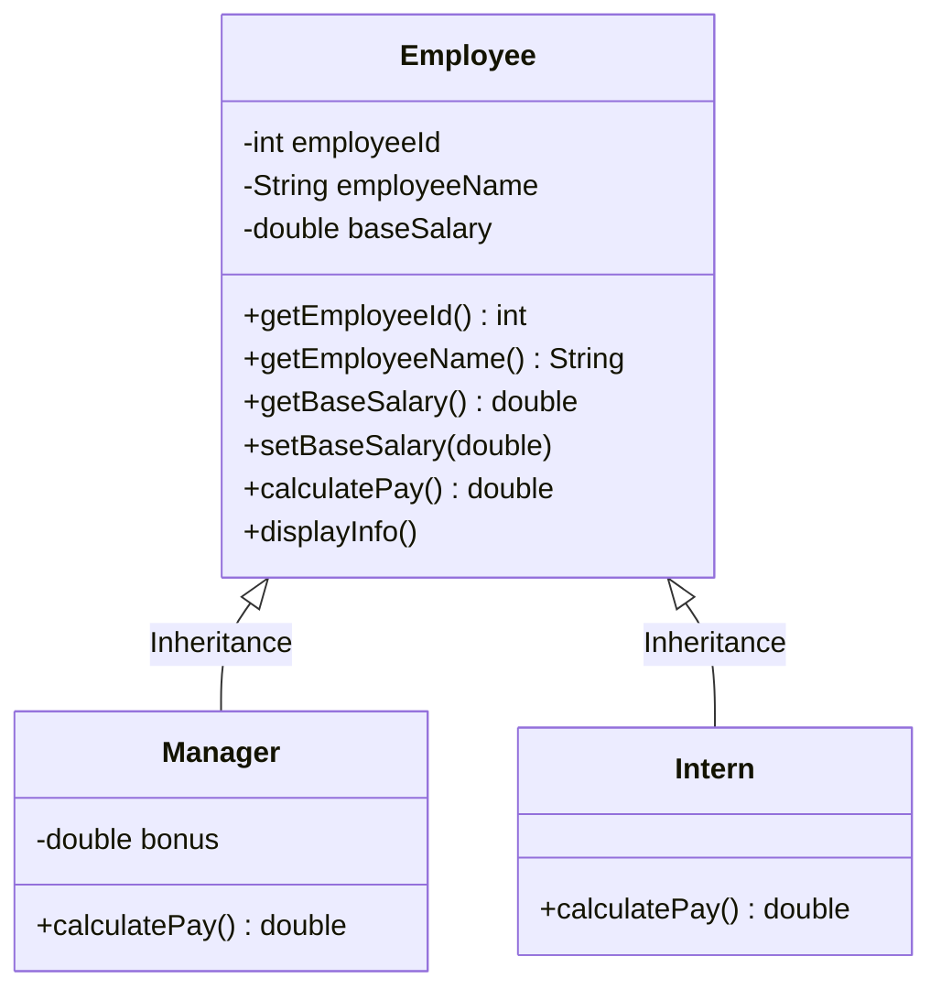
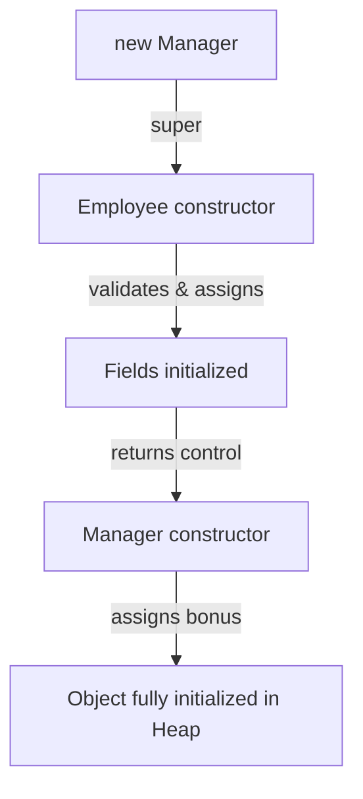

# Inheritance and Encapsulation Integration

## Introduction

So far, we have explored **Encapsulation** (securing state variables) and **Inheritance** (propagating state/behavior down class structures) as isolated pillars. 

In this case study, we combine these pillars to build a **Corporate Payroll Management System**. We will see how private parent properties are secured through encapsulation, yet accessed and initialized correctly by child subclasses using parent accessor APIs and constructors.

---

## Case Study: Corporate Payroll System

### Requirements:
1. **Employee (Parent Superclass)**:
   * Holds private variables `employeeId` (int), `employeeName` (String), and `baseSalary` (double).
   * Restricts direct modifications to `baseSalary` (only positive inputs allowed).
   * Declares a public method `calculatePay()` returning `baseSalary`.
2. **Manager (Child Subclass)**:
   * Inherits `Employee` fields and methods.
   * Adds private variable `bonus` (double).
   * Overrides `calculatePay()` to compute: $\text{Base Salary} + \text{Bonus}$.
3. **Intern (Child Subclass)**:
   * Inherits `Employee` fields and methods.
   * Overrides `calculatePay()` to return just the base stipend (the base salary).



---

## Code Implementation

Here is the unified Java code structure combining access controls, constructor delegations, and overridden calculations.

```java
// Superclass enforcing Encapsulation
class Employee {
    private int employeeId;
    private String employeeName;
    private double baseSalary; // Secure private field

    public Employee(int employeeId, String employeeName, double baseSalary) {
        this.employeeId = employeeId;
        this.employeeName = employeeName;
        setBaseSalary(baseSalary); // Route assignment through setter for validation
    }

    public int getEmployeeId() {
        return employeeId;
    }

    public String getEmployeeName() {
        return employeeName;
    }

    public double getBaseSalary() {
        return baseSalary;
    }

    public void setBaseSalary(double baseSalary) {
        if (baseSalary >= 0) {
            this.baseSalary = baseSalary;
        } else {
            System.out.println("Warning: Invalid negative salary ignored. Defaulting to 0.0");
            this.baseSalary = 0.0;
        }
    }

    public double calculatePay() {
        return baseSalary;
    }

    public void displayInfo() {
        System.out.println("Employee ID   : " + employeeId);
        System.out.println("Employee Name : " + employeeName);
    }
}

// Subclass inheriting base traits, adding Manager behaviors
class Manager extends Employee {
    private double bonus;

    public Manager(int employeeId, String employeeName, double baseSalary, double bonus) {
        super(employeeId, employeeName, baseSalary); // Initialize parent variables
        this.bonus = bonus;
    }

    @Override
    public double calculatePay() {
        // Can only access baseSalary using the public getter
        return getBaseSalary() + bonus;
    }
}

// Subclass inheriting base traits, representing Intern behaviors
class Intern extends Employee {
    public Intern(int employeeId, String employeeName, double stipend) {
        super(employeeId, employeeName, stipend);
    }

    @Override
    public double calculatePay() {
        return getBaseSalary();
    }
}

public class Main {
    public static void main(String[] args) {
        Manager manager = new Manager(101, "Sanjay", 80000, 15000);
        Intern intern = new Intern(201, "Rahul", 15000);

        System.out.println("=== MANAGER DETAILS ===");
        manager.displayInfo();
        System.out.println("Monthly Net Pay: $" + manager.calculatePay());

        System.out.println("\n=== INTERN DETAILS ===");
        intern.displayInfo();
        System.out.println("Monthly Net Pay: $" + intern.calculatePay());
    }
}
```

### Output:
```text
=== MANAGER DETAILS ===
Employee ID   : 101
Employee Name : Sanjay
Monthly Net Pay: $95000.0

=== INTERN DETAILS ===
Employee ID   : 201
Employee Name : Rahul
Monthly Net Pay: $15000.0
```

---

## OOP Principles In Action

### 1. Encapsulation
The `baseSalary` variable is marked `private`. If subclass code tries to access `baseSalary` directly (e.g. `this.baseSalary = 80000`), a compiler error is thrown. Access must go through `getBaseSalary()` and `setBaseSalary()`.

### 2. Inheritance
Rather than copying the ID, name, and basic print logic into both classes, `Manager` and `Intern` inherit `employeeId`, `employeeName`, and `displayInfo()` directly from `Employee`.

---

## Constructor Execution Mechanics

When you call `new Manager(...)`:
1. `Manager` constructor runs and calls `super(employeeId, employeeName, baseSalary)`.
2. `Employee` constructor executes, initializing name and validating salary.
3. Once the parent constructor completes, the `Manager` constructor finishes by initializing `bonus`.



---

## Interview Questions (FAQ)

### If a child subclass inherits private parent fields, where are they stored?
They are stored inside the subclass object on the Heap. Marking fields `private` only restricts visibility in the source code; the subclass instance still contains memory allocated for those fields.

### Why is `super()` required when parent fields are private?
Because parent fields are private, a subclass constructor cannot initialize them directly. The child constructor must call the parent constructor (`super(...)`) to let the parent initialize its own private variables.

### What is the advantage of using getters inside child methods like `calculatePay()`?
It prevents breaking encapsulation. If the parent class changes how salary is calculated or formatted in the future, the child subclasses will automatically inherit those updates.

---

## Key Takeaways

* Private fields inside a superclass are inherited by subclasses, but can only be accessed via public or protected getters and setters.
* Subclass constructors must use `super(...)` to initialize inherited private superclass fields.
* Method overriding allows child classes to implement custom logic (like `calculatePay()`) while retaining the base structure.

---

**Back to Module Home:** [Object-Oriented Programming](README.md)
