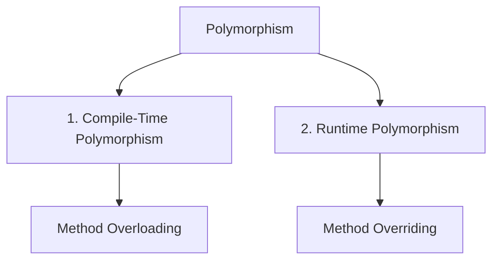
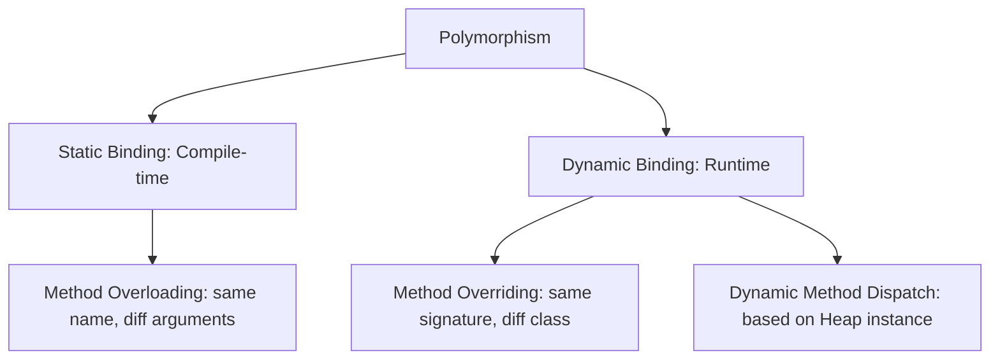

# Polymorphism in Java

## Introduction

Polymorphism is one of the four key pillars of Object-Oriented Programming (OOP), alongside Encapsulation, Inheritance, and Abstraction. The word itself originates from Greek:
* **`Poly`** = Many
* **`Morph`** = Form

In Java, **Polymorphism** is the ability of a single method, interface, or object reference to behave in multiple forms. It allows us to write general code that works with parent definitions while executing child-specific behaviors at runtime.

---

## Real-World Analogy: The Person

Consider yourself:
* At **Home**, you act as a **Son / Daughter**.
* At **College**, you act as a **Student**.
* At the **Office**, you act as an **Employee**.

You are the same person, but you react differently depending on the context. That is the essence of polymorphism.

---

## Types of Polymorphism in Java

Java supports two primary forms of polymorphism:



---

## 1. Compile-Time Polymorphism (Static Binding)

Compile-time polymorphism is achieved using **Method Overloading**. It occurs when multiple methods in the same class share the same name but have different parameter lists (different count, type, or order of parameters).

### Calculator Example:
```java
class Calculator {
    // Overloaded method: 2 parameters
    public int add(int a, int b) {
        return a + b;
    }

    // Overloaded method: 3 parameters
    public int add(int a, int b, int c) {
        return a + b + c;
    }
}

public class Main {
    public static void main(String[] args) {
        Calculator calc = new Calculator();
        System.out.println(calc.add(10, 20));     // Executes 2-parameter method
        System.out.println(calc.add(10, 20, 30)); // Executes 3-parameter method
    }
}
```

### Why "Compile-Time"?
It is called compile-time polymorphism because the compiler binds the method call to its actual definition during compilation based on the arguments passed. This is also called **Static Binding** or **Early Binding**.

---

## 2. Runtime Polymorphism (Dynamic Binding)

Runtime polymorphism is achieved using **Method Overriding** combined with **Upcasting** (assigning a subclass object to a parent reference variable).

### Animal Hierarchy Example:
```java
// Superclass
class Animal {
    public void sound() {
        System.out.println("Animal makes a sound");
    }
}

// Subclass A
class Dog extends Animal {
    @Override
    public void sound() {
        System.out.println("Dog barks: Woof!");
    }
}

// Subclass B
class Cat extends Animal {
    @Override
    public void sound() {
        System.out.println("Cat meows: Meow!");
    }
}
```

```java
public class Main {
    public static void main(String[] args) {
        Animal myAnimal; // Parent Reference Variable

        myAnimal = new Dog(); // Upcasting
        myAnimal.sound();     // Resolves to Dog's sound() at runtime

        myAnimal = new Cat(); // Upcasting
        myAnimal.sound();     // Resolves to Cat's sound() at runtime
    }
}
```

### Output:
```text
Dog barks: Woof!
Cat meows: Meow!
```

---

## Dynamic Method Dispatch

Runtime polymorphism works via **Dynamic Method Dispatch**. 

When an overridden method is called through a parent class reference, Java determines which implementation to execute based on the **actual object type in Heap memory** at runtime, rather than the reference type.


---

## Compile-Time vs. Runtime Polymorphism

| Feature | Compile-Time Polymorphism | Runtime Polymorphism |
| :--- | :--- | :--- |
| **Concept** | Method Overloading | Method Overriding |
| **Resolution Time** | Decided during Compilation | Decided during Execution (Runtime) |
| **Binding** | Static / Early Binding | Dynamic / Late Binding |
| **Class Scope** | Usually within the same class | Inherited across Parent-Child classes |
| **Performance** | Faster (no lookup at runtime) | Slightly slower (due to vtable lookup) |

---

## Advantages of Polymorphism

* **Flexibility**: A single reference variable can store and trigger behaviors across different subclasses.
* **Scalability**: New subclasses can be introduced with zero changes to caller code that references the parent type.
* **Decoupling**: Decouples the generic interface design from child implementations.

---

## Common Mistakes

### 1. Expecting Parent Reference to Access Child-Unique Methods
A parent reference variable can *only* invoke methods declared in the parent class. If a subclass adds a brand-new method that is not in the parent, a parent reference cannot call it directly.
```java
Animal animal = new Dog();
animal.bark(); // COMPILER ERROR: bark() is not defined in Animal class!
```
*(To call child-unique methods, reference type casting is required).*

### 2. Confusing Method Signature Overloading with Overriding
Overriding requires the *exact same* parameters. Changing the parameter list in a child class creates an overloaded method, not an overridden one, disabling runtime polymorphism.

---

## Concept Map



---

## Interview Questions (FAQ)

### What is polymorphism?
Polymorphism is the capability of a method or object to execute in multiple forms.

### What is Dynamic Method Dispatch?
It is the runtime mechanism Java uses to resolve calls to overridden methods. The JVM invokes the implementation belonging to the actual runtime object on the Heap, not the compile-time reference type.

### Can static methods be overridden to show runtime polymorphism?
No. Static methods are bound to the class itself, not individual object instances. Binds occur statically at compile-time. If you redefine a static method in a subclass, it is called **Method Hiding**, not overriding.

---

## Practice Challenges

1. **Payment Portal**: Design a base class `Payment` with a method `pay()`. Derive child classes `UPIPayment` and `CardPayment`. Override `pay()` in each. Write a driver program using a single `Payment` reference variable to invoke both methods.
2. **Shape Drawer**: Create a base class `Shape` with a method `draw()`. Extend it with `Circle` and `Square`. Override `draw()` and demonstrate dynamic dispatch.

---

## Key Takeaways

* Polymorphism means **"one interface, multiple implementations"**.
* Method overloading resolves at compile-time (early binding).
* Method overriding resolves at runtime (late binding).
* Dynamic method dispatch selects method implementations based on the actual Heap object, not the Stack reference type.

---

**Back to Module Home:** [Object-Oriented Programming](README.md)
