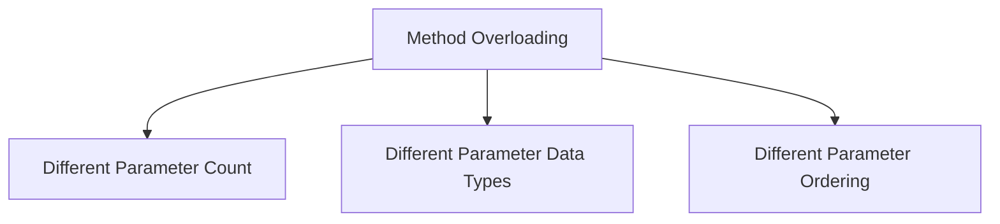
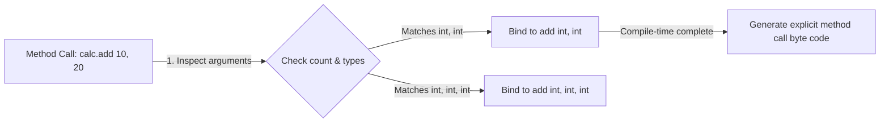
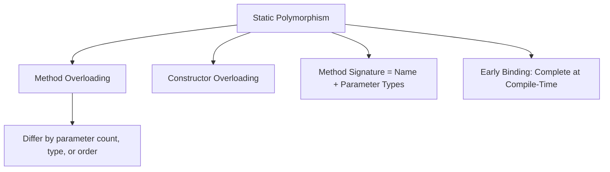

# Compile-Time Polymorphism in Java

## Introduction

In Object-Oriented Programming (OOP), **Compile-Time Polymorphism** occurs when the binding between a method call and its actual implementation is resolved by the compiler at compile-time, before the program runs.

Because these decisions are made early during compilation, this concept is also known as:
* **Static Polymorphism**
* **Static Binding**
* **Early Binding**

In Java, compile-time polymorphism is achieved using **Method Overloading** and **Constructor Overloading**.

---

## What is Method Overloading?

Method Overloading is a class design feature that allows a class to declare multiple methods with the **same name** but **different parameter lists**.

### Rules for Overloading Method Parameters:
To overload a method name, the parameter declarations must differ in at least one of the following criteria:
1. **The number of parameters** (e.g., `add(int, int)` vs. `add(int, int, int)`).
2. **The data types of parameters** (e.g., `show(int)` vs. `show(double)`).
3. **The order of parameters** (e.g., `display(int, String)` vs. `display(String, int)`).



---

## Method Overloading Examples

### 1. Different Number of Parameters
```java
class Calculator {
    public int add(int a, int b) {
        return a + b;
    }

    public int add(int a, int b, int c) {
        return a + b + c;
    }
}
```

### 2. Different Parameter Data Types
```java
class Display {
    public void show(int num) {
        System.out.println("Integer input: " + num);
    }

    public void show(double num) {
        System.out.println("Double input: " + num);
    }
}
```

### 3. Different Parameter Ordering
```java
class Reporter {
    public void display(int id, String status) {
        System.out.println("ID: " + id + ", Status: " + status);
    }

    public void display(String status, int id) {
        System.out.println("Status: " + status + ", ID: " + id);
    }
}
```

---

## Execution Flow & Binding Mechanics

When the compiler encounters a method call like `calc.add(10, 20)`, it performs signature matching:



Since the target method is mapped directly in the bytecode, execution is highly optimized at runtime.

---

## Method Signatures and Return Type Restrictions

In Java, a method is uniquely identified within a class by its **Method Signature**:
$$\text{Method Signature} = \text{Method Name} + \text{Parameter List}$$

### Return Type Restriction:
Changing only the return type of a method is **not** valid overloading. The compiler ignores return types during resolution and throws a duplicate method compilation error.

```java
// INVALID OVERLOADING (Will cause compile error)
class Calculator {
    public int add(int a, int b) { return a + b; }
    public double add(int a, int b) { return a + b; } // Error: duplicate method add(int, int)
}
```

---

## Constructor Overloading

Constructors, like regular methods, can be overloaded to provide multiple ways to instantiate objects.

```java
class Student {
    private String name;

    // No-arg constructor
    public Student() {
        this.name = "Unknown";
        System.out.println("Default Constructor Called");
    }

    // Parameterized constructor
    public Student(String name) {
        this.name = name;
        System.out.println("Parameterized Constructor Called: " + name);
    }
}

public class Main {
    public static void main(String[] args) {
        Student s1 = new Student();         // Binds to no-arg constructor
        Student s2 = new Student("Sanjay"); // Binds to parameterized constructor
    }
}
```

### Output:
```text
Default Constructor Called
Parameterized Constructor Called: Sanjay
```

---

## Advantages of Compile-Time Polymorphism

* **Readability**: Operations that are conceptually identical but accept different parameters use the same name (e.g. `add()` or `print()`).
* **Flexibility**: Clients can call methods using different argument patterns.
* **Performance**: Early binding incurs zero runtime lookup overhead.

---

## Concept Map



---

## Interview Questions (FAQ)

### What is Compile-Time Polymorphism?
A polymorphism model where the method binding is decided by the compiler during compilation based on the method signatures.

### Why is changing only the return type invalid for overloading?
Because at call site, e.g. `add(5, 10)`, the compiler cannot determine the return type context. The compiler matches methods based on method signatures (name + parameter types), which excludes return types.

### Can static methods be overloaded?
Yes. Static methods can be overloaded in the same class as long as their parameter lists are different.

---

## Practice Challenges

1. **Area Calculator**: Write a class `AreaCalculator` with overloaded methods:
   * `area(int side)` $\rightarrow$ Calculates square area.
   * `area(int length, int breadth)` $\rightarrow$ Calculates rectangle area.
   * `area(double radius)` $\rightarrow$ Calculates circle area.
2. **Contact Card**: Create a class `Contact` with overloaded constructors to create contacts with either `(name, phone)` or `(name, phone, email)`.

---

## Key Takeaways

* Compile-time polymorphism is achieved via method and constructor overloading.
* Overloaded methods must differ in parameter count, type, or order.
* Return types are not part of method signatures and cannot be used alone for overloading.
* It is also referred to as Static Polymorphism or Early/Static Binding.

---

**Back to Module Home:** [Object-Oriented Programming](README.md)
