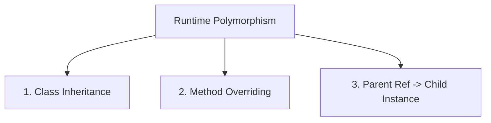
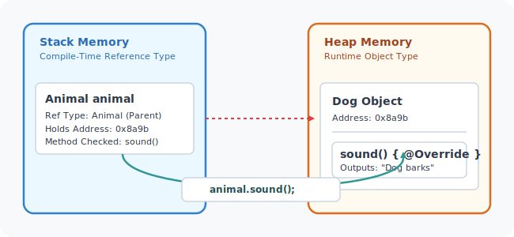
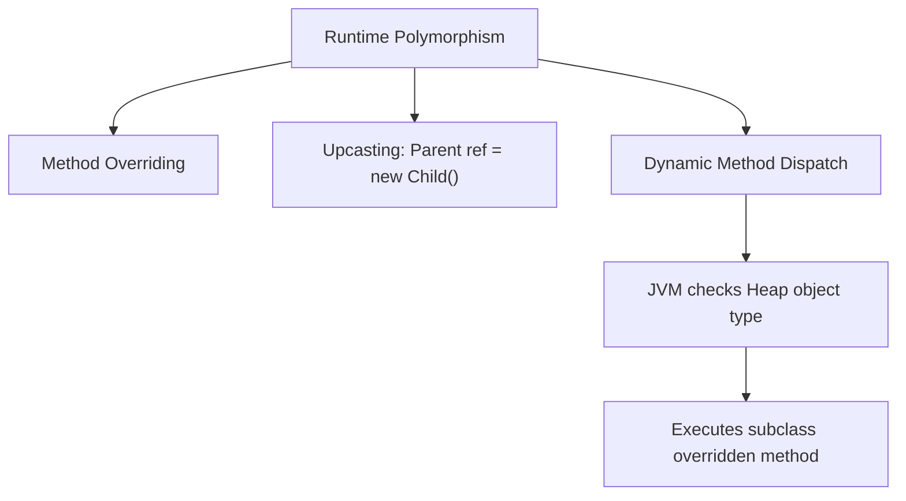

# Runtime Polymorphism in Java

## Introduction

In previous guides, we explored **Compile-Time Polymorphism** (early binding resolved via method overloading). 

This guide examines **Runtime Polymorphism**, where method calls are bound to their implementations during program execution rather than compilation. Runtime polymorphism is the core mechanism that allows Java to execute subclass-specific behaviors dynamically.

This mechanism is also known as:
* **Dynamic Polymorphism**
* **Late Binding**
* **Dynamic Method Dispatch**

---

## What is Runtime Polymorphism?

Runtime Polymorphism is the capability by which a call to an overridden method is resolved at runtime. It is implemented in Java by combining three distinct concepts:
1. **Inheritance**: Subclasses must inherit from a common parent class.
2. **Method Overriding**: Subclasses must provide their own custom implementations of a method declared in the parent class.
3. **Upcasting (Parent Reference, Child Object)**: A reference variable of the parent class must point to a subclass object.



---

## Core Mechanics: Method Overriding Rules

For a subclass to successfully override a parent method and trigger runtime polymorphism:
* The subclass method must share the **exact same name** as the parent method.
* The subclass method must declare the **exact same parameter list** (signatures must match).
* The subclass method's return type must be the same (or a subtype, known as a **covariant return type**).
* The access modifier of the overriding method cannot be more restrictive than the parent method (e.g. if the parent method is `protected`, the child method must be `protected` or `public`).

---

## Runtime Polymorphism Example

Here is a complete program demonstrating dynamic binding.

```java
// Superclass
class Animal {
    public void sound() {
        System.out.println("Animal makes a general sound.");
    }
}

// Subclass A
class Dog extends Animal {
    @Override
    public void sound() {
        System.out.println("Dog barks: Woof!");
    }
}

// Subclass B
class Cat extends Animal {
    @Override
    public void sound() {
        System.out.println("Cat meows: Meow!");
    }
}

public class Main {
    public static void main(String[] args) {
        Animal animal; // Parent Reference Variable

        animal = new Dog(); // Reference points to Dog object on Heap
        animal.sound();     // Output: Dog barks: Woof!

        animal = new Cat(); // Reference points to Cat object on Heap
        animal.sound();     // Output: Cat meows: Meow!
    }
}
```

### Why does `Dog.sound()` execute?
Even though the compile-time type of the variable `animal` is `Animal`, the JVM inspects the **actual object type in Heap memory** when executing `animal.sound()`. Since the object is an instance of `Dog` (or `Cat`), the overridden method inside `Dog` (or `Cat`) is dispatched.

---

## Dynamic Method Dispatch

Dynamic Method Dispatch is the name of the execution-time algorithm that resolves overridden method calls. The JVM locates the correct method inside the subclass's method table (vtable) dynamically.



---

## Crucial Rule: Variables are NOT Polymorphic

While method invocations participate in late binding, instance variables do not. Variable resolution is determined strictly by the compile-time reference type (Static Binding).

```java
class Animal {
    String name = "Generic Animal";
}

class Dog extends Animal {
    String name = "Dog";
}

public class Main {
    public static void main(String[] args) {
        Animal animal = new Dog();
        System.out.println(animal.name); // Prints "Generic Animal", NOT "Dog"!
    }
}
```

### Output:
```text
Generic Animal
```

---

## Constructors and Runtime Polymorphism

**Constructors cannot be overridden.** A constructor is tied to a specific class definition and is never inherited by subclasses. Therefore, constructors cannot participate in runtime polymorphism.

```java
class Parent {
    public Parent() {} // Constructor
}

class Child extends Parent {
    // INVALID - Compile error
    @Override
    public Parent() {} 
}
```

---

## Compile-Time vs. Runtime Polymorphism

| Parameter | Compile-Time Polymorphism | Runtime Polymorphism |
| :--- | :--- | :--- |
| **Technique** | Method Overloading | Method Overriding |
| **Binding Mechanism** | Early Binding / Static Binding | Late Binding / Dynamic Binding |
| **Execution Speed** | Faster execution (binding resolved at compile-time) | Slightly slower (method lookup occurs at runtime) |
| **Inheritance Requirement**| Not required | Mandatory |

---

## Advantages of Runtime Polymorphism

* **Plug-and-Play Extensibility**: New subclasses can be written and plugged into existing codebases with zero adjustments to calls referencing the parent.
* **Loose Coupling**: Client programs interact with general interfaces rather than hardcoding child dependencies.
* **Code Cleanliness**: Replaces cluttered `if-else` or `switch` type checks (e.g. checking whether a vehicle is a car, truck, or bike) with a single polymorphic call (`vehicle.start()`).

---

## Concept Map



---

## Interview Questions (FAQ)

### What is dynamic method dispatch?
It is the runtime mechanism by which the JVM resolves calls to overridden methods, executing the implementation corresponding to the actual instance on the Heap.

### Can static methods be overridden?
No. Static methods belong to the class namespace, not object instances. Redefining a static method in a subclass hides the parent method, which is known as **Method Hiding**, and does not support late binding.

### What is a covariant return type in overriding?
It allows an overriding subclass method to return a subtype of the return type declared in the parent method. For example, if a parent method returns `Animal`, the overridden child method can return `Dog`.

---

## Practice Challenges

1. **Shape Area Calculator**: Create a base class `Shape` with a method `calculateArea()`. Extend it with subclasses `Circle` (needs radius) and `Rectangle` (needs width/height). Override `calculateArea()` in each subclass. Use a parent `Shape` reference array to compute and display areas for different shapes.
2. **Device Remote System**: Define a `Device` superclass with a method `turnOn()`. Extend it with `Television` and `AirConditioner` subclasses. Demonstrate dynamic dispatch by invoking `turnOn()` on different device instances.

---

## Key Takeaways

* Runtime polymorphism relies on method overriding and upcasting.
* Overridden method execution is resolved at runtime based on the actual object type in the Heap.
* Instance variables are **not** polymorphic; they are resolved based on the compile-time reference type.
* Constructors cannot be overridden.

---

**Back to Module Home:** [Object-Oriented Programming](README.md)
