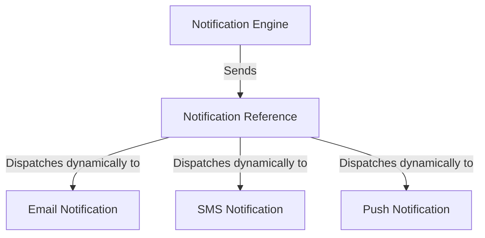
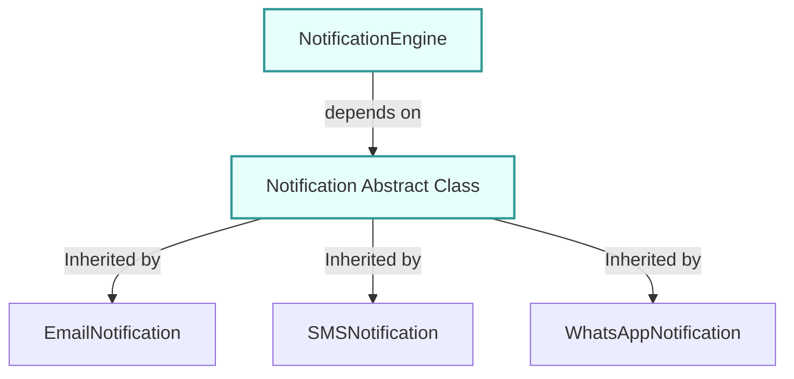

# Advanced Polymorphism: Notification System

## Introduction

In enterprise software engineering, code must be built for scalability. When new features are requested, developers should not have to modify existing, tested code. Instead, the architecture should allow adding new classes that integrate seamlessly.

This design goal is summarized by the **Open-Closed Principle (OCP)**:
> Software entities (classes, modules, functions) should be open for extension, but closed for modification.

This chapter walks through building an **E-Commerce Notification Dispatcher** using runtime polymorphism to satisfy the Open-Closed Principle.

---

## The Problem Statement

An e-commerce platform needs to send transactional notifications (order confirmation, shipping updates) using different channels:
* Email
* SMS
* Push Notifications

The delivery manager class (the "Notification Engine") must remain completely decoupled from the specific channel implementations. Adding a new channel (like WhatsApp, Slack, or Telegram) in the future must require **zero modifications** to the core `NotificationEngine` class.



---

## Why Avoid `if-else` Type Code?

A common anti-pattern in intermediate programming is using type flags:

```java
public void deliver(String type, String message) {
    if (type.equals("EMAIL")) {
        // Send Email
    } else if (type.equals("SMS")) {
        // Send SMS
    } else if (type.equals("PUSH")) {
        // Send Push
    }
}
```

### The Problem:
Every time a new notification channel (e.g. WhatsApp) is added, you must open this file and insert a new `else if` block. This violates the Open-Closed Principle, increases the risk of regression bugs, and makes automated testing difficult.

---

## Polymorphic Design Solution

We create an abstract parent class `Notification` and subclass it for each channel type. The `NotificationEngine` then depends exclusively on the `Notification` reference.

### 1. Abstract Base Class (`Notification.java`)
```java
public abstract class Notification {
    protected String message;

    public Notification(String message) {
        this.message = message;
    }

    public abstract void sendNotification();
}
```

### 2. Email Channel Implementation (`EmailNotification.java`)
```java
public class EmailNotification extends Notification {
    public EmailNotification(String message) {
        super(message);
    }

    @Override
    public void sendNotification() {
        System.out.println("[EMAIL] Dispatching Email -> Content: " + message);
    }
}
```

### 3. SMS Channel Implementation (`SMSNotification.java`)
```java
public class SMSNotification extends Notification {
    public SMSNotification(String message) {
        super(message);
    }

    @Override
    public void sendNotification() {
        System.out.println("[SMS] Dispatching SMS text -> Content: " + message);
    }
}
```

### 4. Push Channel Implementation (`PushNotification.java`)
```java
public class PushNotification extends Notification {
    public PushNotification(String message) {
        super(message);
    }

    @Override
    public void sendNotification() {
        System.out.println("[PUSH] Dispatching App Push notification -> Content: " + message);
    }
}
```

### 5. Decoupled Delivery Engine (`NotificationEngine.java`)
```java
public class NotificationEngine {
    // Accepts any subclass of Notification Polymorphically
    public void deliver(Notification notification) {
        notification.sendNotification(); // Triggers Late Binding
    }
}
```

---

## Main Runner Execution

Here is how we set up a list of notification requests and process them through the delivery engine:

```java
public class Main {
    public static void main(String[] args) {
        NotificationEngine engine = new NotificationEngine();

        // Create an array of polymorphic references
        Notification[] queue = {
            new EmailNotification("Your order has shipped!"),
            new SMSNotification("Auth Code: 4892"),
            new PushNotification("Flash sale ends in 5 minutes!")
        };

        System.out.println("=== Starting Notification Dispatcher ===");
        for (Notification n : queue) {
            engine.deliver(n); // Dynamic Method Dispatch
        }
    }
}
```

### Output:
```text
=== Starting Notification Dispatcher ===
[EMAIL] Dispatching Email -> Content: Your order has shipped!
[SMS] Dispatching SMS text -> Content: Auth Code: 4892
[PUSH] Dispatching App Push notification -> Content: Flash sale ends in 5 minutes!
```

---

## Demonstrating OCP: Adding WhatsApp

If client requirements update and we must support **WhatsApp** notifications:

1. **Write the new class**:
   ```java
   public class WhatsAppNotification extends Notification {
       public WhatsAppNotification(String message) {
           super(message);
       }

       @Override
       public void sendNotification() {
           System.out.println("[WHATSAPP] Dispatching secure text -> Content: " + message);
       }
   }
   ```
2. **Execute it**:
   ```java
   engine.deliver(new WhatsAppNotification("Order delivered."));
   ```

### What Changed?
We added `WhatsAppNotification` without altering a single line of code inside `NotificationEngine`. The engine successfully dispatched the new channel dynamically. This is the power of runtime polymorphism.

---

## Concept Map



---

## Interview Questions (FAQ)

### How does this project demonstrate the Open-Closed Principle?
The `NotificationEngine` is **closed for modification** (we do not need to change its source code to support new channels) but **open for extension** (we can add new subclasses of `Notification` at any time).

### Why use an abstract class here instead of a regular class?
Making the class `abstract` prevents direct instantiation of a generic `Notification` object, forcing subclasses to implement their own specific `sendNotification()` logic.

---

## Key Takeaways

* Runtime polymorphism enables **loose coupling** between managers and handlers.
* Decoupled architectures allow adding new features without editing existing code templates.
* Polymorphic reference arrays (e.g. `Notification[]`) streamline batch processing.

---

**Back to Module Home:** [Object-Oriented Programming](README.md)
