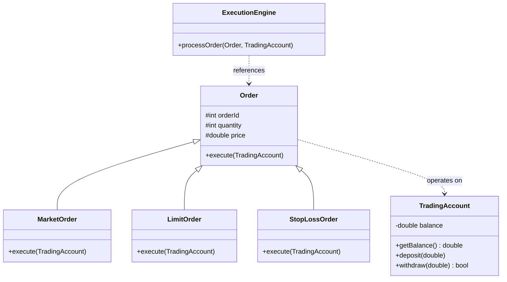

# Advanced Project: Financial Order System

## Introduction

In high-throughput trading platforms (like Zerodha, Robinhood, or institutional stock exchange engines), order processing systems receive thousands of transactions per second. The system must process multiple order types (Market, Limit, Stop Loss) with custom execution rules while protecting user funds from corruption.

This project combines the three core pillars of Object-Oriented Programming (OOP) we have learned so far:
1. **Encapsulation**: Securing user accounts against illegal withdrawals or balance adjustments.
2. **Inheritance**: Sharing base data properties (ID, price, quantity) across different order subclasses.
3. **Runtime Polymorphism**: Building a decoupled order processor that executes custom transaction strategies dynamically.

---

## Architectural Class Design

Our order execution system uses a decoupled class architecture:



---

## Code Implementation

Below is the complete, compiled stock trading program.

### 1. Encapsulated User Account (`TradingAccount.java`)
```java
public class TradingAccount {
    private double balance; // Secure private field

    public TradingAccount(double balance) {
        this.balance = balance;
    }

    public double getBalance() {
        return balance;
    }

    public void deposit(double amount) {
        if (amount > 0) {
            balance += amount;
        }
    }

    public boolean withdraw(double amount) {
        // Enforces withdrawal rules to prevent negative balances
        if (amount > 0 && amount <= balance) {
            balance -= amount;
            return true;
        }
        return false;
    }
}
```

### 2. Abstract Order Base Class (`Order.java`)
```java
public abstract class Order {
    protected int orderId;
    protected int quantity;
    protected double price;

    public Order(int orderId, int quantity, double price) {
        this.orderId = orderId;
        this.quantity = quantity;
        this.price = price;
    }

    // Abstract execution method
    public abstract void execute(TradingAccount account);
}
```

### 3. Specialized Order Subclasses
```java
// Subclass 1: Market Order
class MarketOrder extends Order {
    public MarketOrder(int id, int qty, double price) {
        super(id, qty, price);
    }

    @Override
    public void execute(TradingAccount account) {
        double cost = quantity * price;
        if (account.withdraw(cost)) {
            System.out.println("Market Order #" + orderId + " filled at current price. Cost: $" + cost);
        } else {
            System.out.println("Market Order #" + orderId + " failed: Insufficient Funds.");
        }
    }
}

// Subclass 2: Limit Order
class LimitOrder extends Order {
    public LimitOrder(int id, int qty, double price) {
        super(id, qty, price);
    }

    @Override
    public void execute(TradingAccount account) {
        double cost = quantity * price;
        if (account.withdraw(cost)) {
            System.out.println("Limit Order #" + orderId + " filled at target limit. Cost: $" + cost);
        } else {
            System.out.println("Limit Order #" + orderId + " failed: Insufficient Funds.");
        }
    }
}

// Subclass 3: Stop Loss Order
class StopLossOrder extends Order {
    public StopLossOrder(int id, int qty, double price) {
        super(id, qty, price);
    }

    @Override
    public void execute(TradingAccount account) {
        double cost = quantity * price;
        if (account.withdraw(cost)) {
            System.out.println("Stop Loss Order #" + orderId + " triggered and filled. Cost: $" + cost);
        } else {
            System.out.println("Stop Loss Order #" + orderId + " failed: Insufficient Funds.");
        }
    }
}
```

### 4. Decoupled Execution Engine (`ExecutionEngine.java`)
```java
public class ExecutionEngine {
    // Accepts any subclass of Order polymorphically
    public void processOrder(Order order, TradingAccount account) {
        order.execute(account); // Triggers Late Binding
    }
}
```

### 5. Main Driver Runner (`Main.java`)
```java
public class Main {
    public static void main(String[] args) {
        TradingAccount portfolio = new TradingAccount(100000.0);
        ExecutionEngine engine = new ExecutionEngine();

        // Instantiate polymorphic references
        Order market = new MarketOrder(101, 10, 1000.0); // Cost: $10,000
        Order limit = new LimitOrder(102, 5, 2000.0);     // Cost: $10,000
        Order stop = new StopLossOrder(103, 2, 5000.0);   // Cost: $10,000

        engine.processOrder(market, portfolio);
        engine.processOrder(limit, portfolio);
        engine.processOrder(stop, portfolio);

        System.out.println("------------------------------------");
        System.out.println("Final Portfolio Balance: $" + portfolio.getBalance());
    }
}
```

### Output:
```text
Market Order #101 filled at current price. Cost: $10000.0
Limit Order #102 filled at target limit. Cost: $10000.0
Stop Loss Order #103 triggered and filled. Cost: $10000.0
------------------------------------
Final Portfolio Balance: $70000.0
```

---

## Demonstrating OOP Integration

### 1. Encapsulation
The `TradingAccount` balance is private. It can only be decreased via the `withdraw()` method. If subclass calculations contain logical errors or attempt to assign negative values directly, `withdraw()` rejects the operation, preserving data integrity.

### 2. Inheritance
The fields `orderId`, `quantity`, and `price` are defined in the `Order` superclass. Subclasses inherit these properties directly, avoiding code duplication across order types.

### 3. Runtime Polymorphism
The `ExecutionEngine` relies solely on the `Order` reference:
```java
public void processOrder(Order order, TradingAccount account)
```
When `order.execute(account)` is called, the JVM routes execution to the overridden method of the actual subclass instance (`MarketOrder`, `LimitOrder`, or `StopLossOrder`) on the Heap.

---

## Key Takeaways

* Combining encapsulation, inheritance, and polymorphism produces clean, maintainable, and secure architectures.
* Parameterizing abstract parent types in method signatures decouples runner engines from specific subclasses.
* Adhering to the Open-Closed Principle ensures that new subclass features (e.g. adding an `IcebergOrder` class) can be added without modifying core execution logic.

---

**Back to Module Home:** [Object-Oriented Programming](README.md)
