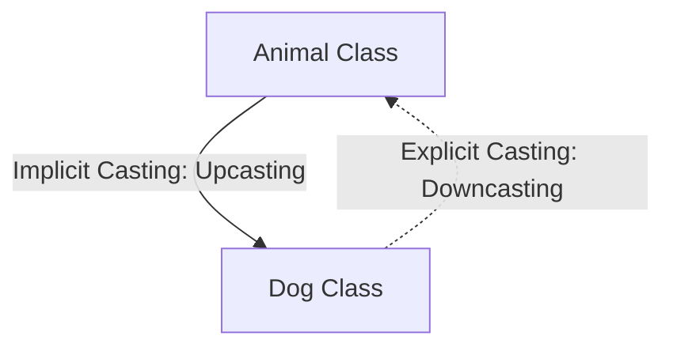
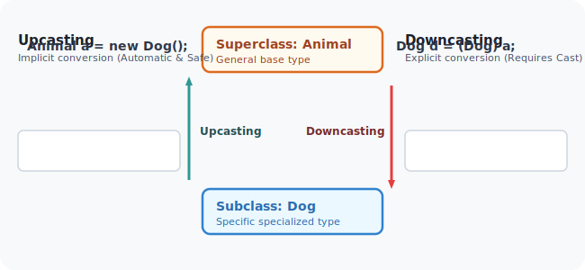
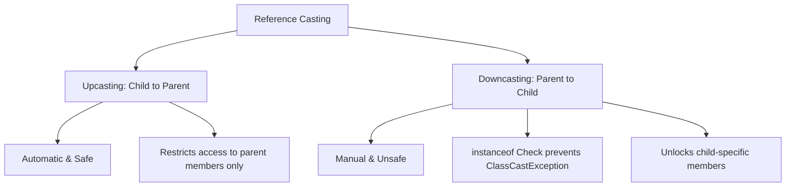

# Reference Type Casting: Upcasting and Downcasting

## Introduction

In Java, object references are static-typed at compile-time but dynamic-typed at runtime. To bridge compile-time definitions and runtime implementations, Java uses reference type casting.

Understanding **Upcasting** and **Downcasting** is essential to implement runtime polymorphism and access subclass-unique behaviors safely.

---

## Real-World Analogy: Animals

* Every **Dog** is an **Animal**. Therefore, converting a Dog reference to an Animal reference is implicit and safe.
* However, not every **Animal** is a **Dog**. It could be a Cat or a Lion. Converting a generic Animal reference to a specific Dog reference is unsafe and must be declared explicitly.



---

## What is Upcasting?

Upcasting is casting a subclass object to a parent class reference. This is done implicitly by the compiler and is always safe.



### Upcasting Example:
```java
class Animal {
    public void eat() {
        System.out.println("Animal is eating.");
    }
}

class Dog extends Animal {
    public void bark() {
        System.out.println("Dog barks: Woof!");
    }
}

public class Main {
    public static void main(String[] args) {
        // Implicit upcasting: Dog reference assigned to Animal reference
        Animal animal = new Dog(); 
        animal.eat(); // Output: Animal is eating.
    }
}
```

---

## What Can Be Accessed After Upcasting?

When a child object is upcast to a parent reference:
* You **can** access all methods declared in the parent class.
* You **cannot** access subclass-unique methods directly.

```java
Animal animal = new Dog();
animal.eat();  // VALID - declared in Animal
animal.bark(); // COMPILER ERROR - cannot find symbol 'bark()' in Animal
```

### Why?
The compiler determines member accessibility based on the **reference variable type** (`Animal`), not the runtime object type (`Dog`).

---

## What is Downcasting?

Downcasting is casting a parent reference back to its subclass reference type. This must be performed explicitly, as it is potentially unsafe.

### Why Downcast?
We use downcasting when we have a parent reference but need to access subclass-unique methods (e.g. calling `bark()` using an `Animal` reference).

### Downcasting Example:
```java
public class Main {
    public static void main(String[] args) {
        Animal animal = new Dog(); // Upcast
        
        // Explicit Downcast
        Dog dog = (Dog) animal; 
        dog.bark(); // VALID - Output: Dog barks: Woof!
    }
}
```

---

## Unsafe Downcasting & `ClassCastException`

If you attempt to downcast an object to a type it does not belong to, the JVM will throw a **`ClassCastException`** at runtime.

```java
class Cat extends Animal {}

public class Main {
    public static void main(String[] args) {
        Animal animal = new Cat(); // animal is actually a Cat
        
        // Attempting to downcast Cat to Dog
        Dog dog = (Dog) animal; // Compiles fine, but throws ClassCastException at runtime!
        dog.bark();
    }
}
```

---

## Safe Downcasting using `instanceof`

To prevent `ClassCastException`, always use the **`instanceof`** operator to verify the runtime object type before downcasting.

```java
public class Main {
    public static void main(String[] args) {
        Animal animal = new Dog();

        if (animal instanceof Dog) {
            Dog dog = (Dog) animal; // Safe downcast
            dog.bark();
        } else {
            System.out.println("Casting aborted: Object is not a Dog.");
        }
    }
}
```

---

## Upcasting vs. Downcasting

| Feature | Upcasting | Downcasting |
| :--- | :--- | :--- |
| **Direction** | Subclass to Superclass (`Child` $\rightarrow$ `Parent`) | Superclass to Subclass (`Parent` $\rightarrow$ `Child`) |
| **Casting Syntax**| Implicit / Automatic | Explicit (requires manual cast syntax) |
| **Safety** | Always safe | Unsafe (can throw `ClassCastException`) |
| **Purpose** | Enables runtime polymorphism | Accesses subclass-unique members |

---

## Concept Map



---

## Interview Questions (FAQ)

### Why is upcasting safe but downcasting unsafe?
Upcasting is safe because a subclass inherits all fields and methods from the parent class, guaranteeing their presence. Downcasting is unsafe because a parent reference might point to a different subclass (e.g. an `Animal` reference pointing to a `Cat` cannot be cast to a `Dog`).

### What exception is thrown on invalid downcasting?
`java.lang.ClassCastException` is thrown.

### Can we bypass compiler checks during downcasting?
No. The compiler requires an explicit cast syntax `(Subclass) reference` to acknowledge that you are taking responsibility for casting safety.

---

## Practice Challenges

1. **Multimedia Player**: Create a base class `Media` and subclass `Video`. Add a subclass-unique method `playVideo()`. Upcast a `Video` object to a `Media` reference. Then, safely downcast it back using `instanceof` to call `playVideo()`.
2. **Staff Hierarchy**: Design a `Staff` base class and a `Professor` subclass. Add `giveLecture()` to `Professor`. Demonstrate safe downcasting from a `Staff` reference to trigger `giveLecture()`.

---

## Key Takeaways

* Upcasting converts a child reference to a parent reference type. It is implicit, safe, and powers runtime polymorphism.
* Downcasting converts a parent reference back to a child reference type. It is explicit and can throw a `ClassCastException`.
* Always use `instanceof` to check the runtime object type before downcasting.
* Casting reference variables changes the compile-time visibility of members, not the underlying object type on the Heap.

---

**Back to Module Home:** [Object-Oriented Programming](README.md)
