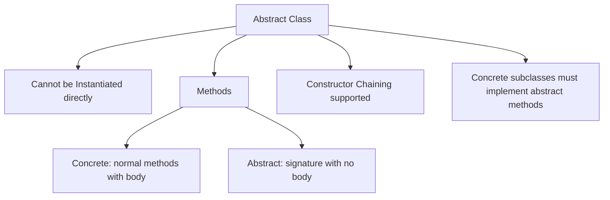

# Abstract Classes in Java

## Introduction

In object-oriented system design, we often need to model broad classifications (like `Animal`, `Shape`, or `Payment`) that contain shared states and declare required behaviors, but cannot have concrete implementations of their own.

Java uses **Abstract Classes** to define templates. An abstract class acts as a blueprint, establishing common rules that child subclasses are required to implement.

---

## What is an Abstract Class?

An Abstract Class is a class declared with the `abstract` keyword. Its primary characteristic is that **it cannot be instantiated directly**. It is designed specifically to be inherited by subclasses.

```java
// Compile Error if you attempt direct instantiation
Animal animal = new Animal(); // Error: Animal is abstract; cannot be instantiated
```

An abstract class lies between a normal class and an interface:
* Like a normal class, it can declare instance variables, constructors, and fully implemented methods.
* Like an interface, it can declare method templates with no body (known as **Abstract Methods**).

---

## What is an Abstract Method?

An Abstract Method is a method signature declared with the `abstract` keyword that has **no implementation body**. It terminates with a semicolon.

```java
abstract void sound(); // No curly braces {} allowed!
```

Any concrete subclass extending the abstract parent class is **mandated** to override and implement all abstract methods. If it fails to do so, the subclass itself must also be declared `abstract`, or the compiler will throw an error.

---

## Abstract Class Example

```java
// Abstract Parent Class
abstract class Animal {
    // Abstract method (no body)
    abstract void sound();

    // Normal implemented method
    public void sleep() {
        System.out.println("Sleeping... Zzz");
    }
}

// Concrete Subclass A
class Dog extends Animal {
    @Override
    void sound() {
        System.out.println("Dog barks: Woof!");
    }
}

// Concrete Subclass B
class Cat extends Animal {
    @Override
    void sound() {
        System.out.println("Cat meows: Meow!");
    }
}
```

```java
public class Main {
    public static void main(String[] args) {
        // Polymorphic assignment
        Animal myDog = new Dog();
        Animal myCat = new Cat();

        myDog.sound(); // Output: Dog barks: Woof!
        myDog.sleep(); // Output: Sleeping... Zzz

        myCat.sound(); // Output: Cat meows: Meow!
    }
}
```

---

## Constructor Execution in Abstract Classes

A common interview question is: **"Can an abstract class declare a constructor?"**

The answer is **Yes**. While you cannot call `new AbstractClass()`, the abstract class constructor is executed during subclass instantiation via constructor chaining. This allows parent class properties to be initialized correctly.

```java
abstract class Employee {
    protected String name;

    // Abstract class constructor
    public Employee(String name) {
        this.name = name;
        System.out.println("Employee base constructor initialized.");
    }

    abstract void work();
}

class Developer extends Employee {
    public Developer(String name) {
        super(name); // Call abstract parent constructor
    }

    @Override
    void work() {
        System.out.println(name + " is writing code.");
    }
}

public class Main {
    public static void main(String[] args) {
        Employee dev = new Developer("Sanjay");
        dev.work();
    }
}
```

### Output:
```text
Employee base constructor initialized.
Sanjay is writing code.
```

---

## Abstract Class vs. Normal Class

| Metric | Normal Class | Abstract Class |
| :--- | :--- | :--- |
| **Instantiation** | Can be instantiated directly | Cannot be instantiated directly |
| **Methods** | Implemented methods only | Implemented + Abstract methods |
| **Keyword** | No special keyword | Must use the `abstract` class modifier |
| **Purpose** | Standalone object blueprints | Shared templates designed for inheritance |

---

## Abstract Class vs. Interface

While both provide abstraction, they serve different design purposes:

| Feature | Abstract Class | Interface |
| :--- | :--- | :--- |
| **Abstraction Level** | Partial Abstraction (can have instance states) | Complete Abstraction (states must be public static constants) |
| **Inheritance** | Single class inheritance (`extends`) | Multiple inheritance support (`implements`) |
| **Constructors** | Supported | Not supported |
| **Instance Fields** | Supported | Not supported (only static constants) |

---

## Common Mistakes

### 1. Declaring an Abstract Method with a Body
Abstract methods must end with a semicolon. They cannot have curly braces.
```java
// WRONG
abstract void sound() {} 

// CORRECT
abstract void sound(); 
```

### 2. Bypassing Subclass Method Overrides
If a child class extends an abstract parent, it *must* override all abstract methods unless the child class itself is marked `abstract`.
```java
// WRONG - Compiler error
class Dog extends Animal {
    // sound() is missing!
}
```

---

## Concept Map



---

## Interview Questions (FAQ)

### Can an abstract class be declared without any abstract methods?
Yes. You can declare a class `abstract` simply to prevent users from instantiating it directly, even if all its methods are fully implemented.

### Can an abstract class be declared final?
No. A class marked `final` cannot be inherited. Since abstract classes are designed specifically to be inherited, marking an abstract class `final` will cause a compilation error.

### Can abstract methods be marked private?
No. Private methods are not visible to subclasses. Because subclasses must override abstract methods, abstract methods must be declared `protected` or `public`.

---

## Practice Challenges

1. **Payment Terminal**: Create an abstract class `Payment` with an abstract method `processPayment()`. Extend it with subclasses `UPI` and `CardPayment`. Override the method in each.
2. **System Logger**: Design an abstract class `Logger` with a constructor that sets the log prefix. Declare an abstract method `log(String message)`. Derive subclasses `ConsoleLogger` and `FileLogger`.

---

## Key Takeaways

* Abstract classes define template signatures using the `abstract` keyword.
* Abstract classes cannot be instantiated directly but can declare constructors.
* Subclasses must implement all abstract methods or be declared abstract themselves.
* Abstract classes promote a consistent API design across related class types.

---

**Back to Module Home:** [Object-Oriented Programming](README.md)
