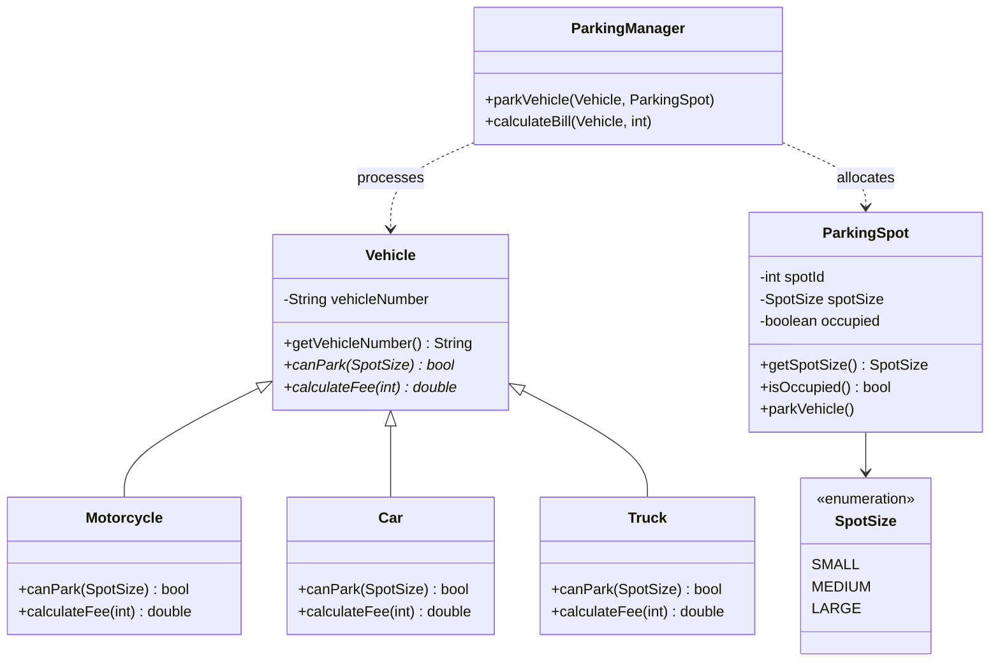

# Capstone Project: Parking Lot System

## Introduction

In modern smart-city architectures, municipal infrastructure relies heavily on automated management systems. A key system is the **Multi-Level Parking Lot Manager**, which coordinates vehicle parking spot allocations, validates parking dimensions, and calculates billing fees dynamically.

This capstone project combines the four pillars of Object-Oriented Programming (OOP) we have covered in this module:
1. **Encapsulation**: Securing parking spot occupation states and vehicle identifiers.
2. **Inheritance**: Creating a hierarchy of vehicle classifications.
3. **Abstraction**: Modeling generic vehicle actions (e.g. fee calculation, parking rules).
4. **Polymorphism**: Interacting with all vehicles via a base type reference to invoke subclass-specific logic.

---

## Business Rules

* **Motorcycles**: Can park in Small, Medium, or Large spots. Fee: ₹10/hour.
* **Cars**: Can park in Medium or Large spots. Fee: ₹20/hour.
* **Trucks**: Can park in Large spots only. Fee: ₹50/hour.

---

## Architectural Class Design



---

## Code Implementation

Below is the complete Java implementation of the smart parking lot backend.

### 1. Spot Size Enumeration (`SpotSize.java`)
```java
public enum SpotSize {
    SMALL,
    MEDIUM,
    LARGE
}
```

### 2. Abstract Vehicle Base Class (`Vehicle.java`)
```java
public abstract class Vehicle {
    private String vehicleNumber; // Secure private field

    public Vehicle(String vehicleNumber) {
        this.vehicleNumber = vehicleNumber;
    }

    public String getVehicleNumber() {
        return vehicleNumber;
    }

    // Abstract methods to be overridden by subclasses
    public abstract boolean canPark(SpotSize size);
    public abstract double calculateFee(int hours);
}
```

### 3. Specialized Vehicle Subclasses
```java
// Motorcycle Subclass
class Motorcycle extends Vehicle {
    public Motorcycle(String vehicleNumber) {
        super(vehicleNumber);
    }

    @Override
    public boolean canPark(SpotSize size) {
        return true; // Motorcycles can park in small, medium, or large spots
    }

    @Override
    public double calculateFee(int hours) {
        return hours * 10.0;
    }
}

// Car Subclass
class Car extends Vehicle {
    public Car(String vehicleNumber) {
        super(vehicleNumber);
    }

    @Override
    public boolean canPark(SpotSize size) {
        return size == SpotSize.MEDIUM || size == SpotSize.LARGE;
    }

    @Override
    public double calculateFee(int hours) {
        return hours * 20.0;
    }
}

// Truck Subclass
class Truck extends Vehicle {
    public Truck(String vehicleNumber) {
        super(vehicleNumber);
    }

    @Override
    public boolean canPark(SpotSize size) {
        return size == SpotSize.LARGE;
    }

    @Override
    public double calculateFee(int hours) {
        return hours * 50.0;
    }
}
```

### 4. Parking Spot Representation (`ParkingSpot.java`)
```java
public class ParkingSpot {
    private int spotId;
    private SpotSize spotSize;
    private boolean occupied;

    public ParkingSpot(int spotId, SpotSize spotSize) {
        this.spotId = spotId;
        this.spotSize = spotSize;
        this.occupied = false;
    }

    public SpotSize getSpotSize() {
        return spotSize;
    }

    public boolean isOccupied() {
        return occupied;
    }

    public void parkVehicle() {
        this.occupied = true;
    }

    public void vacateSpot() {
        this.occupied = false;
    }
}
```

### 5. Decoupled Parking Coordinator (`ParkingManager.java`)
```java
public class ParkingManager {
    public void parkVehicle(Vehicle vehicle, ParkingSpot spot) {
        if (spot.isOccupied()) {
            System.out.println("Parking Failed: Spot #" + spot.getSpotSize() + " is already occupied.");
            return;
        }

        // Evaluate vehicle-specific spot compatibility rules polymorphically
        if (vehicle.canPark(spot.getSpotSize())) {
            spot.parkVehicle();
            System.out.println("Vehicle [" + vehicle.getVehicleNumber() + "] parked successfully.");
        } else {
            System.out.println("Parking Failed: Vehicle [" + vehicle.getVehicleNumber() + 
                               "] is too large for spot size " + spot.getSpotSize());
        }
    }

    public void calculateBill(Vehicle vehicle, int hours) {
        double fee = vehicle.calculateFee(hours);
        System.out.println("Billing Code: " + vehicle.getVehicleNumber() + " | Parking Fee: ₹" + fee);
    }
}
```

### 6. Main Runner Setup (`Main.java`)
```java
public class Main {
    public static void main(String[] args) {
        ParkingManager manager = new ParkingManager();

        // Instantiate vehicles
        Vehicle bike = new Motorcycle("TN38BIKE01");
        Vehicle sedan = new Car("TN38AB1234");
        Vehicle freight = new Truck("TN38TRUCK99");

        // Instantiate spots
        ParkingSpot smallSpot = new ParkingSpot(1, SpotSize.SMALL);
        ParkingSpot mediumSpot = new ParkingSpot(2, SpotSize.MEDIUM);
        ParkingSpot largeSpot = new ParkingSpot(3, SpotSize.LARGE);

        System.out.println("=== Parking Operations ===");
        manager.parkVehicle(bike, smallSpot);      // Success: Bike in small spot
        manager.parkVehicle(sedan, mediumSpot);    // Success: Sedan in medium spot
        manager.parkVehicle(freight, mediumSpot);  // Fails: Truck in medium spot
        manager.parkVehicle(freight, largeSpot);   // Success: Truck in large spot

        System.out.println("\n=== Billing Operations ===");
        manager.calculateBill(bike, 5);
        manager.calculateBill(sedan, 5);
        manager.calculateBill(freight, 5);
    }
}
```

### Output:
```text
=== Parking Operations ===
Vehicle [TN38BIKE01] parked successfully.
Vehicle [TN38AB1234] parked successfully.
Parking Failed: Vehicle [TN38TRUCK99] is too large for spot size MEDIUM
Vehicle [TN38TRUCK99] parked successfully.

=== Billing Operations ===
Billing Code: TN38BIKE01 | Parking Fee: ₹50.0
Billing Code: TN38AB1234 | Parking Fee: ₹100.0
Billing Code: TN38TRUCK99 | Parking Fee: ₹250.0
```

---

## OOP Principles In Action

### 1. Encapsulation
The class variables `vehicleNumber`, `spotId`, `spotSize`, and `occupied` are marked `private`. Changing spot states must only occur through verified methods (`parkVehicle()` or `vacateSpot()`), preventing illegal modifications.

### 2. Abstraction
The `Vehicle` class declares abstract signatures `canPark()` and `calculateFee()` but provides no implementation details. This exposes *what* variables and methods a vehicle possesses, hiding *how* specific vehicles calculate fees or evaluate spots.

### 3. Inheritance
The child classes (`Motorcycle`, `Car`, `Truck`) inherit the basic initialization properties and variable structures of the `Vehicle` parent class.

### 4. Runtime Polymorphism
The `ParkingManager` operates on the generic `Vehicle` superclass reference type. During execution, dynamic dispatch resolves the correct overridden method implementation of the actual subclass instance (`Motorcycle`, `Car`, or `Truck`) in memory.

---

## Practice Challenges

1. **Electric Vehicle (EV) Spot Support**: Add a new spot size `CHARGING_SPOT`. Derive a subclass `ElectricCar` that requires `CHARGING_SPOT` and charges ₹25/hour.
2. **Floor Level Management**: Expand the system to manage multiple floors (e.g. `Level 1`, `Level 2`), each holding an array of `ParkingSpot` objects.

---

## Key Takeaways

* Capstone architectures leverage encapsulation, inheritance, abstraction, and polymorphism together.
* Using enums (e.g. `SpotSize`) prevents compile-time spelling errors and provides type safety.
* Extensible designs support adding new subclasses (e.g. `ElectricCar`) without modifying existing core logic.

---

**Back to Module Home:** [Object-Oriented Programming](README.md)
