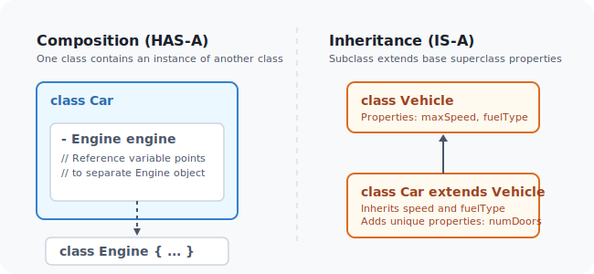
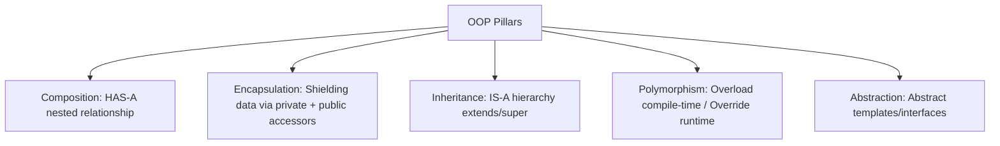

# Object-Oriented Programming (OOP) in Java

Object-Oriented Programming (OOP) is a programming paradigm that organizes software design around **data (objects)** rather than functions or logic. By modeling real-world entities in code, OOP makes software more modular, reusable, and easier to extend over time.

This module covers the core concepts and design principles of OOP in Java, transitioning from basic relationships (Composition) to encapsulation techniques, inheritance structures, polymorphism mechanics, and abstraction.

---

## Learning Objectives

By the end of this module, you will be able to:
* **Apply Composition** to model `HAS-A` relationships between classes.
* **Implement Encapsulation** to secure data boundaries using access modifiers, getters, and setters.
* **Design Inheritance Hierarchies** using single, multilevel, and hierarchical structures.
* **Master Polymorphism** via compile-time method overloading, runtime method overriding, and dynamic method dispatch.
* **Apply Reference Type Casting** (Upcasting and Downcasting) correctly.
* **Design Abstract Classes** to define templates for specialized subclass implementations.

---

## Module Index

Below is the directory map of the lessons contained in this module:

| Lesson File | Core Concepts Covered | Link |
| :--- | :--- | :--- |
| **01. Composition** | Modeling `HAS-A` relationships, nested object instantiations. | [Open Guide](01_Composition-in-Java.md) |
| **02. Composition Challenges** | Advanced composition programs, object array tracking. | [Open Guide](02_Advanced-Composition-Program.md) |
| **03. Encapsulation &amp; Accessors** | Hiding implementation details, writing getters/setters with validation. | [Open Guide](03_Encapsulation-in-Java.md) |
| **04. Encapsulation Challenges** | Encapsulated banking systems and library records. | [Open Guide](04_Encapsulation-Advanced-Programs.md) |
| **05. Inheritance in Java** | Class hierarchies, the `extends` keyword, base super constructors. | [Open Guide](07_Inheritance-in-Java.md) |
| **06. Single Inheritance** | Subclass extending one superclass, calling parent fields. | [Open Guide](08_Single-Inheritance.md) |
| **07. Multilevel Inheritance** | Chained classes, parent-child-grandchild relationships. | [Open Guide](09_Multilevel-Inheritance.md) |
| **08. Hierarchical Inheritance** | Multiple subclasses inheriting from a single parent class. | [Open Guide](10_Hierarchical-Inheritance.md) |
| **09. Inheritance Challenges** | Advanced inheritance challenges, complex class hierarchies. | [Open Guide](11_Inheritance-Advanced-Programs.md) |
| **10. Inheritance &amp; Encapsulation** | Combining constructors, superclass fields, and accessor protections. | [Open Guide](12_Inheritance-and-Encapsulation-Advanced-Problem.md) |
| **11. Polymorphism in Java** | Dynamic binding, reference variables vs runtime heap objects. | [Open Guide](13_Polymorphism-in-Java.md) |
| **12. Compile-Time Polymorphism** | Method overloading rules, compile-time signature resolution. | [Open Guide](14_Compile-Time-Polymorphism.md) |
| **13. Runtime Polymorphism** | Method overriding rules, dynamic method dispatch logic. | [Open Guide](15_Runtime-Polymorphism.md) |
| **14. Polymorphism Challenges** | Implementing notifications, payroll systems, and shape calculators. | [Open Guide](16_Polymorphism-Advanced-Program-Notification-System.md) |
| **15. Unified OOP Program** | Combining composition, encapsulation, inheritance, and polymorphism. | [Open Guide](17_Polymorphism-Inheritance-Encapsulation-Advanced-Program.md) |
| **16. Type Casting (Up/Down)** | Reference variable casting, explicit type checks, and safety rules. | [Open Guide](18_Upcasting-and-Downcasting.md) |
| **17. Abstract Classes** | Abstract method templates, subclass implementation mandates, object restrictions. | [Open Guide](19_Abstract-Class-in-Java.md) |
| **18. Parking Lot Mini-Project** | Advanced OOP project applying composition, hierarchies, polymorphism. | [Open Guide](20_OOPs-Advanced-Problem-Parking-Lot-Management-System.md) |

---

## Core OOP Pillars

---

## Interview Questions (FAQ)

### What is the difference between Composition and Inheritance?
Inheritance represents an `IS-A` relationship (e.g., `Car` is a `Vehicle`). It inherits code from a parent class. Composition represents a `HAS-A` relationship (e.g., `Car` has an `Engine`). Composition is generally preferred over inheritance because it keeps classes loosely coupled and allows changing nested behaviors at runtime.

### What is dynamic method dispatch?
Dynamic Method Dispatch is the mechanism by which a call to an overridden method is resolved at runtime rather than compile-time. The JVM determines which method implementation to execute based on the actual object type in Heap memory, not the reference variable type.

### Why does Java not support multiple inheritance with classes?
If two parent classes have methods with the same name and signature, a child class extending both would not know which parent method implementation to execute. This is called the **Diamond Problem**. To prevent this ambiguity, Java supports only single inheritance with classes but allows multiple inheritance via **Interfaces**.

### What is the difference between Upcasting and Downcasting?
* **Upcasting**: Casting a subclass reference to a superclass type (e.g., `Animal a = new Dog();`). It is safe, implicit, and performed automatically by Java.
* **Downcasting**: Casting a superclass reference back to a subclass type (e.g., `Dog d = (Dog) a;`). It must be done explicitly and can throw a `ClassCastException` at runtime if the object is not actually an instance of that subclass.

---

**Next Module:** Let's learn about package setups and naming standardizations in [07_Naming-Conventions-and-Packages-in-Java](../07_Naming-Conventions-and-Packages-in-Java)
