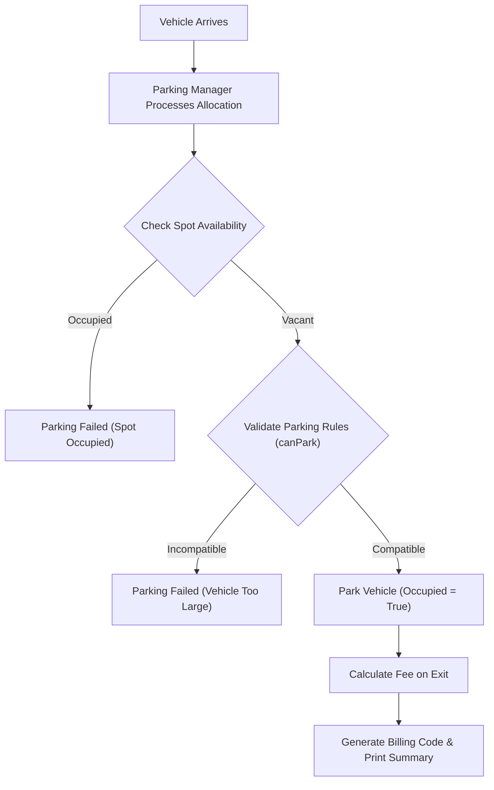

# Multi-Level Parking Lot Management System

## Problem Statement

Design and implement a backend system for a Multi-Level Parking Lot using Object-Oriented Programming (OOP) principles. The system must support multiple vehicle types:
* Motorcycle
* Car
* Truck

Each vehicle requires different parking spot sizes based on dimensions:

| Vehicle Type | Allowed Parking Spots |
| :--- | :--- |
| **Motorcycle** | Small, Medium, Large |
| **Car** | Medium, Large |
| **Truck** | Large Only |

### System Features:
* Allow vehicles to enter and park safely.
* Validate spot sizes based on vehicle compatibility.
* Prevent invalid parking allocations.
* Calculate parking fees dynamically.
* Support future vehicle types cleanly without modifying existing code structures.

---

## Business Rules

* **Motorcycles**: Can park in Small, Medium, or Large spots. Fee: ₹10 per hour.
* **Cars**: Can park in Medium or Large spots. Fee: ₹20 per hour.
* **Trucks**: Can park in Large spots only. Fee: ₹50 per hour.

---

## OOP Concepts Used

### 1. Encapsulation
Sensitive fields such as `vehicleNumber`, `spotId`, and `occupied` state are marked `private` inside class scopes. Access is regulated via standard getters/setters, preserving data integrity.

### 2. Abstraction
The parent superclass `Vehicle` declares abstract methods `canPark(SpotSize)` and `calculateFee(int)` without implementation details. This exposes the expected behavior while hiding implementation specifics.

### 3. Inheritance
Child classes (`Car`, `Truck`, and `Motorcycle`) extend the base `Vehicle` superclass, inheriting common attributes and constructor patterns to avoid code redundancy.

### 4. Runtime Polymorphism
The `ParkingManager` processes actions on a generic `Vehicle` superclass reference. At runtime, the JVM dynamically invokes the overridden method corresponding to the actual subclass instance (`Car`, `Motorcycle`, or `Truck`) in memory.

---

## Program Flow



---

## Project Structure

The project code is modularized into packages representing component areas:

```text
parkinglot/
├── Main.java
├── ParkingManager.java
├── vehicles/
│   ├── Vehicle.java
│   ├── Car.java
│   ├── Motorcycle.java
│   └── Truck.java
└── parking/
    ├── ParkingSpot.java
    └── SpotSize.java
```

---

## Example Execution

### Vehicle Entry Scenario:
* `Motorcycle` $\rightarrow$ Small Spot
* `Car` $\rightarrow$ Medium Spot
* `Truck` $\rightarrow$ Large Spot

### Billing Scenario (5 Hours Duration):
* **Motorcycle**: $5 \text{ hrs} \times \text{₹10} = \text{₹50}$
* **Car**: $5 \text{ hrs} \times \text{₹20} = \text{₹100}$
* **Truck**: $5 \text{ hrs} \times \text{₹50} = \text{₹250}$

### Expected Output:
```text
TN38BIKE01 Parked Successfully
TN38CAR01 Parked Successfully
TN38TRUCK01 Parked Successfully

TN38BIKE01 Parking Fee : ₹50.0
TN38CAR01 Parking Fee : ₹100.0
TN38TRUCK01 Parking Fee : ₹250.0
```

---

## Future Enhancements

* **Multi-Level Floors**: Introduce dynamic floor-level collections with floor-switching indicators.
* **Electric Vehicle Charging**: Add specialized charging ports to designated spots.
* **VIP Spots**: Support spot reservation for priority loyalty members.
* **Duration Tracker**: Integrate system timestamps (`java.time`) to calculate duration automatically.

---

**Back to Module Home:** [Object-Oriented Programming](../README.md)
